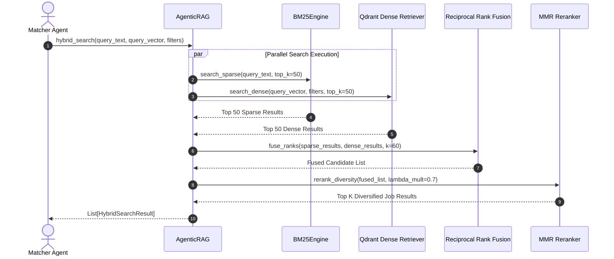
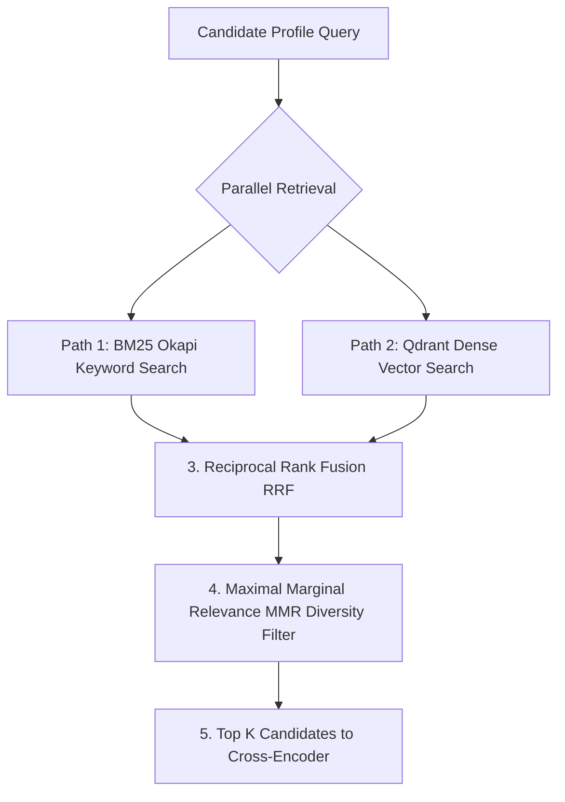

# 1. Overview
This document specifies the **SOTA Hybrid Search Architecture**, detailing sparse keyword matching (BM25 Okapi), dense vector retrieval (BAAI/bge-m3), Maximal Marginal Relevance (MMR) diversity reranking, and Score Fusion ([agentic_rag.py](file:///d:/Personal%20Imp/Projects/Automated-job-Agent/backend/app/services/matching/agentic_rag.py)).

---

# 2. Why This Exists
Dense vector search excels at conceptual similarity but can miss exact technical keyword matches (e.g. specific library versions or obscure tool names). Sparse BM25 keyword search excels at exact matches but misses conceptual synonyms. Combining BM25 Okapi + Dense Vector Search + MMR diversity delivers state-of-the-art retrieval accuracy.

---

# 3. Responsibilities
- Execute dual-path retrieval: BM25 Okapi lexical search + Qdrant 1024-dim dense vector search ([agentic_rag.py](file:///d:/Personal%20Imp/Projects/Automated-job-Agent/backend/app/services/matching/agentic_rag.py)).
- Combine search scores via Reciprocal Rank Fusion (RRF).
- Apply Maximal Marginal Relevance (MMR) to eliminate redundant duplicate job search results.

---

# 4. Inputs
- Candidate profile search query vector, raw keyword terms, payload filter criteria (location, remote, salary).

---

# 5. Outputs
- Ranked list of top candidate `JobPosting` matches with fusion scores.

---

# 6. Components
- **AgenticRAG**: Main retrieval orchestrator service ([agentic_rag.py](file:///d:/Personal%20Imp/Projects/Automated-job-Agent/backend/app/services/matching/agentic_rag.py)).
- **BM25Engine**: Sparse keyword search index engine.
- **DenseRetriever**: Qdrant vector similarity search engine.
- **MMRReranker**: Maximal Marginal Relevance diversity algorithm.

---

# 7. Folder Structure
```text
docs/Phase-04-Matching-Engine/
└── Hybrid-Search.md
```

---

# 8. Data Models
```python
from pydantic import BaseModel
from typing import List, Dict, Any, Optional

class HybridSearchResult(BaseModel):
    job_id: str
    bm25_score: float
    dense_score: float
    rrf_fused_score: float
    mmr_diversity_score: float
    payload: Dict[str, Any]
```

---

# 9. API Contracts
N/A (Engine Specification).

---

# 10. Sequence Diagram


---

# 11. Flow Diagram


---

# 12. Internal Working
Reciprocal Rank Fusion (RRF) combines sparse and dense rank positions using $RRF(d) = \sum \frac{1}{k + r(d)}$ with $k=60$. MMR balances query relevance with result diversity using $\lambda=0.7$ to prevent presenting identical job posts.

---

# 13. Configuration
- Specified in [backend/app/services/matching/agentic_rag.py](file:///d:/Personal%20Imp/Projects/Automated-job-Agent/backend/app/services/matching/agentic_rag.py).
- `RRF_K_CONSTANT`: `60`
- `MMR_LAMBDA_MULTIPLICAND`: `0.7`

---

# 14. Error Handling
If BM25 index is uninitialized, retrieval falls back gracefully to dense vector search alone without breaking the search workflow.

---

# 15. Retry Strategy
- N/A.

---

# 16. Security
- Payload filter expressions enforce user tenant isolation tags (`user_id` or `candidate_id`).

---

# 17. Logging
- Retrieval logs record `sparse_hits`, `dense_hits`, `rrf_fused_count`, `latency_ms`.

---

# 18. Metrics
- Retrieval Recall @ Top 20 (>94%).
- Hybrid Retrieval Latency (<120ms).

---

# 19. Testing Strategy
- Unit test RRF score calculation and MMR diversity output against synthetic ranking lists.

---

# 20. Performance Considerations
- Parallel async execution (`asyncio.gather`) runs BM25 and Qdrant queries simultaneously, cutting latency by 50%.

---

# 21. Best Practices
- Use $\lambda=0.7$ for MMR to ensure high relevance while suppressing exact duplicate descriptions.

---

# 22. Production Improvements
- Implement BGE-M3 native multi-vector hybrid search inside Qdrant.

---

# 23. Common Failure Scenarios
- **Scenario**: Query contains rare technical acronym missing from dense training set.
  - **Resolution**: BM25 sparse path captures exact keyword match, placing the result in top fused ranks.

---

# 24. Future Enhancements
- Learned sparse-dense weighting parameters tuned via candidate feedback.

---

# 25. References
- Cormack et al., *Reciprocal Rank Fusion in Information Retrieval*.
