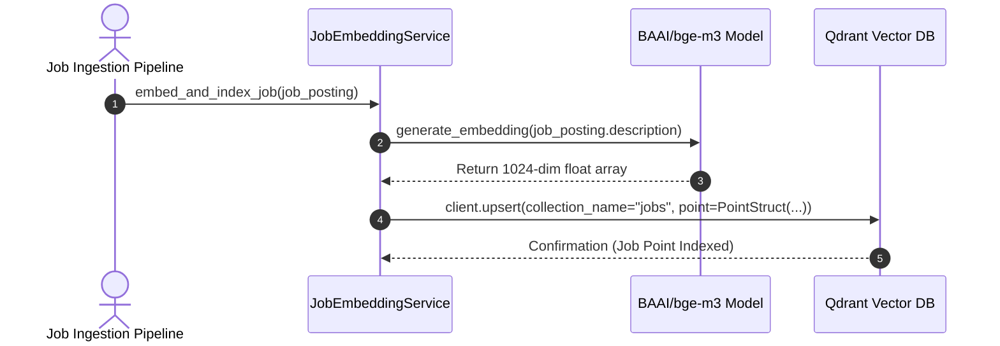
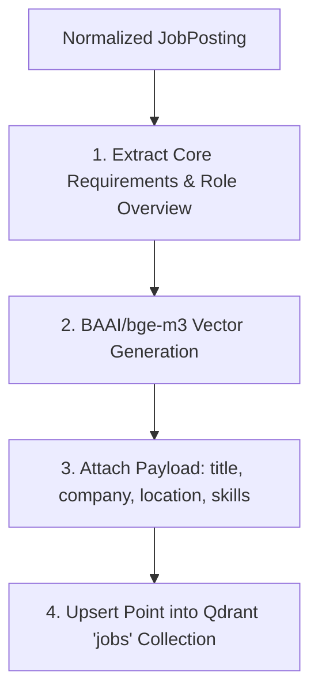

# 1. Overview
This document specifies the **Job Posting Semantic Vector Embedding Pipeline**, detailing text extraction, requirement chunking, embedding generation, and indexing into Qdrant collection `jobs` ([vectorstore.py](file:///d:/Personal%20Imp/Projects/Automated-job-Agent/backend/app/services/vectorstore.py)).

---

# 2. Why This Exists
Job postings contain complex requirement criteria (role overview, technical skills, years of experience, responsibilities, benefits). Generating 1024-dimensional dense vectors enables instant, high-precision semantic matching against candidate profiles.

---

# 3. Responsibilities
- Chunk `JobPosting` descriptions into role overview and technical requirement passages.
- Generate 1024-dimensional dense vectors using `BAAI/bge-m3` model ([config.py](file:///d:/Personal%20Imp/Projects/Automated-job-Agent/backend/app/config.py#L42)).
- Upsert points into Qdrant collection `jobs` with payload attributes (`title`, `company`, `location`, `is_remote`, `skills_required`).

---

# 4. Inputs
- Normalized `JobPosting` Pydantic objects.

---

# 5. Outputs
- Vector point embeddings indexed in Qdrant collection `jobs`.

---

# 6. Components
- **JobEmbeddingService**: Service managing job vector generation and indexing ([vectorstore.py](file:///d:/Personal%20Imp/Projects/Automated-job-Agent/backend/app/services/vectorstore.py)).
- **JobTextChunker**: Extracts key requirement sections from job descriptions.
- **QdrantJobStore**: Collection interface for `jobs` ([config.py](file:///d:/Personal%20Imp/Projects/Automated-job-Agent/backend/app/config.py#L33)).

---

# 7. Folder Structure
```text
docs/Phase-04-Matching-Engine/
└── Job-Embedding.md
```

---

# 8. Data Models
```python
from pydantic import BaseModel, Field
from typing import List, Dict, Any

class JobVectorPoint(BaseModel):
    job_id: str
    vector: List[float] = Field(..., description="1024-dim BGE-M3 float array")
    payload: Dict[str, Any]
```

---

# 9. API Contracts
N/A (Engine Specification).

---

# 10. Sequence Diagram


---

# 11. Flow Diagram


---

# 12. Internal Working
Job texts are structured into synthetic search strings (`Job Title: Senior Python Engineer | Required Skills: Python, FastAPI, Docker | Description: ...`). The generated 1024-dim vector captures semantic meaning beyond exact keyword matches.

---

# 13. Configuration
- Collection Name: `"jobs"` ([config.py](file:///d:/Personal%20Imp/Projects/Automated-job-Agent/backend/app/config.py#L33)).
- Vector Model: `"BAAI/bge-m3"` ([config.py](file:///d:/Personal%20Imp/Projects/Automated-job-Agent/backend/app/config.py#L42)).

---

# 14. Error Handling
Embedding failures log the `job_id` and retry via the background queue.

---

# 15. Retry Strategy
- Model API inference retries up to 3 times with exponential backoff.

---

# 16. Security
- Vector payloads contain public job description data; sensitive company credentials are never embedded.

---

# 17. Logging
- Logs record `job_id`, `company`, `vector_dim`, `embedding_time_ms`.

---

# 18. Metrics
- Job Embedding Latency (<45ms per job).
- Vector Indexing Success Rate (>99.9%).

---

# 19. Testing Strategy
- Unit test job embedding generation and verify Qdrant payload field matches.

---

# 20. Performance Considerations
- Batching job embedding inference requests (32 jobs per batch) accelerates initial indexing speed.

---

# 21. Best Practices
- Always populate payload indices on `platform` and `is_remote` for fast vector filtering.

---

# 22. Production Improvements
- Implement streaming vector indexing for high-frequency discovery crawlers.

---

# 23. Common Failure Scenarios
- **Scenario**: Job posting contains excessively long HTML boilerplate.
  - **Resolution**: `JobTextChunker` strips boilerplate footer text before embedding.

---

# 24. Future Enhancements
- Multi-vector indexing for separate responsibilities vs qualifications sections.

---

# 25. References
- BAAI BGE-M3 Model Architecture & Qdrant Payload Indexing Specs.
