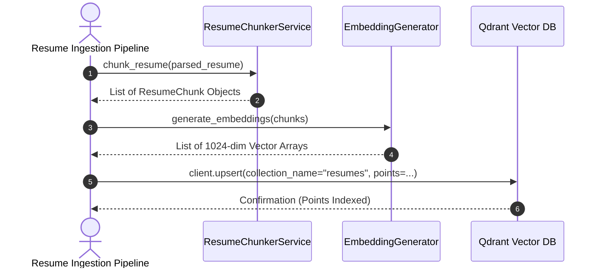
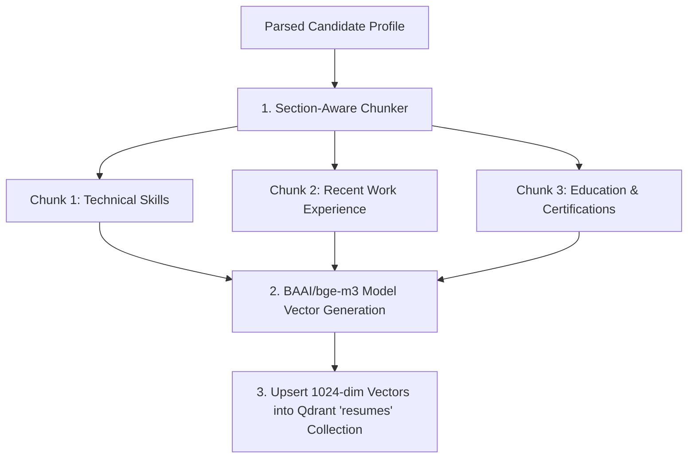

# 1. Overview
This document specifies the **Candidate Profile Semantic Chunking & Vector Embedding Subsystem**, detailing section-aware text chunking, vector embedding generation, and point upsert into Qdrant collection `resumes` ([generator.py](file:///d:/Personal%20Imp/Projects/Automated-job-Agent/backend/app/automation/candidate/embeddings/generator.py)).

---

# 2. Why This Exists
A complete candidate resume covers multiple distinct topics (e.g. executive summary, specific technical skills, individual past jobs, education). Embedding the entire resume as a single massive text block dilutes specific technical details. Section-aware semantic chunking creates focused vectors for each experience block.

---

# 3. Responsibilities
- Split `ParsedResume` objects into section-aware semantic chunks ([chunker.py](file:///d:/Personal%20Imp/Projects/Automated-job-Agent/backend/app/automation/candidate/semantic/chunker.py)).
- Generate 1024-dimensional dense vectors using `BAAI/bge-m3` embedding model.
- Store vector points into Qdrant collection `resumes` with candidate payload metadata ([config.py](file:///d:/Personal%20Imp/Projects/Automated-job-Agent/backend/app/config.py#L34)).

---

# 4. Inputs
- Structured `ParsedResume` objects from the parsing engine.

---

# 5. Outputs
- Vector point embeddings indexed in Qdrant collection `resumes`.

---

# 6. Components
- **ResumeChunkerService**: Section-aware text chunker ([chunker.py](file:///d:/Personal%20Imp/Projects/Automated-job-Agent/backend/app/automation/candidate/semantic/chunker.py)).
- **EmbeddingGenerator**: Vector model inference service ([generator.py](file:///d:/Personal%20Imp/Projects/Automated-job-Agent/backend/app/automation/candidate/embeddings/generator.py)).
- **QdrantResumeStore**: Qdrant collection interface ([vectorstore.py](file:///d:/Personal%20Imp/Projects/Automated-job-Agent/backend/app/services/vectorstore.py)).

---

# 7. Folder Structure
```text
docs/Phase-04-Matching-Engine/
└── Resume-Embedding.md
```

---

# 8. Data Models
```python
from pydantic import BaseModel, Field
from typing import List, Dict, Any

class ResumeChunkVector(BaseModel):
    chunk_id: str
    candidate_id: str
    section_name: str  # e.g. Skills, Experience_AcmeCorp, Education
    text_content: str
    vector: List[float] = Field(..., description="1024-dim BGE-M3 float array")
    metadata: Dict[str, Any]
```

---

# 9. API Contracts
N/A (Engine Specification).

---

# 10. Sequence Diagram


---

# 11. Flow Diagram


---

# 12. Internal Working
The chunker creates separate text passages for each major resume section (e.g. `[Candidate: cand_123 | Section: Skills] Python, FastAPI, PostgreSQL, Docker...`). Each chunk is embedded and stored with `candidate_id` payload fields.

---

# 13. Configuration
- Collection Name: `"resumes"` ([config.py](file:///d:/Personal%20Imp/Projects/Automated-job-Agent/backend/app/config.py#L34)).
- Vector Dimension: `1024`

---

# 14. Error Handling
If vector generation fails for a single chunk, the pipeline logs a warning and proceeds with remaining valid chunks before triggering a background retry.

---

# 15. Retry Strategy
- Vector model API inference retries up to 3 times with exponential backoff.

---

# 16. Security
- Candidate vector points are tagged with `candidate_id` payload filters to prevent cross-candidate data leakages during retrieval.

---

# 17. Logging
- Logs record `candidate_id`, `chunks_count`, `vector_dimension`, `indexing_duration_ms`.

---

# 18. Metrics
- Candidate Resume Embedding Latency (<250ms per resume).

---

# 19. Testing Strategy
- Unit test section-aware chunking to verify clear boundary separation between work history entries.

---

# 20. Performance Considerations
- Section-aware chunking creates 3-5 focused vectors per candidate rather than 50+ arbitrary fixed-length windows, minimizing vector store RAM usage.

---

# 21. Best Practices
- Always include `candidate_id` in vector payload filters for strict security isolation.

---

# 22. Production Improvements
- Implement local ONNX vector quantization to accelerate embedding speed.

---

# 23. Common Failure Scenarios
- **Scenario**: Candidate profile updated with new skills.
  - **Resolution**: `ResumeChunkerService` deletes existing candidate points in Qdrant collection `resumes` before upserting updated chunk vectors.

---

# 24. Future Enhancements
- Fine-tune custom embedding model adapter for domain-specific software development terminology.

---

# 25. References
- SentenceTransformers Vector Embedding Architecture Guidelines.
