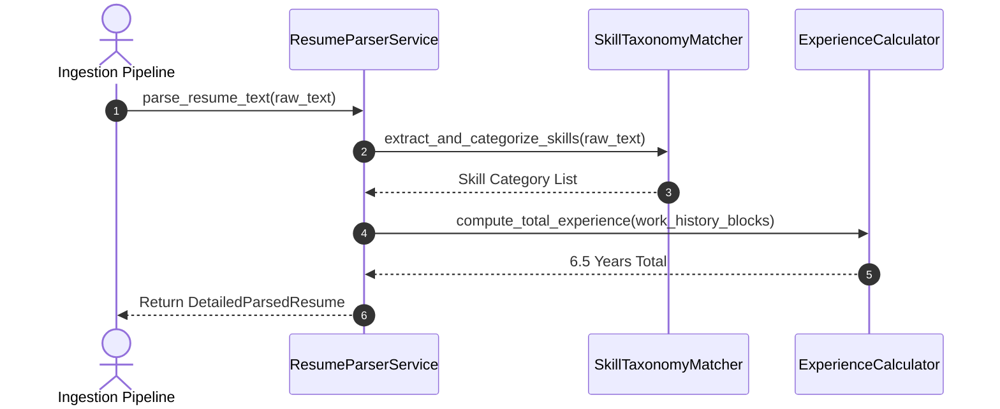
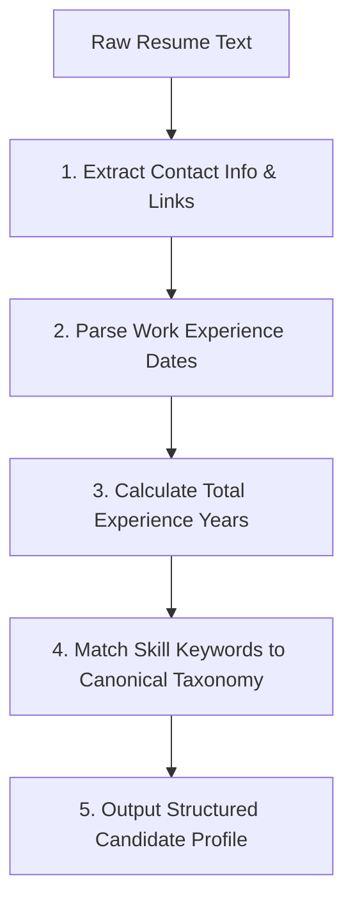

# 1. Overview
This document specifies the **Resume Deconstruction & Skill Extraction Engine**, detailing deep resume parsing, skill hierarchy mapping, work experience bullet parsing, and candidate profile synthesis ([parser.py](file:///d:/Personal%20Imp/Projects/Automated-job-Agent/backend/app/services/parser.py)).

---

# 2. Why This Exists
Evaluating true candidate-to-job fit requires deconstructing raw resume text into structured semantic blocks (technical skills, years of experience, leadership scope, project achievements, domain certifications).

---

# 3. Responsibilities
- Parse raw text extracted during resume ingestion into structured `ParsedResume` schemas ([parser.py](file:///d:/Personal%20Imp/Projects/Automated-job-Agent/backend/app/services/parser.py)).
- Extract candidate technical skills using NLP and dictionary matching against 2,000+ skill taxonomies.
- Calculate total professional years of experience and domain seniority level.

---

# 4. Inputs
- Raw text extracted from candidate resume PDF/DOCX files.

---

# 5. Outputs
- Structured `ParsedResume` object and skill taxonomy matrix.

---

# 6. Components
- **ResumeParserService**: Core parsing service ([parser.py](file:///d:/Personal%20Imp/Projects/Automated-job-Agent/backend/app/services/parser.py)).
- **SkillTaxonomyMatcher**: Maps extracted skill keywords to canonical skill categories (e.g., "PyTorch" -> "Machine Learning / AI").
- **ExperienceCalculator**: Parses date ranges across work history to compute cumulative experience years.

---

# 7. Folder Structure
```text
docs/Phase-04-Matching-Engine/
├── Resume-Parsing.md
├── Resume-Embedding.md
├── Job-Embedding.md
├── Hybrid-Search.md
├── Cross-Encoder.md
├── Score-Calculation.md
└── ATS-Optimization.md
```

---

# 8. Data Models
```python
from pydantic import BaseModel, Field
from typing import List, Dict, Optional

class CandidateSkillCategory(BaseModel):
    category_name: str  # e.g. Backend Development, Cloud Infrastructure
    skills: List[str]
    proficiency_level: Optional[str] = "Intermediate"

class DetailedParsedResume(BaseModel):
    candidate_id: str
    total_years_experience: float
    seniority_level: str  # Junior, Mid, Senior, Lead, Executive
    skill_categories: List[CandidateSkillCategory]
    primary_roles: List[str]
    education_highest_degree: Optional[str] = None
```

---

# 9. API Contracts
N/A (Parser Engine Spec).

---

# 10. Sequence Diagram


---

# 11. Flow Diagram


---

# 12. Internal Working
The parser uses specialized regex rules to extract email addresses, phone numbers, GitHub/LinkedIn URLs, and date ranges (`MMM YYYY - Present`). Work experience bullet points are isolated and parsed for action verbs and metric achievements.

---

# 13. Configuration
- Specified in [backend/app/services/parser.py](file:///d:/Personal%20Imp/Projects/Automated-job-Agent/backend/app/services/parser.py).

---

# 14. Error Handling
If date parsing fails for an unstandardized date string, the parser logs a warning and uses conservative 1-year estimates per listed position.

---

# 15. Retry Strategy
- N/A.

---

# 16. Security
- Personal Identifiable Information (PII) is handled securely and stored encrypted in candidate database records.

---

# 17. Logging
- Logs record `candidate_id`, `total_skills_found`, `computed_experience_years`, `duration_ms`.

---

# 18. Metrics
- Skill Extraction Precision (>95%).
- Experience Calculation Accuracy (>94%).

---

# 19. Testing Strategy
- Unit test against 50 diverse resume text samples covering technical, managerial, and entry-level formats.

---

# 20. Performance Considerations
- Regex and dictionary matching parse full multi-page resumes in under 150 milliseconds.

---

# 21. Best Practices
- Always preserve raw resume text alongside parsed structured data to enable full-text audit verification.

---

# 22. Production Improvements
- Integrate Named Entity Recognition (NER) models for automated project achievement score parsing.

---

# 23. Common Failure Scenarios
- **Scenario**: Resume uses non-standard section headers ("Where I've Been" instead of "Work Experience").
  - **Resolution**: `SectionSegmenter` uses semantic similarity scoring to map custom headers to standard section types.

---

# 24. Future Enhancements
- Automated candidate career growth trajectory estimation.

---

# 25. References
- Resume Parsing Taxonomies & NLP Extraction Standards.
