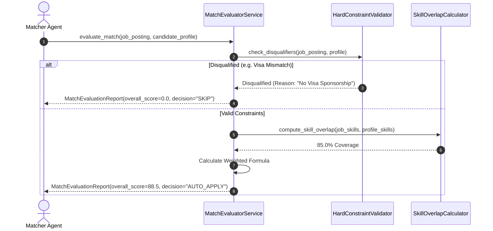
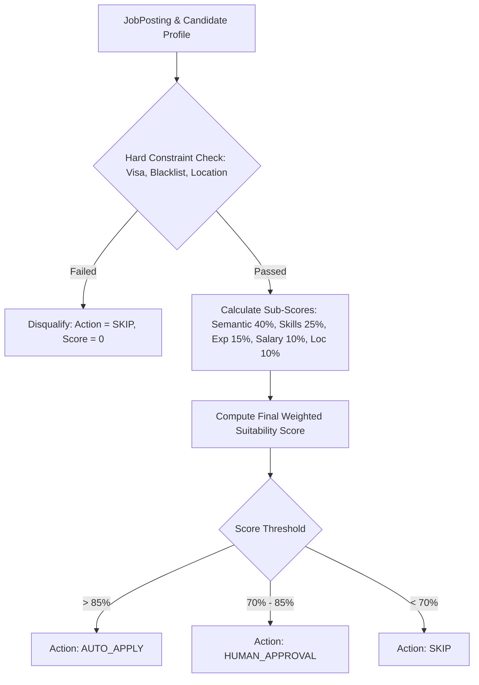

# 1. Overview
This document specifies the **Multi-Factor Match Score Calculation Engine**, detailing weighted scoring across Semantic Similarity, Technical Skill Coverage, Experience Seniority, Salary Fit, Location/Remote Policy, and Visa Sponsorship match factors ([evaluator.py](file:///d:/Personal%20Imp/Projects/Automated-job-Agent/backend/app/services/matching/evaluator.py)).

---

# 2. Why This Exists
Semantic vector similarity alone does not determine if a job application should proceed. A candidate may have a 95% semantic match but lack mandatory work visa sponsorship or fall outside salary parameters. A multi-factor scoring matrix combines semantic relevance with hard constraints to generate an overall Suitability Score (0-100%).

---

# 3. Responsibilities
- Calculate weighted sub-scores: Semantic Relevance (40%), Skill Coverage (25%), Experience Fit (15%), Salary Fit (10%), Location/Remote Fit (10%).
- Apply hard constraint disqualifiers (Visa mismatch, salary disqualification, blacklisted company).
- Output comprehensive `MatchEvaluationReport` ([evaluator.py](file:///d:/Personal%20Imp/Projects/Automated-job-Agent/backend/app/services/matching/evaluator.py)).

---

# 4. Inputs
- Cross-encoder reranked scores, candidate profile, `JobPosting` object, user preference settings.

---

# 5. Outputs
- `MatchEvaluationReport` with final suitability percentage, sub-score breakdown, and decision action (`AUTO_APPLY`, `HUMAN_APPROVAL`, `SKIP`).

---

# 6. Components
- **MatchEvaluatorService**: Core scoring service ([evaluator.py](file:///d:/Personal%20Imp/Projects/Automated-job-Agent/backend/app/services/matching/evaluator.py)).
- **SkillOverlapCalculator**: Computes exact and semantic coverage percentage of required job skills.
- **HardConstraintValidator**: Checks non-negotiable disqualifiers (visa, remote policy, blacklist).

---

# 7. Folder Structure
```text
docs/Phase-04-Matching-Engine/
└── Score-Calculation.md
```

---

# 8. Data Models
```python
from pydantic import BaseModel, Field
from typing import List, Dict, Optional

class MatchSubScores(BaseModel):
    semantic_relevance_score: float = Field(..., description="0.0 to 100.0")
    skill_coverage_score: float = Field(..., description="0.0 to 100.0")
    experience_fit_score: float = Field(..., description="0.0 to 100.0")
    salary_fit_score: float = Field(..., description="0.0 to 100.0")
    location_remote_score: float = Field(..., description="0.0 to 100.0")

class MatchEvaluationReport(BaseModel):
    job_id: str
    candidate_id: str
    overall_suitability_score: float = Field(..., description="Final score 0.0 to 100.0")
    action_decision: str = Field(..., description="AUTO_APPLY, HUMAN_APPROVAL, SKIP")
    is_disqualified: bool = False
    disqualification_reasons: List[str] = Field(default_factory=list)
    sub_scores: MatchSubScores
    missing_critical_skills: List[str] = Field(default_factory=list)
```

---

# 9. API Contracts
Match Evaluation API Result Payload:
```json
{
  "job_id": "gh_98412",
  "candidate_id": "cand_98412",
  "overall_suitability_score": 88.5,
  "action_decision": "AUTO_APPLY",
  "is_disqualified": false,
  "sub_scores": {
    "semantic_relevance_score": 92.0,
    "skill_coverage_score": 85.0,
    "experience_fit_score": 90.0,
    "salary_fit_score": 80.0,
    "location_remote_score": 90.0
  },
  "missing_critical_skills": ["Kubernetes"]
}
```

---

# 10. Sequence Diagram


---

# 11. Flow Diagram


---

# 12. Internal Working
Final score formula: $Score = (0.40 \cdot Semantic) + (0.25 \cdot Skill) + (0.15 \cdot Exp) + (0.10 \cdot Salary) + (0.10 \cdot Loc)$. If any hard constraint fails, `is_disqualified` is set to `True`, triggering immediate `SKIP`.

---

# 13. Configuration
- Specified in [backend/app/services/matching/evaluator.py](file:///d:/Personal%20Imp/Projects/Automated-job-Agent/backend/app/services/matching/evaluator.py).
- Auto-Apply Score Threshold: `AUTO_APPLY_SCORE_THRESHOLD = 85.0`
- Human Approval Threshold: `HUMAN_APPROVAL_SCORE_THRESHOLD = 70.0`

---

# 14. Error Handling
Missing optional profile metadata defaults to neutral 75.0% sub-scores to prevent unwarranted job disqualifications.

---

# 15. Retry Strategy
- N/A.

---

# 16. Security
- Blacklisted company domain checking prevents applying to candidate's current employer or explicitly restricted organizations.

---

# 17. Logging
- Evaluation logs record `job_id`, `candidate_id`, `overall_score`, `decision`, `disqualification_reasons`.

---

# 18. Metrics
- Match Evaluation Accuracy (>93%).
- Evaluation Latency (<15ms per candidate-job pair).

---

# 19. Testing Strategy
- Unit test score evaluation against a test matrix of 20 candidate profiles and job postings with varied parameters.

---

# 20. Performance Considerations
- Multi-factor evaluation runs in-memory using compiled Python arithmetic, completing in under 15 milliseconds.

---

# 21. Best Practices
- Always check `is_disqualified` before evaluating sub-score metrics.

---

# 22. Production Improvements
- Build an interactive weight tuning UI allowing candidates to adjust priority sliders (e.g. increase salary weight).

---

# 23. Common Failure Scenarios
- **Scenario**: Job posting does not explicitly mention salary range.
  - **Resolution**: `SalaryFit` module returns neutral 100% score to avoid penalizing unlisted salary packages.

---

# 24. Future Enhancements
- Integrate machine learning model predicting candidate interview callback probability based on historical application outcomes.

---

# 25. References
- Decision Matrix Evaluation Standards & Weighted Scoring Algorithms.
