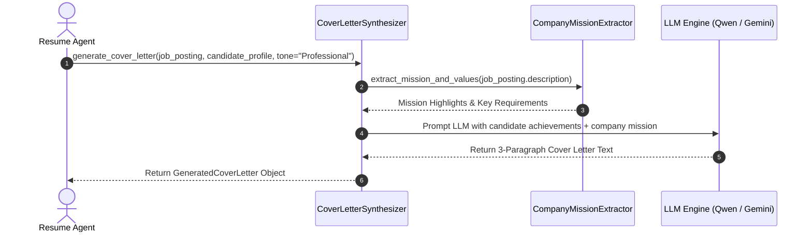
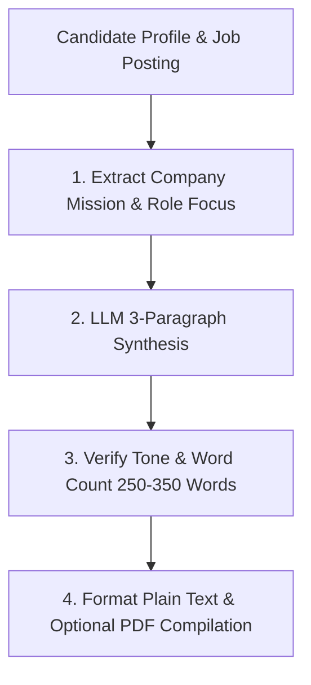

# 1. Overview
This document specifies the **Dynamic Cover Letter Synthesis Engine**, detailing personalized cover letter generation, tone customization, company mission alignment, and text/PDF formatting.

---

# 2. Why This Exists
Many job applications (particularly at tech startups, creative agencies, and leadership positions) require a custom cover letter. Synthesizing concise, professional, company-aligned cover letters increases candidate application quality.

---

# 3. Responsibilities
- Synthesize 3-paragraph tailored cover letters connecting candidate achievements to target company mission.
- Support tone customization (Professional, Enthusiastic, Technical, Executive).
- Output formatted plain-text and compiled PDF cover letter artifacts.

---

# 4. Inputs
- Candidate profile, `JobPosting` object, desired tone setting.

---

# 5. Outputs
- Formatted cover letter text string and optional PDF artifact path (`storage/tailored_resumes/<cand_id>_<job_id>_cover_letter.pdf`).

---

# 6. Components
- **CoverLetterSynthesizer**: Core LLM generation service.
- **CompanyMissionExtractor**: Extracts company core values and team focus from job postings.
- **CoverLetterPDFCompiler**: Formats text into professional PDF documents.

---

# 7. Folder Structure
```text
docs/Phase-05-Resume-Intelligence/
└── Cover-Letter-Generation.md
```

---

# 8. Data Models
```python
from pydantic import BaseModel, Field
from typing import Optional

class GeneratedCoverLetter(BaseModel):
    job_id: str
    candidate_id: str
    company_name: str
    cover_letter_text: str
    pdf_path: Optional[str] = None
    tone: str = "Professional"
    word_count: int
```

---

# 9. API Contracts
Cover Letter Synthesis API Endpoint Payload:
```json
{
  "endpoint": "/api/v1/resume/cover-letter",
  "method": "POST",
  "request": {
    "job_id": "gh_98412",
    "tone": "Professional"
  },
  "response": {
    "status": "Success",
    "word_count": 280,
    "cover_letter_text": "Dear Hiring Manager at Acme Corp,\n\nI am writing to express my strong interest..."
  }
}
```

---

# 10. Sequence Diagram


---

# 11. Flow Diagram


---

# 12. Internal Working
The cover letter follows a structured 3-paragraph template:
- **Paragraph 1**: Hook & specific role/company excitement.
- **Paragraph 2**: Relevant technical achievements matching top 2 job requirements.
- **Paragraph 3**: Call to action and professional closing.

---

# 13. Configuration
- Target Word Count Range: `250 - 350 words`
- Default Tone: `"Professional"`

---

# 14. Error Handling
If LLM generation returns excessive length (>450 words), `CoverLetterSynthesizer` automatically executes a compression pass.

---

# 15. Retry Strategy
- LLM generation retries up to 2 times on API timeouts.

---

# 16. Security
- Cover letter text is sanitized to prevent prompt injection payload inclusion.

---

# 17. Logging
- Logs record `job_id`, `company_name`, `word_count`, `generation_duration_ms`.

---

# 18. Metrics
- Cover Letter Generation Speed (<1.8s).

---

# 19. Testing Strategy
- Unit test generation against diverse company job descriptions to verify tone accuracy and word count boundaries.

---

# 20. Performance Considerations
- Streaming LLM outputs reduces perceived latency in frontend UI.

---

# 21. Best Practices
- Keep cover letters concise; recruiters spend less than 30 seconds scanning cover letters.

---

# 22. Production Improvements
- Add candidate custom paragraph template overrides.

---

# 23. Common Failure Scenarios
- **Scenario**: Job posting lacks company background details.
  - **Resolution**: Extractor defaults to role-focused achievements without hallucinating unverified company facts.

---

# 24. Future Enhancements
- Auto-customize cover letter address to specific hiring manager name when detected.

---

# 25. References
- Modern Technical Recruitment Cover Letter Best Practices.
