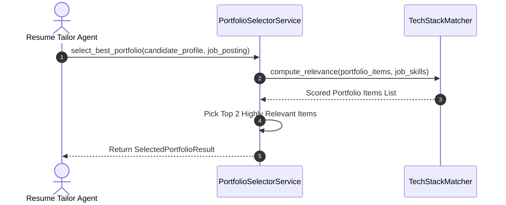
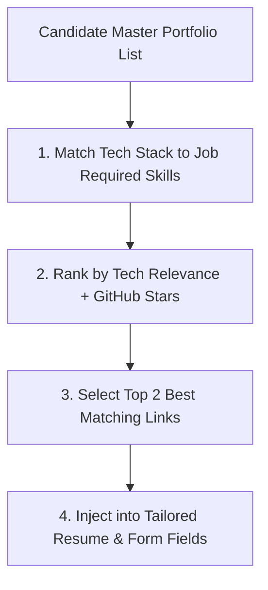

# 1. Overview
This document specifies the **Dynamic Portfolio & GitHub Repository Selection Subsystem**, detailing candidate code repository ranking, portfolio link selection, and relevance scoring matching target job postings.

---

# 2. Why This Exists
Engineers often maintain multiple GitHub repositories, live demo links, and portfolio projects. Including irrelevant project links in job applications distracts recruiters. Selecting the top 2-3 most relevant repositories for a specific job posting maximizes candidate technical credibility.

---

# 3. Responsibilities
- Index candidate GitHub repositories, live demo URLs, and project descriptions.
- Calculate semantic relevance between project tech stacks and target job requirements.
- Select top 2-3 portfolio links for inclusion in tailored resumes and application fields.

---

# 4. Inputs
- Candidate portfolio repository list from master profile, `JobPosting` object.

---

# 5. Outputs
- Ranked list of target portfolio links with relevance scores.

---

# 6. Components
- **PortfolioSelectorService**: Core project matching engine.
- **TechStackMatcher**: Matches repository topics/languages (e.g. Python, Docker, PyTorch) to job requirements.

---

# 7. Folder Structure
```text
docs/Phase-05-Resume-Intelligence/
└── Portfolio-Selection.md
```

---

# 8. Data Models
```python
from pydantic import BaseModel, HttpUrl
from typing import List, Optional

class CandidatePortfolioItem(BaseModel):
    title: str
    description: str
    tech_stack: List[str]
    url: str
    github_stars: Optional[int] = 0

class SelectedPortfolioResult(BaseModel):
    job_id: str
    selected_items: List[CandidatePortfolioItem]
    relevance_rationale: str
```

---

# 9. API Contracts
N/A (Subsystem Spec).

---

# 10. Sequence Diagram


---

# 11. Flow Diagram


---

# 12. Internal Working
The selection algorithm scores repositories based on exact skill overlap (60%), semantic description relevance (30%), and repository popularity/stars (10%).

---

# 13. Configuration
- Max Selected Links: `MAX_PORTFOLIO_LINKS = 2`

---

# 14. Error Handling
If no candidate portfolio items match job tech stack, the selector returns the candidate's primary GitHub profile URL.

---

# 15. Retry Strategy
- N/A.

---

# 16. Security
- Repository URLs are checked to ensure valid HTTPS protocol formatting.

---

# 17. Logging
- Logs record `job_id`, `candidate_id`, `selected_repos_count`, `top_match_score`.

---

# 18. Metrics
- Portfolio Selection Accuracy (>92%).

---

# 19. Testing Strategy
- Unit test selection algorithm against sample portfolio lists and job descriptions.

---

# 20. Performance Considerations
- Portfolio ranking completes in under 5 milliseconds using in-memory set intersections.

---

# 21. Best Practices
- Never include private/broken repository links in candidate job applications.

---

# 22. Production Improvements
- Implement automatic GitHub API sync fetching repository star counts and primary languages.

---

# 23. Common Failure Scenarios
- **Scenario**: Candidate has zero listed portfolio projects.
  - **Resolution**: Selector skips portfolio section gracefully without throwing errors.

---

# 24. Future Enhancements
- Live URL health check verifying portfolio website availability before submission.

---

# 25. References
- Candidate Portfolio Optimization Benchmarks.
