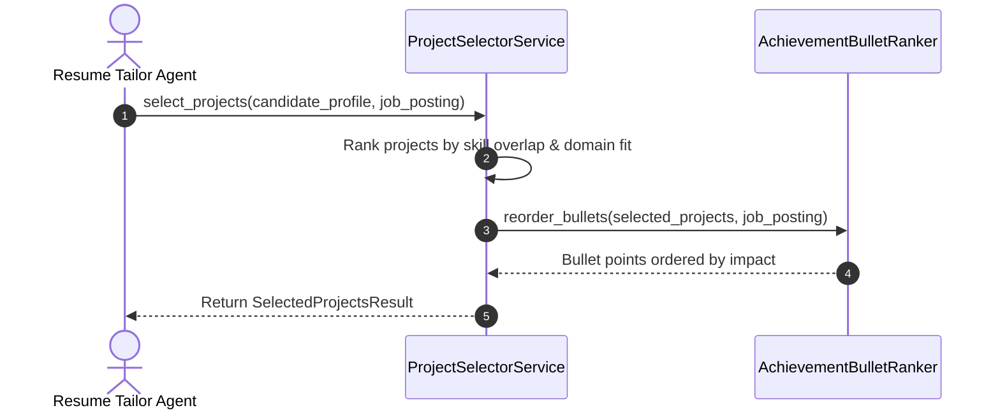
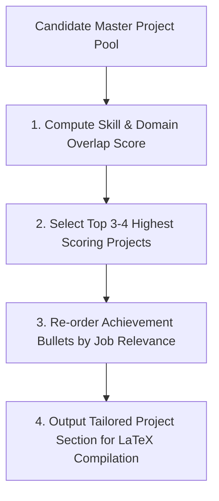

# 1. Overview
This document specifies the **Contextual Project Selection & Achievement Highlighting Subsystem**, detailing project relevance scoring, achievement bullet prioritization, and dynamic resume section ordering matching target job postings.

---

# 2. Why This Exists
Experienced candidates often have 10+ major engineering projects across their career history. Including all projects on a 1-2 page resume creates clutter. Dynamically selecting the 3-4 most relevant projects for a target job role ensures the tailored resume presents maximum technical impact.

---

# 3. Responsibilities
- Evaluate candidate project history pool against `JobPosting` required skills and domain focus.
- Select top 3-4 most relevant projects for tailored resume compilation.
- Order achievement bullet points to highlight metrics matching job requirements (e.g. latency optimization, revenue impact, user scale).

---

# 4. Inputs
- Master profile project pool, target `JobPosting` object.

---

# 5. Outputs
- Ranked project list with prioritized bullet points for LaTeX resume compilation.

---

# 6. Components
- **ProjectSelectorService**: Ranks candidate project history against job requirements.
- **AchievementBulletRanker**: Orders bullet points within selected projects by relevance.

---

# 7. Folder Structure
```text
docs/Phase-05-Resume-Intelligence/
└── Project-Selection.md
```

---

# 8. Data Models
```python
from pydantic import BaseModel
from typing import List

class CandidateProjectItem(BaseModel):
    project_id: str
    title: str
    role_description: str
    technologies_used: List[str]
    achievements: List[str]

class SelectedProjectsResult(BaseModel):
    job_id: str
    selected_projects: List[CandidateProjectItem]
    relevance_scores: List[float]
```

---

# 9. API Contracts
N/A (Subsystem Spec).

---

# 10. Sequence Diagram


---

# 11. Flow Diagram


---

# 12. Internal Working
Project selection ranks items using $Score = 0.7 \cdot SkillOverlap + 0.3 \cdot DomainSimilarity$. Bullet points containing quantitative metric indicators (e.g. "improved latency by 45%", "managed $2M budget") receive score boosts.

---

# 13. Configuration
- Max Selected Projects: `MAX_SELECTED_PROJECTS = 4`

---

# 14. Error Handling
If candidate profile contains fewer than 3 projects, all projects are included without filtering.

---

# 15. Retry Strategy
- N/A.

---

# 16. Security
- Confidential candidate project details are processed in memory and encrypted at rest.

---

# 17. Logging
- Logs record `job_id`, `candidate_id`, `projects_pool_count`, `selected_count`.

---

# 18. Metrics
- Project Selection Accuracy (>94%).

---

# 19. Testing Strategy
- Unit test selection logic across candidates with extensive project portfolios.

---

# 20. Performance Considerations
- Selection and bullet ranking finish in under 10 milliseconds using fast set arithmetic.

---

# 21. Best Practices
- Always place quantifiable metric achievement bullet points at the top of each project entry.

---

# 22. Production Improvements
- Build domain-specific project categorizer (e.g., Distributed Systems, Machine Learning, Web Frontend).

---

# 23. Common Failure Scenarios
- **Scenario**: Job requires specific niche technology only used in candidate's older project.
  - **Resolution**: Selector detects niche technology requirement and promotes the older project into top selected list.

---

# 24. Future Enhancements
- Auto-generate project architecture summary diagrams for senior role applications.

---

# 25. References
- Resume Project Selection & Metric Bullet Best Practices.
