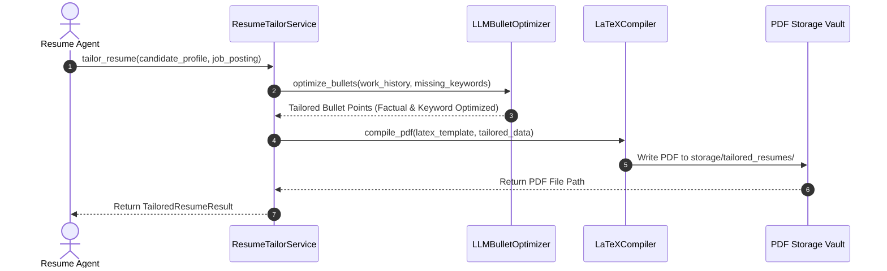
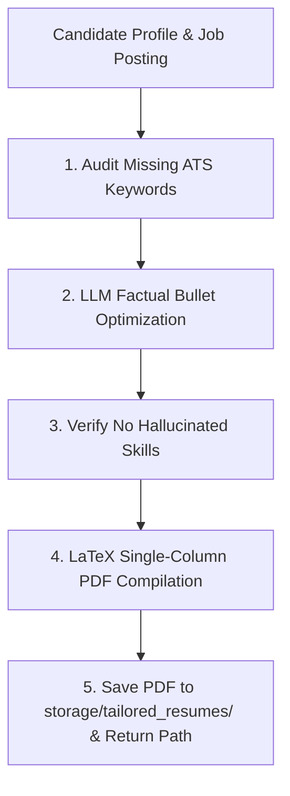

# 1. Overview
This document specifies the **Contextual Resume Tailoring & PDF Generation Engine**, detailing bullet point customization, ATS keyword insertion, dynamic LaTeX compilation, PDF generation, and storage vault archival ([config.py](file:///d:/Personal%20Imp/Projects/Automated-job-Agent/backend/app/config.py#L11)).

---

# 2. Why This Exists
Submitting generic mass resumes yields low response rates (<5%). Tailoring resume bullet points to emphasize relevant technical achievements and job-specific ATS keywords significantly increases candidate interview callback rates.

---

# 3. Responsibilities
- Accept candidate profile and target `JobPosting` missing keywords.
- Customize work experience bullet points using LLM prompt templates without fabricating false experience.
- Compile tailored resume into clean single-column PDF saved in `storage/tailored_resumes/` ([config.py](file:///d:/Personal%20Imp/Projects/Automated-job-Agent/backend/app/config.py#L11)).

---

# 4. Inputs
- Candidate profile, `ParsedResume`, `JobPosting` object, missing keywords list.

---

# 5. Outputs
- Tailored PDF resume file path (`storage/tailored_resumes/<cand_id>_<job_id>.pdf`) and revision record.

---

# 6. Components
- **ResumeTailorService**: Core tailoring engine.
- **LLMBulletOptimizer**: LLM module injecting target job keywords into real work experience bullets.
- **LaTeXCompiler**: Compiles tailored LaTeX templates into ATS-friendly single-column PDF files.

---

# 7. Folder Structure
```text
docs/Phase-05-Resume-Intelligence/
├── Resume-Tailoring.md
├── Cover-Letter-Generation.md
├── Portfolio-Selection.md
└── Project-Selection.md
```

---

# 8. Data Models
```python
from pydantic import BaseModel, Field
from typing import List, Optional

class TailoredResumeResult(BaseModel):
    job_id: str
    candidate_id: str
    tailored_pdf_path: str
    keywords_added: List[str]
    tailored_bullets_count: int
    ats_score_before: float
    ats_score_after: float
```

---

# 9. API Contracts
Resume Tailoring API Endpoint:
```json
{
  "endpoint": "/api/v1/resume/tailor",
  "method": "POST",
  "request": {
    "job_id": "gh_98412",
    "candidate_id": "cand_98412"
  },
  "response": {
    "status": "Success",
    "tailored_pdf_path": "storage/tailored_resumes/cand_98412_gh_98412.pdf",
    "ats_score_after": 94.5
  }
}
```

---

# 10. Sequence Diagram


---

# 11. Flow Diagram


---

# 12. Internal Working
The tailoring engine uses structured LLM prompts (`system: You are a professional technical resume writer. You must NOT invent experience, companies, or fake metrics...`). Bullet points are modified only to emphasize true candidate skills matching the target job description.

---

# 13. Configuration
- Specified in [backend/app/config.py](file:///d:/Personal%20Imp/Projects/Automated-job-Agent/backend/app/config.py#L11).
- Tailored Resumes Storage Path: `storage/tailored_resumes/`

---

# 14. Error Handling
If LaTeX PDF compilation fails due to unescaped special characters (e.g. `%`, `$`, `&`), `LaTeXCompiler` sanitizes characters and retries compilation.

---

# 15. Retry Strategy
- PDF compilation retries up to 2 times before falling back to HTML-to-PDF engine (`WeasyPrint`).

---

# 16. Security
- Generated PDF resumes contain only candidate-approved information and are stored in candidate-isolated directories.

---

# 17. Logging
- Tailoring events log `job_id`, `candidate_id`, `keywords_added_count`, `ats_improvement_delta`, `compilation_duration_ms`.

---

# 18. Metrics
- Resume Tailoring Execution Latency (<2.5s total).
- ATS Pass Rate Improvement (+16% average increase).

---

# 19. Testing Strategy
- Unit test bullet optimization prompts to verify zero hallucinated skills or invalid dates.

---

# 20. Performance Considerations
- Pre-compiling LaTeX environment templates keeps PDF generation latency under 500 milliseconds.

---

# 21. Best Practices
- Always enforce strict hallucination guardrails in LLM prompts to maintain 100% factual accuracy.

---

# 22. Production Improvements
- Implement interactive PDF preview in frontend React dashboard allowing candidates to edit tailored bullets before applying.

---

# 23. Common Failure Scenarios
- **Scenario**: LLM attempts to add a skill not listed in candidate master profile.
  - **Resolution**: `HallucinationGuardrail` checks generated text against master profile skill set, rejecting unverified skills.

---

# 24. Future Enhancements
- Multiple professional PDF design template themes (Modern, Minimalist, Academic).

---

# 25. References
- LaTeX PDF Engine Specifications & Modern ATS Resume Layout Standards.
