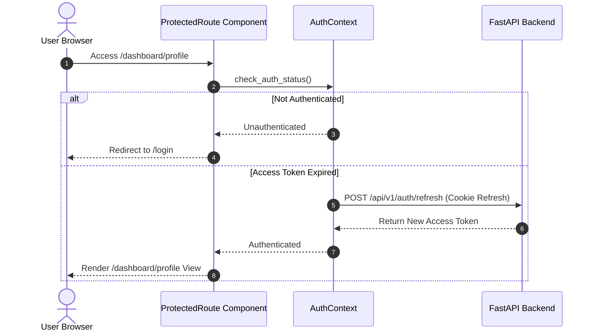
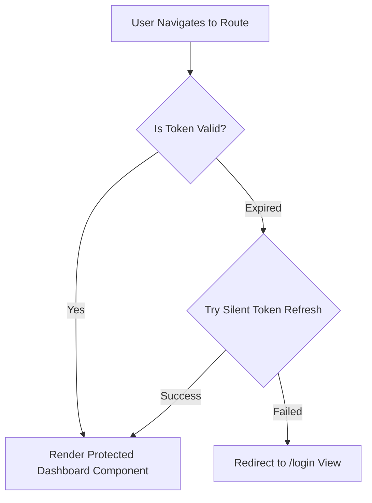

# 1. Overview
This document specifies the **Frontend Authentication Flow & Protected Route Guards**, detailing candidate sign-in, OAuth redirects, JWT Bearer token injection, automatic token refresh, and route protection.

---

# 2. Why This Exists
Candidate dashboard pages (profile settings, application history, credential vault) contain private candidate data. Enforcing strict frontend route guards prevents unauthenticated users from accessing protected views.

---

# 3. Responsibilities
- Handle login form submission, OAuth redirect handoffs, and token acquisition.
- Intercept HTTP API requests to attach `Authorization: Bearer <token>` headers.
- Automatically execute refresh token flow on HTTP 401 response intercept.

---

# 4. Inputs
- User login credentials, OAuth callback tokens, HTTP response status codes.

---

# 5. Outputs
- Authenticated candidate user session and protected route rendering.

---

# 6. Components
- **AuthService**: Axios / Fetch API wrapper handling authentication endpoints.
- **ProtectedRoute**: React wrapper component guarding private routes.
- **TokenRefreshInterceptor**: Axios / Fetch interceptor managing silent token refresh.

---

# 7. Folder Structure
```text
docs/Phase-05A-Frontend/
└── Authentication-Flow.md
```

---

# 8. Data Models
```typescript
export interface AuthState {
  isAuthenticated: boolean;
  user: {
    id: string;
    email: string;
    fullName: string;
  } | null;
  accessToken: string | null;
  isLoading: boolean;
}
```

---

# 9. API Contracts
Frontend Authentication Interceptor Logic:
```typescript
// Interceptor automatically appends Bearer JWT
apiClient.interceptors.request.use((config) => {
  const token = getAccessToken();
  if (token) {
    config.headers.Authorization = `Bearer ${token}`;
  }
  return config;
});
```

---

# 10. Sequence Diagram


---

# 11. Flow Diagram


---

# 12. Internal Working
When an access token expires (15-minute lifespan), the Axios response interceptor catches the 401 status, pauses pending API requests, calls `/api/v1/auth/refresh`, updates the token in `AuthContext`, and replays original requests transparently.

---

# 13. Configuration
- Token Refresh Margin: `REFRESH_THRESHOLD_SECONDS = 60`

---

# 14. Error Handling
Failed token refresh clears user state and redirects to `/login?expired=true` with a clear user notification.

---

# 15. Retry Strategy
- Silent token refresh retries 1 time before declaring session expired.

---

# 16. Security
- Tokens are stored in memory and refreshed using `HttpOnly` secure cookies to prevent XSS credential theft.

---

# 17. Logging
- Auth flow logs record `login_success`, `token_refreshed`, `logout`, and `session_expired` events.

---

# 18. Metrics
- Auth Token Refresh Latency (<120ms).

---

# 19. Testing Strategy
- Unit test route guards and token refresh interceptor using Vitest mock responses.

---

# 20. Performance Considerations
- Silent background refresh prevents jarring page reloads or user login prompts mid-session.

---

# 21. Best Practices
- Never store raw passwords or long-lived secret tokens in `localStorage` or `sessionStorage`.

---

# 22. Production Improvements
- Add multi-factor authentication (MFA) OTP verification modal component.

---

# 23. Common Failure Scenarios
- **Scenario**: User opens 5 browser tabs simultaneously; all 5 attempt token refresh at once.
  - **Resolution**: Interceptor implements token refresh queuing to execute only 1 network refresh call for all tabs.

---

# 24. Future Enhancements
- Biometric WebAuthn passkey login support.

---

# 25. References
- OAuth 2.0 Token Refresh & SPA Security Best Practices.
