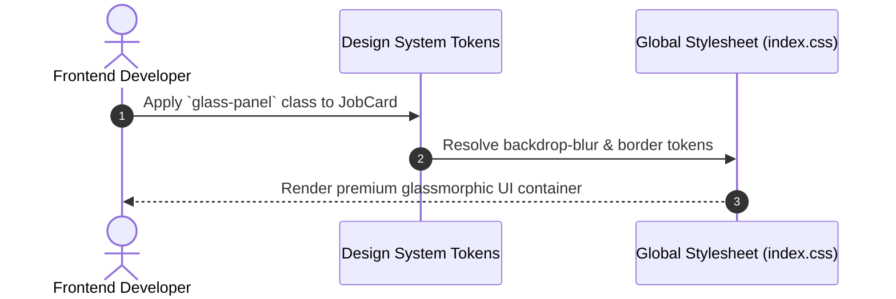
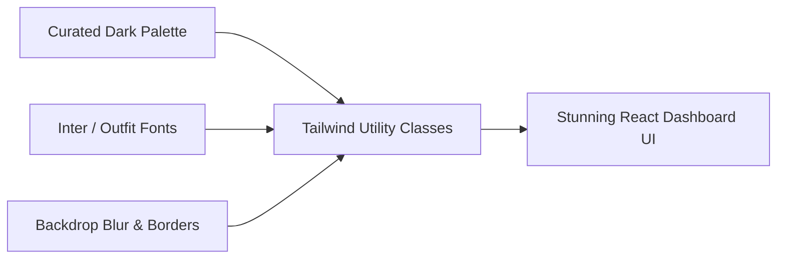

# 1. Overview
This document specifies the **Design System & Aesthetics Guidelines**, detailing the dark mode palette, glassmorphism visual effects, typography, micro-animations, and TailwindCSS design tokens ([index.css](file:///d:/Personal%20Imp/Projects/Automated-job-Agent/frontend/src/index.css)).

---

# 2. Why This Exists
Enterprise software should provide a stunning visual experience. Establishing a cohesive design system (curated dark mode palette, glassmorphism backdrop blurs, vibrant gradient accents, micro-animations) ensures the candidate frontend looks state-of-the-art.

---

# 3. Responsibilities
- Specify color palettes (Slate, Indigo, Emerald, Amber, Rose).
- Define glassmorphism CSS utilities (`backdrop-blur-md`, semi-transparent borders).
- Define typography scale (Google Fonts: Inter / Outfit).
- Specify hover states, micro-transitions, and active animations.

---

# 4. Inputs
- TailwindCSS configuration and global stylesheet ([index.css](file:///d:/Personal%20Imp/Projects/Automated-job-Agent/frontend/src/index.css)).

---

# 5. Outputs
- Unified design system tokens applied across all React components.

---

# 6. Components
- **Color Tokens**: Dark Background (`#0F172A`), Surface Card (`#1E293B` with `bg-opacity-60`), Accent Primary (`#6366F1` Indigo), Success (`#10B981` Emerald), Warning (`#F59E0B` Amber), Error (`#EF4444` Rose).
- **Glassmorphism Utility**: `backdrop-blur-lg bg-slate-900/60 border border-slate-700/50 shadow-xl`.
- **Typography Scale**: Sans-serif (`Inter`, `Outfit`), Code/Mono (`JetBrains Mono`).

---

# 7. Folder Structure
```text
docs/Phase-05A-Frontend/
└── Design-System.md
```

---

# 8. Data Models
```css
/* Core Design Tokens in index.css */
@layer utilities {
  .glass-panel {
    background-color: rgba(15, 23, 42, 0.65);
    backdrop-filter: blur(12px);
    border: 1px solid rgba(255, 255, 255, 0.08);
  }

  .gradient-text {
    background: linear-gradient(135deg, #6366F1 0%, #A855F7 100%);
    -webkit-background-clip: text;
    -webkit-text-fill-color: transparent;
  }
}
```

---

# 9. API Contracts
N/A (Design System Specification).

---

# 10. Sequence Diagram


---

# 11. Flow Diagram


---

# 12. Internal Working
Design tokens are configured in TailwindCSS and `index.css`. Glassmorphism uses GPU-accelerated CSS `backdrop-filter: blur(...)` to maintain 60 FPS animation performance.

---

# 13. Configuration
- Specified in [frontend/src/index.css](file:///d:/Personal%20Imp/Projects/Automated-job-Agent/frontend/src/index.css).

---

# 14. Error Handling
- N/A.

---

# 15. Retry Strategy
- N/A.

---

# 16. Security
- N/A.

---

# 17. Logging
- N/A.

---

# 18. Metrics
- UI Frame Rate (Constant 60 FPS during scrolling and modal transitions).

---

# 19. Testing Strategy
- Visual regression tests verify component rendering across Chrome, Firefox, and Safari viewports.

---

# 20. Performance Considerations
- GPU-accelerated CSS transforms (`transform: translateZ(0)`) keep micro-animations smooth.

---

# 21. Best Practices
- Never use generic raw red (`#FF0000`) or blue (`#0000FF`); use curated HSL palette tokens (`rose-500`, `indigo-500`).

---

# 22. Production Improvements
- Automated dark/light theme tokens generation.

---

# 23. Common Failure Scenarios
- **Scenario**: Safari browser drops backdrop-filter rendering.
  - **Resolution**: Include `-webkit-backdrop-filter` fallback in global stylesheet.

---

# 24. Future Enhancements
- Customizable dashboard color theme builder for candidate personalization.

---

# 25. References
- Modern Web Aesthetics & Glassmorphism Design Guidelines.
