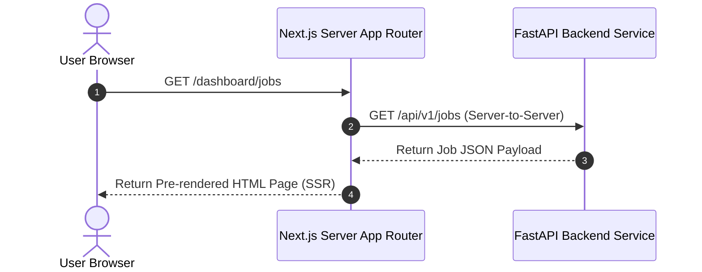
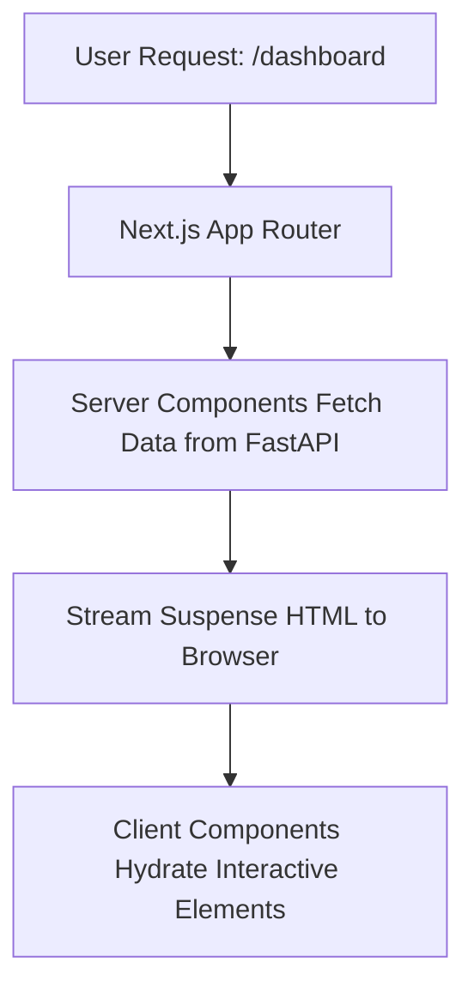

# 1. Overview
This document specifies the **Next.js App Router Enterprise Architecture**, detailing server-side rendering (SSR), server components, API route proxies, layout hierarchies, and dynamic streaming page rendering.

---

# 2. Why This Exists
While SPA React apps work well for simple dashboards, enterprise candidate platforms require server-side rendering (SSR), instant page loads, dynamic OpenGraph metadata generation, secure server-side API proxying, and streaming UI components.

---

# 3. Responsibilities
- Implement Next.js 14+ App Router directory conventions (`app/`).
- Provide server-rendered candidate dashboard pages and server actions for secure mutation dispatches.
- Stream LLM resume tailoring and application execution progress using Server-Sent Events (SSE).

---

# 4. Inputs
- Candidate browser requests, Next.js page params, backend FastAPI endpoints.

---

# 5. Outputs
- Server-rendered HTML pages, streaming React Server Component (RSC) UI updates.

---

# 6. Components
- **App Router Directory**: `app/(dashboard)/`, `app/(auth)/`, `app/api/`.
- **Server Actions**: Asynchronous server mutation handlers.
- **API Proxy Middleware**: Routes requests securely to FastAPI backend.

---

# 7. Folder Structure
```text
docs/Phase-05A-Frontend/
└── NextJS-App-Router.md
```

---

# 8. Data Models
```typescript
export interface ServerPageProps {
  params: { [key: string]: string };
  searchParams: { [key: string]: string | string[] | undefined };
}
```

---

# 9. API Contracts
Next.js Server Action Mutation Contract:
```typescript
'use server';

export async function triggerCampaignAction(formData: FormData) {
  // Server-side execution proxying to FastAPI backend
}
```

---

# 10. Sequence Diagram


---

# 11. Flow Diagram


---

# 12. Internal Working
Next.js Server Components fetch data directly from the FastAPI backend on the server side, eliminating CORS issues and hiding backend API keys from client browser JavaScript inspection.

---

# 13. Configuration
- Specified in `next.config.js`.
- Target Runtime: Node.js 18+ Edge / Serverless.

---

# 14. Error Handling
- Use `error.tsx` boundary files to catch server-side rendering errors gracefully.

---

# 15. Retry Strategy
- Server-side fetch calls retry up to 2 times with 500ms backoff on backend connection drops.

---

# 16. Security
- Sensitive OAuth secrets and backend service tokens remain server-side and are never exposed to client bundles.

---

# 17. Logging
- Server-side request events log rendering latency and backend API status codes.

---

# 18. Metrics
- First Contentful Paint (FCP < 0.6s).
- Time to Interactive (TTI < 1.0s).

---

# 19. Testing Strategy
- End-to-end tests run using Playwright for Web against Next.js build output.

---

# 20. Performance Considerations
- React Server Components reduce client JS bundle size by up to 60%.

---

# 21. Best Practices
- Keep client components (`'use client'`) at the leaf nodes of the component tree to maximize server rendering.

---

# 22. Production Improvements
- Deploy Next.js build on Vercel / AWS CloudFront edge network.

---

# 23. Common Failure Scenarios
- **Scenario**: FastAPI backend service restarting during SSR page fetch.
  - **Resolution**: Next.js `loading.tsx` skeleton UI renders while server fetch retries connection.

---

# 24. Future Enhancements
- Incremental Static Re-generation (ISR) for static company profile pages.

---

# 25. References
- Next.js Official App Router Documentation.
