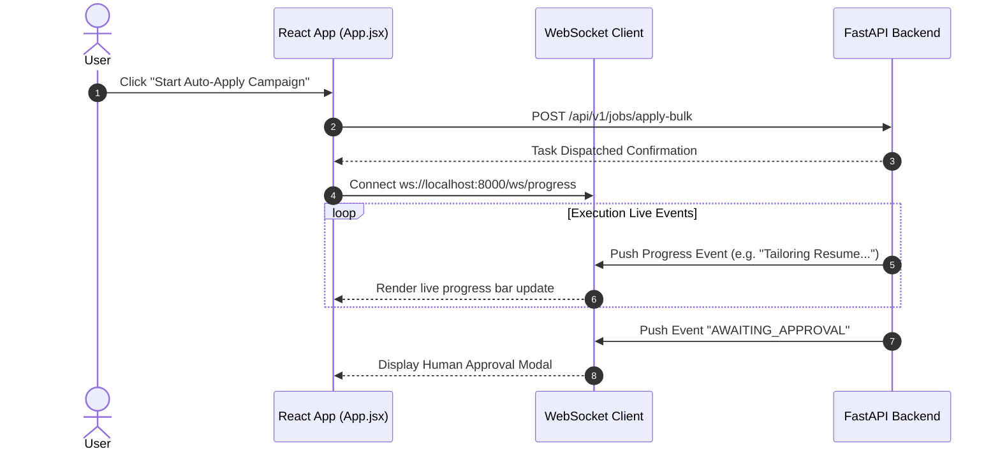
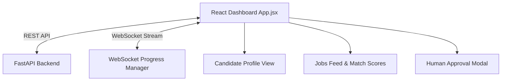

# 1. Overview
This document specifies the **React 18 & Frontend Application Architecture**, detailing modular component design, client-side routing, state management, API integration, and real-time WebSocket progress updates ([App.jsx](file:///d:/Personal%20Imp/Projects/Automated-job-Agent/frontend/src/App.jsx)).

---

# 2. Why This Exists
The candidate user interface requires real-time state synchronization, interactive application progress displays, candidate profile management, match score visualization, and human-in-the-loop approval modal popups. Structuring a modern React frontend ensures high performance and clean component reuse.

---

# 3. Responsibilities
- Render candidate dashboard UI for job discovery, matching, and application control ([App.jsx](file:///d:/Personal%20Imp/Projects/Automated-job-Agent/frontend/src/App.jsx)).
- Maintain WebSocket connection to backend API for live Playwright progress updates.
- Display human-in-the-loop (HITL) approval popups for flagged application fields.

---

# 4. Inputs
- REST API endpoints and real-time WebSocket event streams from FastAPI backend.

---

# 5. Outputs
- Interactive web user interface rendered in candidate web browser.

---

# 6. Components
- **App Core**: Main application container component ([App.jsx](file:///d:/Personal%20Imp/Projects/Automated-job-Agent/frontend/src/App.jsx)).
- **Dashboard View**: Job discovery, matching feed, and application status table.
- **Profile View**: Master candidate profile editor and resume PDF uploader.
- **HITL Modal Component**: Human approval intercept modal.

---

# 7. Folder Structure
```text
docs/Phase-05A-Frontend/
├── React-Architecture.md
├── NextJS-App-Router.md
├── UI-Components.md
├── Design-System.md
├── State-Management.md
├── Authentication-Flow.md
└── Streaming-UI.md
```

---

# 8. Data Models
```typescript
export interface JobPostingUI {
  id: string;
  title: string;
  company: string;
  location: string;
  is_remote: boolean;
  match_score: number;
  status: 'DISCOVERED' | 'MATCHED' | 'TAILORING' | 'AWAITING_APPROVAL' | 'APPLYING' | 'COMPLETED' | 'FAILED';
  url: string;
  platform: string;
}
```

---

# 9. API Contracts
Frontend REST / WebSocket Connection Specifications:
```json
{
  "api_base_url": "http://localhost:8000/api/v1",
  "websocket_url": "ws://localhost:8000/ws/progress",
  "protocol": "JSON over WS"
}
```

---

# 10. Sequence Diagram


---

# 11. Flow Diagram


---

# 12. Internal Working
The application uses Vite for fast hot-module replacement (HMR). State is managed via React Context and Hooks. Real-time updates update local state arrays without full-page re-renders.

---

# 13. Configuration
- Specified in `frontend/vite.config.js` and `.env`.
- API Port: `8000`

---

# 14. Error Handling
Network request errors trigger toast notifications and automatic WebSocket reconnect routines.

---

# 15. Retry Strategy
- WebSocket client automatically reconnects with exponential backoff (1s, 2s, 4s, 8s) upon disconnection.

---

# 16. Security
- Session JWT tokens are stored securely in memory or `HttpOnly` cookies to prevent XSS theft.

---

# 17. Logging
- Frontend console logging is managed via standard logger utility; debug logs are disabled in production builds.

---

# 18. Metrics
- Core Web Vitals (LCP < 1.2s, FID < 50ms, CLS < 0.05).

---

# 19. Testing Strategy
- Run Component tests using Vitest and React Testing Library.

---

# 20. Performance Considerations
- React 18 concurrent rendering and component lazy-loading keep initial bundle size under 250KB.

---

# 21. Best Practices
- Keep components small, modular, and styled using utility design tokens.

---

# 22. Production Improvements
- Migrate production frontend to Next.js App Router for server-side rendering (SSR) and SEO performance.

---

# 23. Common Failure Scenarios
- **Scenario**: WebSocket drops while background application worker is filling form.
  - **Resolution**: Frontend falls back to polling `/api/v1/applications/status` every 3 seconds until WS reconnects.

---

# 24. Future Enhancements
- Mobile-responsive PWA (Progressive Web App) offline caching support.

---

# 25. References
- React 18 Official Documentation & Vite Build Tools Specifications.
