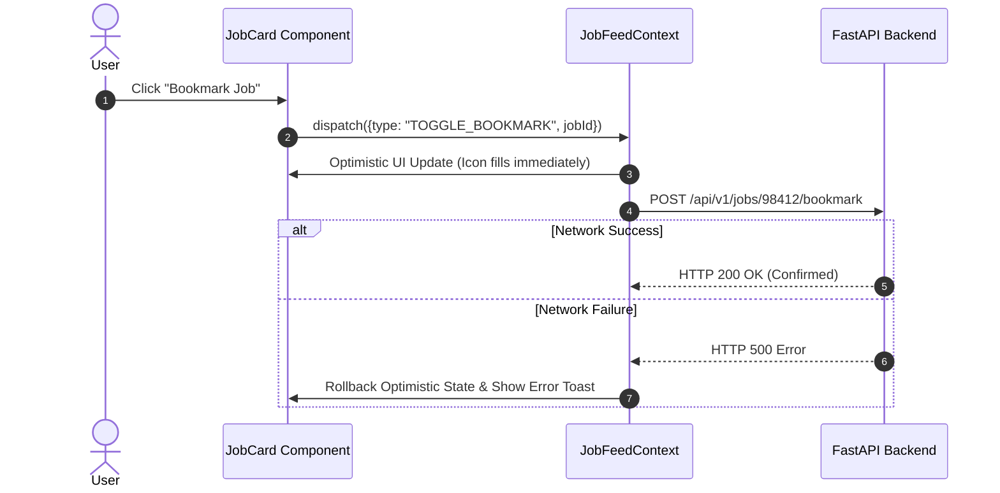
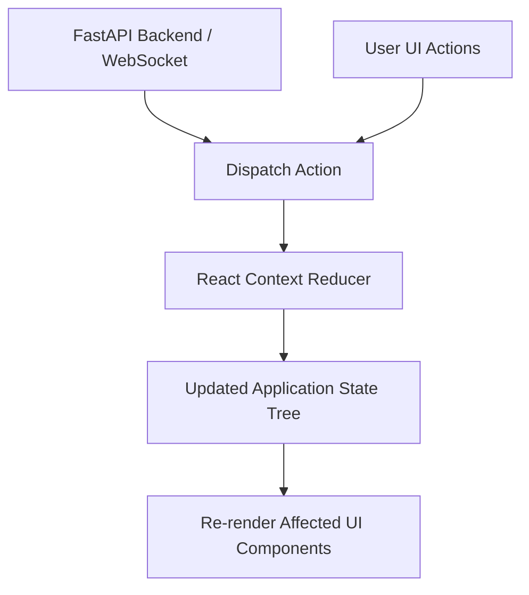

# 1. Overview
This document specifies the **Frontend State Management Subsystem**, detailing global application context, local component state, real-time WebSocket state synchronization, and optimistic UI updates.

---

# 2. Why This Exists
An automated agent interface maintains state across multiple domains (authenticated candidate profile, job discovery list, active campaign progress, real-time Playwright execution steps, human approval requests). Clean state management prevents state desynchronization and re-render loops.

---

# 3. Responsibilities
- Manage global candidate authentication state via `AuthContext`.
- Manage active job application campaign state via `CampaignContext`.
- Handle real-time WebSocket state mutations without causing full UI re-renders.

---

# 4. Inputs
- REST API payloads, WebSocket live progress events, user UI actions.

---

# 5. Outputs
- Synchronized client state tree feeding React UI components.

---

# 6. Components
- **AuthContext**: Manages candidate JWT token, user profile, and session validity.
- **JobFeedContext**: Stores discovered jobs, filter settings, and pagination state.
- **CampaignProgressContext**: Tracks live multi-step execution state across active Playwright application workers.

---

# 7. Folder Structure
```text
docs/Phase-05A-Frontend/
└── State-Management.md
```

---

# 8. Data Models
```typescript
export interface CampaignState {
  activeCampaignId: string | null;
  status: 'IDLE' | 'RUNNING' | 'PAUSED' | 'COMPLETED';
  totalJobs: number;
  completedCount: number;
  failedCount: number;
  awaitingApprovalCount: number;
  currentStepMessage: string;
}
```

---

# 9. API Contracts
N/A (State Management Specification).

---

# 10. Sequence Diagram


---

# 11. Flow Diagram


---

# 12. Internal Working
The state tree uses `useReducer` and custom context providers. WebSocket events dispatch actions (`WS_PROGRESS_UPDATE`, `WS_HITL_INTERRUPT`, `WS_CAMPAIGN_COMPLETE`) that immutably update state slices.

---

# 13. Configuration
- Context Providers wrapped around app entrypoint ([App.jsx](file:///d:/Personal%20Imp/Projects/Automated-job-Agent/frontend/src/App.jsx)).

---

# 14. Error Handling
State mutation errors trigger automatic state rollback and display error toast notifications to the user.

---

# 15. Retry Strategy
- N/A.

---

# 16. Security
- Sensitive tokens are stored in memory within `AuthContext` to prevent XSS storage scanning.

---

# 17. Logging
- In development mode, state dispatches log action type and payload diffs to developer console.

---

# 18. Metrics
- State Mutation Execution Latency (<1ms).

---

# 19. Testing Strategy
- Unit test context reducers using Vitest.

---

# 20. Performance Considerations
- Splitting state into domain contexts (`AuthContext`, `JobFeedContext`, `CampaignContext`) prevents unrelated components from re-rendering during high-frequency progress updates.

---

# 21. Best Practices
- Never mutate state directly (`state.jobs.push(...)`); always return fresh immutable state objects.

---

# 22. Production Improvements
- Integrate Zustand or Redux Toolkit for complex multi-tab state persistence.

---

# 23. Common Failure Scenarios
- **Scenario**: High-frequency WebSocket events overload state reducer.
  - **Resolution**: Throttling / debouncing incoming WebSocket state updates to 200ms windows.

---

# 24. Future Enhancements
- State snapshot export/import utility for developer troubleshooting.

---

# 25. References
- React Context & State Management Patterns.
