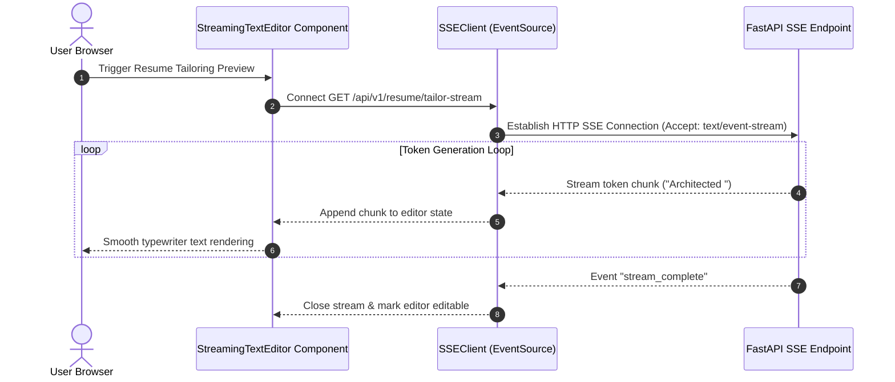
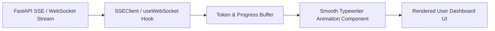

# 1. Overview
This document specifies the **Real-Time Streaming UI & Server-Sent Events (SSE) Engine**, detailing live progress rendering, Playwright browser action streaming, LLM text token streaming, and dynamic UI hydration.

---

# 2. Why This Exists
Long-running agent operations (such as crawling 50 job postings, running LLM resume tailoring, or automating a 5-step Workday form) take 10–30 seconds. Without streaming feedback, the user interface appears frozen. Streaming real-time tokens and step notifications keeps the user engaged.

---

# 3. Responsibilities
- Stream live LLM resume tailoring tokens into the React UI preview editor.
- Display real-time Playwright execution steps ("Navigating to Greenhouse", "Uploading Resume PDF", "Submitting Form").
- Handle WebSocket / SSE stream connection management and reconnection.

---

# 4. Inputs
- WebSocket text frames or Server-Sent Events (`event: message`, `data: json`).

---

# 5. Outputs
- Dynamically updating DOM elements, progress bars, and streaming text editors.

---

# 6. Components
- **StreamingTextEditor**: React component rendering incoming LLM text tokens smoothly.
- **SSEClient**: EventSource API wrapper handling Server-Sent Events connections.
- **WebSocketProgressSubscriber**: Custom React hook (`useWebSocketProgress`) listening to live task queues.

---

# 7. Folder Structure
```text
docs/Phase-05A-Frontend/
└── Streaming-UI.md
```

---

# 8. Data Models
```typescript
export interface StreamingEventPayload {
  taskId: string;
  stepName: string;
  progressPercentage: number;
  message: string;
  timestamp: string;
  isComplete: boolean;
}
```

---

# 9. API Contracts
Server-Sent Event Stream Payload:
```text
event: progress_update
data: {"taskId":"task_98412","stepName":"Tailoring Resume","progressPercentage":65,"message":"Optimizing bullet points for ATS keywords..."}

event: token_chunk
data: {"chunk":"• Architected high-throughput FastAPI services..."}
```

---

# 10. Sequence Diagram


---

# 11. Flow Diagram


---

# 12. Internal Working
The `StreamingTextEditor` component uses a lightweight micro-buffer (16ms frame boundaries matched to `requestAnimationFrame`) to ensure streaming LLM text renders with smooth typewriter motion without causing UI thread lag.

---

# 13. Configuration
- Stream Frame Rate: 60 FPS (`requestAnimationFrame` buffer).

---

# 14. Error Handling
If an SSE stream connection drops mid-tailoring, the client reconnects using `Last-Event-ID` header to resume text streaming from the exact failure point.

---

# 15. Retry Strategy
- Stream connection retries up to 3 times with 1-second delays.

---

# 16. Security
- Streaming endpoints validate user authorization JWT tokens passed in query parameters or custom headers.

---

# 17. Logging
- Streaming events log `stream_id`, `tokens_received`, `stream_duration_ms`.

---

# 18. Metrics
- Time to First Token (TTFT < 400ms).
- Stream Rendering Smoothness (60 FPS constant).

---

# 19. Testing Strategy
- Unit test SSE stream consumer hook against mock EventSource emitters.

---

# 20. Performance Considerations
- Buffering token chunks per animation frame reduces React re-renders from 100+ per second to 60 per second maximum.

---

# 21. Best Practices
- Always close SSE connections and clear timers on component unmount (`useEffect` cleanup return).

---

# 22. Production Improvements
- Add live Playwright canvas screenshot stream for real-time visual automation monitoring.

---

# 23. Common Failure Scenarios
- **Scenario**: Proxy server (NGINX) buffers SSE chunks, breaking real-time streaming behavior.
  - **Resolution**: NGINX configuration must set `proxy_buffering off;` for streaming endpoints.

---

# 24. Future Enhancements
- Interactive voice synthesis streaming for candidate interview preparation.

---

# 25. References
- W3C Server-Sent Events Specification & Web API EventSource.
