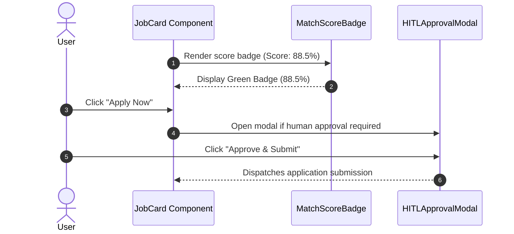
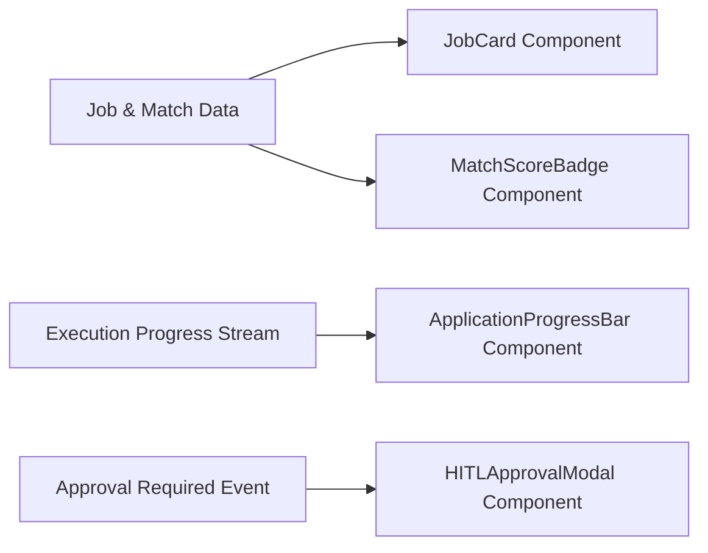

# 1. Overview
This document specifies the **Frontend UI Component Library & Dashboard Views**, detailing reusable React components (JobCard, MatchScoreBadge, ApplicationProgressBar, HITLApprovalModal, ResumeUploader).

---

# 2. Why This Exists
Building a premium user experience requires high-quality, reusable components. Standardizing component APIs and layout structures guarantees visual consistency across candidate profile management, job discovery feeds, and application execution tracking.

---

# 3. Responsibilities
- Provide reusable React UI components built with TailwindCSS and Lucide Icons.
- Render interactive match score visualizers, application execution progress bars, and approval modals.

---

# 4. Inputs
- Candidate application states, job objects, match evaluation reports.

---

# 5. Outputs
- Fully styled, accessible UI components rendered in browser DOM.

---

# 6. Components
- **JobCard**: Displays job title, company logo, location, remote tag, match score badge, and quick apply action.
- **MatchScoreBadge**: Visual progress ring or badge colored by fit (Green: >85%, Yellow: 70-85%, Red: <70%).
- **ApplicationProgressBar**: Live multi-step execution tracker displaying current phase (`DISCOVERING`, `MATCHING`, `TAILORING`, `APPLYING`, `COMPLETED`).
- **HITLApprovalModal**: Interactive dialog asking candidates to review and approve flagged application answers.

---

# 7. Folder Structure
```text
docs/Phase-05A-Frontend/
└── UI-Components.md
```

---

# 8. Data Models
```typescript
export interface JobCardProps {
  job: {
    id: string;
    title: string;
    company: string;
    location: string;
    is_remote: boolean;
    overall_suitability_score: number;
    platform: string;
    url: string;
  };
  onApplyClick: (jobId: string) => void;
}
```

---

# 9. API Contracts
N/A (UI Component Specification).

---

# 10. Sequence Diagram


---

# 11. Flow Diagram


---

# 12. Internal Working
Components use utility classes from TailwindCSS for rapid, responsive layout styling. Lucide Icons provide consistent visual iconography.

---

# 13. Configuration
- UI Icons: `lucide-react`
- Styling Utility: `clsx`, `tailwind-merge`

---

# 14. Error Handling
Component render errors are caught by React Error Boundaries (`ErrorBoundary.jsx`), displaying clean error fallbacks without crashing the app.

---

# 15. Retry Strategy
- N/A.

---

# 16. Security
- User inputs rendered inside components are sanitized to prevent DOM-based XSS attacks.

---

# 17. Logging
- Component user interactions (e.g. button clicks) emit frontend tracking events.

---

# 18. Metrics
- Component Render Time (<5ms per component).

---

# 19. Testing Strategy
- Unit test component rendering and event prop dispatches using Vitest and React Testing Library.

---

# 20. Performance Considerations
- Memoizing heavy components (`React.memo`) prevents unnecessary re-renders during high-frequency WebSocket progress updates.

---

# 21. Best Practices
- Never inline complex styling logic; use standard Tailwind design system classes.

---

# 22. Production Improvements
- Storybook integration for isolated UI component testing and documentation.

---

# 23. Common Failure Scenarios
- **Scenario**: Job posting contains missing company name.
  - **Resolution**: `JobCard` falls back gracefully to display `"Confidential Employer"`.

---

# 24. Future Enhancements
- Dark mode theme toggle with persistent user preference memory.

---

# 25. References
- React Component Design Patterns & TailwindCSS Guidelines.
