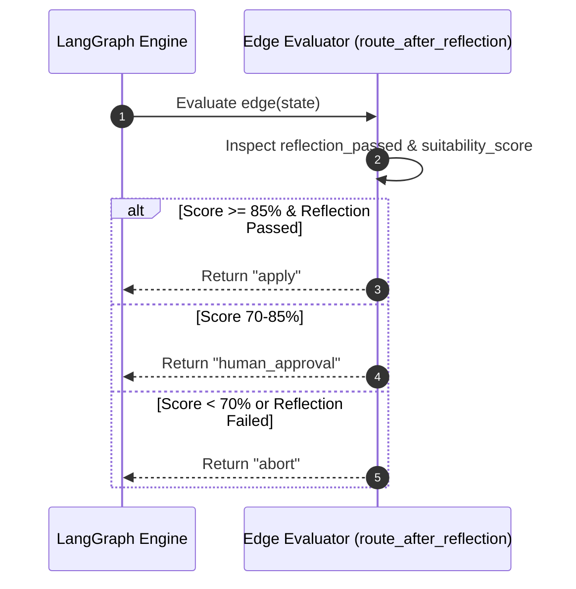
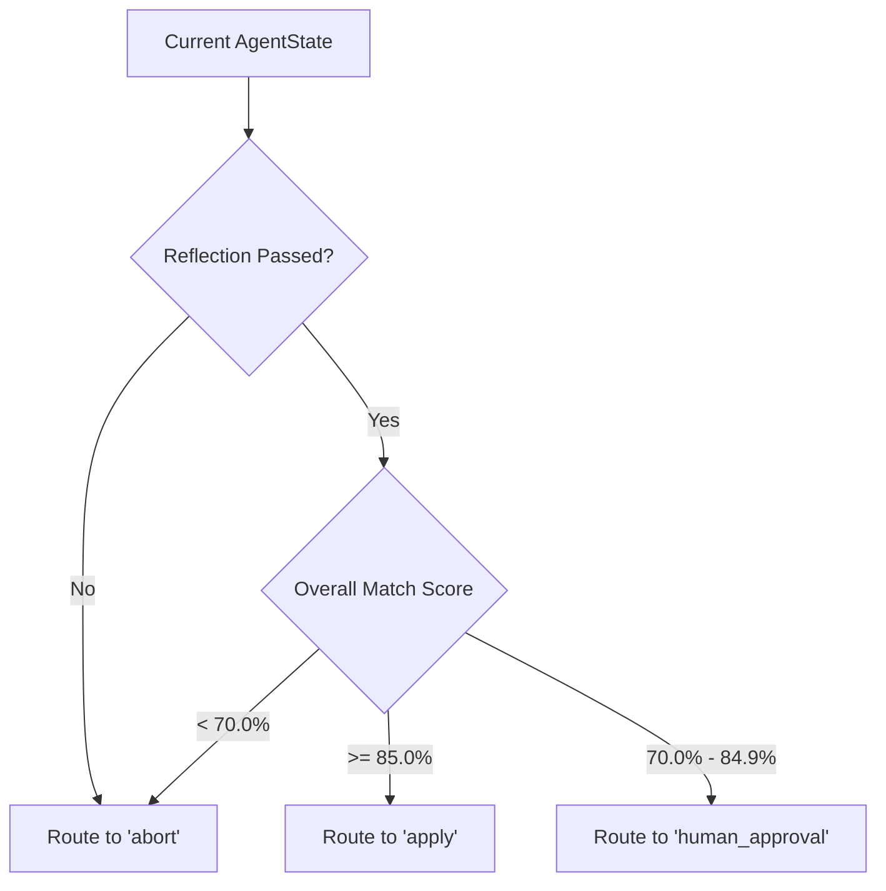

# 1. Overview
This document specifies the **Conditional Edge Evaluation & Decision Making Subsystem**, detailing state transition logic, threshold evaluations, and dynamic route routing within the LangGraph state graph ([state_machine.py](file:///d:/Personal%20Imp/Projects/Automated-job-Agent/backend/app/automation/state_machine.py)).

---

# 2. Why This Exists
LangGraph edges determine which node to execute next based on current `AgentState`. Decoupling node business actions from conditional edge routing ensures deterministic, audit-verifiable workflow transitions.

---

# 3. Responsibilities
- Evaluate conditional graph edges (`should_tailor`, `should_apply`, `requires_human_approval`).
- Route workflow execution dynamically based on match scores, reflection checks, and approval states.

---

# 4. Inputs
- Current `AgentState` payload after node execution.

---

# 5. Outputs
- Target node identifier string returned to LangGraph runtime (e.g. `"tailor"`, `"human_approval"`, `"apply"`, `"abort"`).

---

# 6. Components
- **EdgeEvaluator**: Pure function logic evaluating state conditions ([state_machine.py](file:///d:/Personal%20Imp/Projects/Automated-job-Agent/backend/app/automation/state_machine.py)).
- **ThresholdRules**: Evaluates score boundaries (>85% Auto, 70-85% Approval, <70% Skip).

---

# 7. Folder Structure
```text
docs/Phase-06-Planner/
└── Decision-Making.md
```

---

# 8. Data Models
```python
# Signature for LangGraph Conditional Edge Evaluators
from backend.app.automation.state_machine import AgentState

def route_after_reflection(state: AgentState) -> str:
    """Evaluates next node after ReflectionNode."""
    if not state.get("reflection_passed", False):
        return "abort"
    
    score = state.get("match_evaluation", {}).get("overall_suitability_score", 0.0)
    
    if score >= 85.0:
        return "apply"
    elif score >= 70.0:
        return "human_approval"
    else:
        return "abort"
```

---

# 9. API Contracts
N/A (Edge Evaluator Spec).

---

# 10. Sequence Diagram


---

# 11. Flow Diagram


---

# 12. Internal Working
Conditional edges are registered in LangGraph using `builder.add_conditional_edges(source_node, evaluator_func, path_map)`. The evaluator function returns a key matching `path_map`.

---

# 13. Configuration
- Specified in [backend/app/automation/state_machine.py](file:///d:/Personal%20Imp/Projects/Automated-job-Agent/backend/app/automation/state_machine.py).

---

# 14. Error Handling
If state dictionary is missing expected keys, evaluators fall back safely to `"abort"` to prevent accidental execution of low-quality applications.

---

# 15. Retry Strategy
- N/A.

---

# 16. Security
- Decision logic enforces candidate safety constraints before routing execution to Playwright form fill nodes.

---

# 17. Logging
- Edge routing decisions log `source_node`, `evaluated_route`, `decision_reason`.

---

# 18. Metrics
- Decision Evaluation Speed (<0.1ms).

---

# 19. Testing Strategy
- Unit test conditional edge evaluators against a matrix of state dictionary variations.

---

# 20. Performance Considerations
- Pure function evaluator execution consumes negligible CPU overhead.

---

# 21. Best Practices
- Never perform I/O operations or network calls inside conditional edge functions; edge functions must be instant, pure state inspectors.

---

# 22. Production Improvements
- Dynamic threshold adjustment based on candidate daily application targets.

---

# 23. Common Failure Scenarios
- **Scenario**: Match evaluation report fails to populate in state.
  - **Resolution**: Evaluator detects missing score dictionary and routes safely to `"abort"`.

---

# 24. Future Enhancements
- Reinforcement learning model tuning decision thresholds over time.

---

# 25. References
- LangGraph Conditional Edge Specifications.
