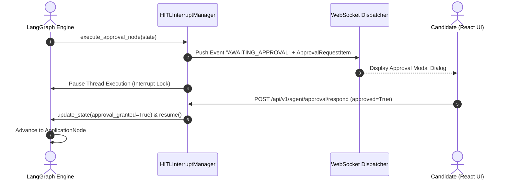
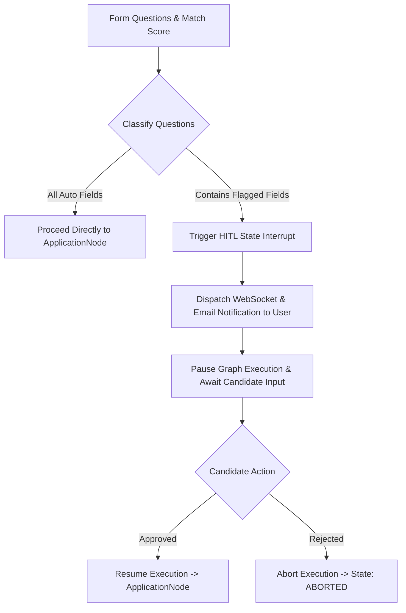

# 1. Overview
This document specifies the **Human-in-the-Loop (HITL) Approval & Intercept Gate Architecture**, detailing candidate approval triggers, field classification (`Auto` vs `Approval Required` vs `Blocked`), state pause/resume, and notification dispatch ([human_review.py](file:///d:/Personal%20Imp/Projects/Automated-job-Agent/backend/app/automation/review/human_review.py)).

---

# 2. Why This Exists
While basic fields (name, email, standard skills, standard resume) can be auto-filled, sensitive application questions (expected salary, notice period, work authorization, relocation preferences, security clearance) require explicit candidate confirmation to prevent hallucinated or unwanted application submissions.

---

# 3. Responsibilities
- Classify application form fields into three tiers: `Auto` (0% risk), `Approval Required` (Medium risk), and `Blocked` (High risk / Safety violation).
- Pause LangGraph workflow execution at `HumanApprovalNode` using state interrupts.
- Push real-time WebSocket and email notifications to candidate.
- Resume state execution upon candidate approval or abort on rejection.

---

# 4. Inputs
- Form map questions, match score evaluation report, candidate preference flags.

---

# 5. Outputs
- Candidate decision response (`approval_granted: true/false`), updated answer memory, and resumed workflow execution.

---

# 6. Components
- **FieldTierClassifier**: Categorizes questions into `Auto`, `Approval Required`, `Blocked`.
- **HITLInterruptManager**: Pauses state machine execution and manages thread pause locks ([human_review.py](file:///d:/Personal%20Imp/Projects/Automated-job-Agent/backend/app/automation/review/human_review.py)).
- **ApprovalNotificationDispatcher**: Pushes WebSocket notifications to candidate React UI.

---

# 7. Folder Structure
```text
docs/Phase-06-Planner/
└── Human-Approval.md
```

---

# 8. Data Models
```python
from pydantic import BaseModel, Field
from typing import List, Dict, Any, Optional

class ApprovalRequestItem(BaseModel):
    thread_id: str
    job_id: str
    company_name: str
    job_title: str
    match_score: float
    flagged_questions: List[Dict[str, Any]] = Field(default_factory=list)
    tailored_resume_preview_url: Optional[str] = None
    created_at: str
```

---

# 9. API Contracts
Human Approval Webhook / Resume API Endpoint:
```json
{
  "endpoint": "/api/v1/agent/approval/respond",
  "method": "POST",
  "request": {
    "thread_id": "thread_98412_gh_98412",
    "approved": true,
    "custom_answers": {
      "expected_salary": "150000 USD",
      "notice_period": "2 weeks"
    }
  },
  "response": {
    "status": "Resumed",
    "next_node": "apply"
  }
}
```

---

# 10. Sequence Diagram


---

# 11. Flow Diagram


---

# 12. Internal Working
LangGraph handles state interrupts natively using `interrupt(value)`. When `interrupt()` is called in `HumanApprovalNode`, the thread state checkpoints to PostgreSQL and execution pauses until `/api/v1/agent/approval/respond` calls `graph.resume()`.

---

# 13. Configuration
- Approval Timeout: `HUMAN_APPROVAL_TIMEOUT_HOURS = 24`

---

# 14. Error Handling
If candidate does not respond within 24 hours, the approval lock times out, state is updated to `EXPIRED`, and worker resources are released.

---

# 15. Retry Strategy
- N/A.

---

# 16. Security
- Approval responses update candidate `SemanticMemory` so identical questions are auto-filled safely in future applications.

---

# 17. Logging
- Approval events log `thread_id`, `job_id`, `flagged_count`, `user_decision`, `wait_duration_seconds`.

---

# 18. Metrics
- Average Candidate Response Time for HITL Approvals.
- User Approval Acceptance Rate (>91%).

---

# 19. Testing Strategy
- Unit test interrupt and resume flow using LangGraph testing utilities.

---

# 20. Performance Considerations
- Pausing threads via Postgres checkpointer releases worker CPU/RAM memory completely during wait periods.

---

# 21. Best Practices
- Never bypass the HITL gate for legal disclosures or salary expectation questions.

---

# 22. Production Improvements
- Implement push notifications via Firebase / WebPush for instant mobile candidate alerts.

---

# 23. Common Failure Scenarios
- **Scenario**: Candidate closes browser while approval modal is open.
  - **Resolution**: Request remains persisted in candidate dashboard pending approval list upon next login.

---

# 24. Future Enhancements
- Voice assistant integration allowing candidates to approve applications via voice commands.

---

# 25. References
- LangGraph Human-in-the-Loop Interrupt Specifications.
