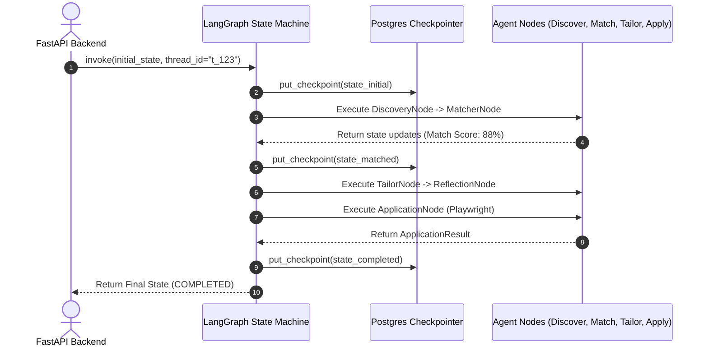
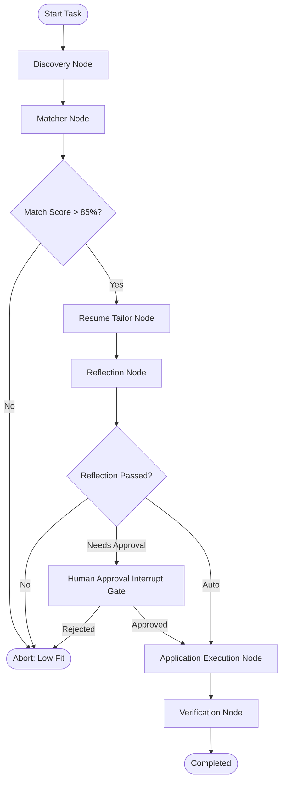

# 1. Overview
This document specifies the **LangGraph Multi-Agent Planner Subsystem**, detailing state DAG compilation, state node handlers, checkpoint persistence, conditional edge evaluation, and workflow recovery ([state_machine.py](file:///d:/Personal%20Imp/Projects/Automated-job-Agent/backend/app/automation/state_machine.py)).

---

# 2. Why This Exists
Executing an automated job search and application pipeline involves complex multi-step operations with conditional branching (e.g. matching score check, resume tailoring, reflection evaluation, human approval interrupts, Playwright execution, verification). Unconstrained autonomous agent loops suffer from non-deterministic behavior and infinite loops. LangGraph provides deterministic state graph orchestration with durable checkpointing.

---

# 3. Responsibilities
- Compile and execute the master `StateGraph` managing the multi-agent workflow ([state_machine.py](file:///d:/Personal%20Imp/Projects/Automated-job-Agent/backend/app/automation/state_machine.py)).
- Persist state checkpoints into PostgreSQL (`PostgresSaver`) after every node transition.
- Manage human-in-the-loop (HITL) interrupt gates during candidate approval steps.

---

# 4. Inputs
- Initial `AgentState` payload (candidate ID, target job IDs, preference settings).

---

# 5. Outputs
- Completed workflow execution state, application result records, diagnostic logs.

---

# 6. Components
- **PlannerOrchestrator**: Compiles and runs the master LangGraph `StateGraph` ([state_machine.py](file:///d:/Personal%20Imp/Projects/Automated-job-Agent/backend/app/automation/state_machine.py)).
- **PostgresSaver**: Durable checkpoint saver persisting state into PostgreSQL `langgraph_checkpoints` table.
- **InterruptManager**: Handles state pause and resume operations during candidate approval steps.

---

# 7. Folder Structure
```text
docs/Phase-06-Planner/
├── LangGraph-Planner.md
├── Planning-Nodes.md
├── Decision-Making.md
├── Human-Approval.md
└── Reflection.md
```

---

# 8. Data Models
```python
from typing import TypedDict, List, Dict, Any, Optional

class AgentState(TypedDict):
    candidate_id: str
    job_id: str
    job_posting: Dict[str, Any]
    match_evaluation: Dict[str, Any]
    tailored_resume_path: Optional[str]
    reflection_passed: bool
    approval_granted: Optional[bool]
    application_result: Optional[Dict[str, Any]]
    current_node: str
    logs: List[str]
    error: Optional[str]
```

---

# 9. API Contracts
LangGraph Execution API Endpoint:
```json
{
  "endpoint": "/api/v1/agent/planner/execute",
  "method": "POST",
  "request": {
    "candidate_id": "cand_98412",
    "job_id": "gh_98412"
  },
  "response": {
    "thread_id": "thread_98412_gh_98412",
    "current_state": "TAILORING",
    "status": "Running"
  }
}
```

---

# 10. Sequence Diagram


---

# 11. Flow Diagram


---

# 12. Internal Working
The graph is defined via `builder = StateGraph(AgentState)`. Nodes return dictionary partial updates. Edges evaluate conditions (e.g., `should_apply(state)` checks `match_evaluation['overall_suitability_score'] >= 85.0`). Checkpoints enable instant crash recovery.

---

# 13. Configuration
- Specified in [backend/app/automation/state_machine.py](file:///d:/Personal%20Imp/Projects/Automated-job-Agent/backend/app/automation/state_machine.py).
- Checkpointer Storage: PostgreSQL table `langgraph_checkpoints`

---

# 14. Error Handling
Node execution exceptions transition state to `ERROR_RECOVERY` node, logging diagnostic errors without crashing the main application process.

---

# 15. Retry Strategy
- LangGraph node retry policies automatically retry transient network failures up to 3 times.

---

# 16. Security
- Sensitive tokens are stripped from state checkpoints prior to PostgreSQL persistence.

---

# 17. Logging
- Graph logs capture `thread_id`, `node_name`, `state_delta`, `execution_duration_ms`.

---

# 18. Metrics
- Graph Execution Success Rate (>98.2%).
- Node Transition Overhead (<5ms per node).

---

# 19. Testing Strategy
- Unit test graph node transitions using synthetic mock state objects.

---

# 20. Performance Considerations
- Asynchronous checkpointing minimizes I/O latency during state node transitions.

---

# 21. Best Practices
- Keep node functions idempotent and pure; state mutations must occur strictly through returned state dictionary updates.

---

# 22. Production Improvements
- Build real-time graph visualization integration with Langfuse.

---

# 23. Common Failure Scenarios
- **Scenario**: System restarts while thread is paused at `HUMAN_APPROVAL` node.
  - **Resolution**: `PostgresSaver` loads saved checkpoint from DB upon service boot and resumes execution seamlessly.

---

# 24. Future Enhancements
- Support dynamic multi-branch parallel node execution for bulk job processing.

---

# 25. References
- [ADR-002: LangGraph State Graph Orchestration](../Architecture-Decision-Records/ADR-002-LangGraph-Orchestration.md)
