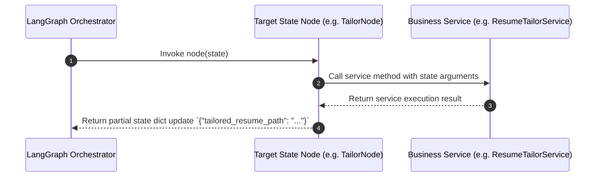
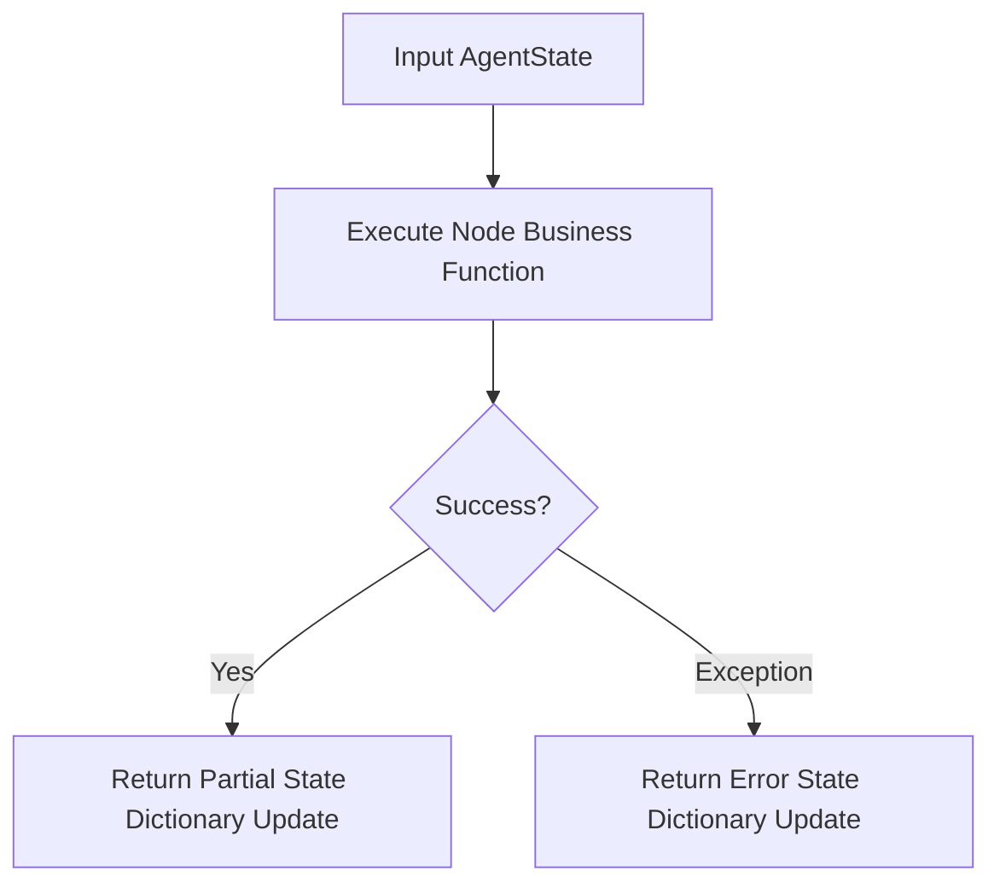

# 1. Overview
This document specifies the individual **Planning & Action Nodes** comprising the LangGraph state graph (`DiscoveryNode`, `MatcherNode`, `TailorNode`, `ReflectionNode`, `HumanApprovalNode`, `ApplicationNode`, `VerificationNode`) ([state_machine.py](file:///d:/Personal%20Imp/Projects/Automated-job-Agent/backend/app/automation/state_machine.py)).

---

# 2. Why This Exists
Breaking the complex agent application workflow into isolated, single-responsibility graph nodes simplifies testing, guarantees deterministic state mutations, and allows individual node optimization without affecting other pipeline components.

---

# 3. Responsibilities
- Specify inputs, state mutations, and outputs for all 7 primary state nodes ([state_machine.py](file:///d:/Personal%20Imp/Projects/Automated-job-Agent/backend/app/automation/state_machine.py)).
- Enforce strict typing and error isolation per node.

---

# 4. Inputs
- Incoming `AgentState` object.

---

# 5. Outputs
- Dictionary containing updated state fields returned to the LangGraph orchestrator.

---

# 6. Components
- **DiscoveryNode**: Invokes `SearchPipelineOrchestrator` to find matching job postings.
- **MatcherNode**: Invokes `AgenticRAG` and `MatchEvaluatorService` to score job fit.
- **TailorNode**: Invokes `ResumeTailorService` to generate keyword-optimized PDF resume.
- **ReflectionNode**: Evaluates pre-application safety, blacklist, and visa constraints.
- **HumanApprovalNode**: Triggers state interrupt for manual candidate approval if required.
- **ApplicationNode**: Invokes `ConnectorManager` and Playwright for form fill execution.
- **VerificationNode**: Verifies post-submission proof screenshot and application ID.

---

# 7. Folder Structure
```text
docs/Phase-06-Planner/
└── Planning-Nodes.md
```

---

# 8. Data Models
```python
# Signature for all LangGraph Node Functions
from typing import Dict, Any
from backend.app.automation.state_machine import AgentState

async def matcher_node(state: AgentState) -> Dict[str, Any]:
    """Node function updating match_evaluation in AgentState."""
    # Node logic execution
    return {"match_evaluation": {"overall_suitability_score": 88.5}}
```

---

# 9. API Contracts
N/A (Node Specification).

---

# 10. Sequence Diagram


---

# 11. Flow Diagram


---

# 12. Internal Working
Node functions are asynchronous Python callables (`async def node_name(state: AgentState) -> Dict[str, Any]`). The return dictionary is automatically merged into the master `AgentState` by LangGraph.

---

# 13. Configuration
- Node definitions in [backend/app/automation/state_machine.py](file:///d:/Personal%20Imp/Projects/Automated-job-Agent/backend/app/automation/state_machine.py).

---

# 14. Error Handling
Nodes catch exceptions internally, update `state['error']`, and log stack traces without throwing uncaught Python exceptions.

---

# 15. Retry Strategy
- LangGraph node configuration sets `retry_policy` (max 3 retries, exponential backoff).

---

# 16. Security
- Nodes sanitize dictionary updates before returning to ensure sensitive tokens are omitted from state logs.

---

# 17. Logging
- Node entry and exit events log `node_name`, `job_id`, `duration_ms`.

---

# 18. Metrics
- Average Execution Time per Node (Matcher: 120ms, Tailor: 1.8s, Apply: 12s).

---

# 19. Testing Strategy
- Unit test each node function in isolation with synthetic `AgentState` input dictionaries.

---

# 20. Performance Considerations
- Asynchronous node implementations enable high concurrency across worker processes.

---

# 21. Best Practices
- Never mutate the input `state` dictionary directly inside a node function; always return a new partial update dictionary.

---

# 22. Production Improvements
- Implement per-node telemetry span tracing with OpenTelemetry.

---

# 23. Common Failure Scenarios
- **Scenario**: `TailorNode` fails to produce PDF resume file.
  - **Resolution**: Node catches error, updates `state['error']`, and routes execution to `ERROR_RECOVERY` node.

---

# 24. Future Enhancements
- Dynamic node timeout configuration based on target portal latency.

---

# 25. References
- LangGraph State Graph Node Patterns.
