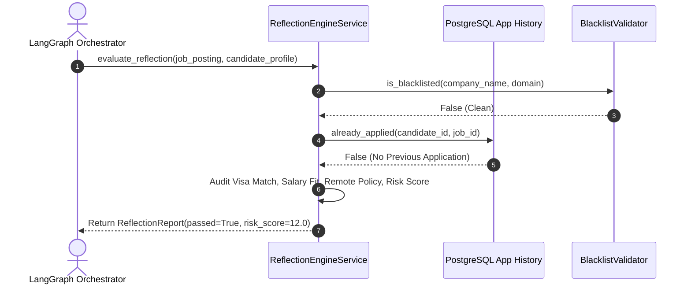
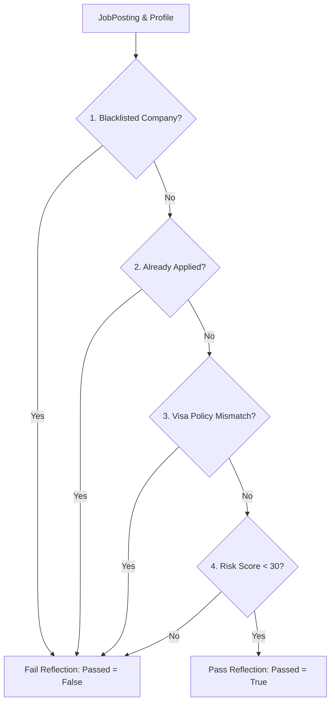

# 1. Overview
This document specifies the **Multi-Criteria Pre-Submission Reflection Engine**, detailing pre-application evaluation rules, company blacklists, duplicate prevention, visa match validation, and risk scoring.

---

# 2. Why This Exists
Submitting job applications blindly based solely on initial match scores exposes candidates to risks: applying to blacklisted companies (such as their current employer), submitting duplicate applications to the same role, applying to roles requiring non-existent visa sponsorship, or attempting applications to scam/phishing job postings. The Reflection Engine performs a rigorous safety evaluation before any browser automation begins.

---

# 3. Responsibilities
- Evaluate 9 core reflection criteria before authorizing form execution.
- Set `reflection_passed: True/False` in `AgentState`.
- Provide detailed reflection failure reasons if evaluation fails.

---

# 4. Inputs
- `JobPosting` object, candidate profile, application history records, company blacklist rules.

---

# 5. Outputs
- `ReflectionReport` specifying validation pass status, risk score (0-100), and list of audit warnings.

---

# 6. Components
- **ReflectionEngineService**: Main reflection evaluation service.
- **BlacklistValidator**: Verifies company name and domain against candidate blacklist.
- **DuplicateApplicationChecker**: Queries database for existing submission records.
- **VisaPolicyValidator**: Verifies visa sponsorship alignment.

---

# 7. Folder Structure
```text
docs/Phase-06-Planner/
└── Reflection.md
```

---

# 8. Data Models
```python
from pydantic import BaseModel, Field
from typing import List

class ReflectionReport(BaseModel):
    job_id: str
    candidate_id: str
    reflection_passed: bool
    risk_score: float = Field(..., description="Risk rating 0.0 (Safe) to 100.0 (High Risk)")
    passed_checks: List[str]
    failed_checks: List[str]
```

---

# 9. API Contracts
N/A (Engine Specification).

---

# 10. Sequence Diagram


---

# 11. Flow Diagram


---

# 12. Internal Working
The Reflection Engine evaluates 9 mandatory checks:
1. **Company Blacklist Check**: Compares company against candidate restricted domain list.
2. **Duplicate Application Check**: Queries `applications` table for identical `job_id` or canonical hash.
3. **Already Applied Check**: Prevents re-applying within 90 days.
4. **Salary Fit Check**: Verifies minimum salary threshold.
5. **Visa Match Check**: Compares candidate work authorization against job sponsorship text.
6. **Remote Policy Check**: Verifies location alignment.
7. **Experience Mismatch Check**: Prevents applying to roles requiring >5 years excess experience.
8. **Resume Score Check**: Verifies tailored resume ATS score >80%.
9. **Risk Score Check**: Evaluates domain legitimacy and anti-scam indicators.

---

# 13. Configuration
- Max Allowable Risk Score: `MAX_ALLOWABLE_RISK_SCORE = 30.0`

---

# 14. Error Handling
If reflection evaluation encounters unparseable data, it defaults safely to `reflection_passed = False`.

---

# 15. Retry Strategy
- N/A.

---

# 16. Security
- Company blacklist verification protects candidate job security by ensuring automated applications are never sent to current employers.

---

# 17. Logging
- Reflection logs record `job_id`, `candidate_id`, `reflection_passed`, `risk_score`, `failed_checks`.

---

# 18. Metrics
- Reflection Execution Speed (<20ms).
- False Positive Rejection Rate (<1%).

---

# 19. Testing Strategy
- Unit test reflection checks against a suite of 30 test scenarios covering blacklists, duplicates, and visa mismatches.

---

# 20. Performance Considerations
- All reflection checks execute in-memory or via indexed database queries in under 20 milliseconds.

---

# 21. Best Practices
- Never bypass the Reflection Engine; it is the primary safety filter protecting candidate security.

---

# 22. Production Improvements
- Implement machine learning domain reputation score lookup to detect fraudulent job listings.

---

# 23. Common Failure Scenarios
- **Scenario**: Employer changes company name format ("Acme Inc" vs "Acme Labs").
  - **Resolution**: `BlacklistValidator` uses fuzzy string matching and domain matching to detect blacklisted entities reliably.

---

# 24. Future Enhancements
- Automated Glassdoor company rating check filtering out companies rated below 3.0 stars.

---

# 25. References
- Candidate Safety & Data Privacy Standards.
