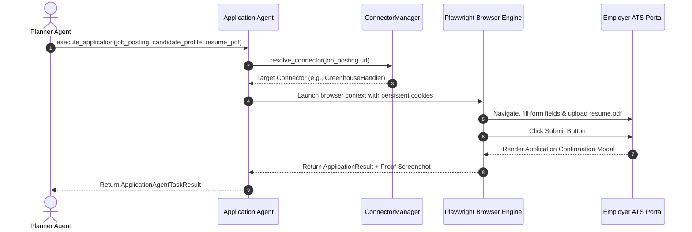
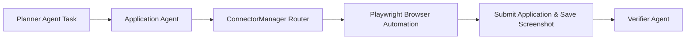

# 1. Overview
This document specifies the **Application Agent**, the specialized micro-agent responsible for invoking platform connectors, executing Playwright browser automation, uploading tailored resume PDFs, filling dynamic forms, and submitting applications ([playwright_client.py](file:///d:/Personal%20Imp/Projects/Automated-job-Agent/backend/app/automation/browser/playwright_client.py)).

---

# 2. Why This Exists
Browser form fill automation is the most complex component of an automated job agent. Isolating browser execution into a dedicated Application Agent keeps heavy Playwright browser instances separate from API servers, vector stores, and planning agents.

---

# 3. Responsibilities
- Resolve target connector via `ConnectorManager` ([registry.py](file:///d:/Personal%20Imp/Projects/Automated-job-Agent/backend/app/automation/portal_plugins/registry.py)).
- Execute Playwright browser form fill automation using persistent browser profiles.
- Upload tailored resume PDF file and submit application.
- Deliver execution screenshot proof and confirmation ID to Verifier Agent.

---

# 4. Inputs
- Target `JobPosting` object, candidate profile, tailored resume PDF path, form map answers.

---

# 5. Outputs
- `ApplicationResult` status payload, proof screenshot path (`storage/screenshots/`), application confirmation ID.

---

# 6. Components
- **ApplicationAgentCore**: Micro-agent controller.
- **ConnectorManagerAdapter**: Interface resolving and executing target connectors.
- **PlaywrightClient**: Async Playwright browser context controller ([playwright_client.py](file:///d:/Personal%20Imp/Projects/Automated-job-Agent/backend/app/automation/browser/playwright_client.py)).

---

# 7. Folder Structure
```text
docs/Phase-06A-Multi-Agent-System/
└── Application-Agent.md
```

---

# 8. Data Models
```python
from pydantic import BaseModel
from typing import Optional, List

class ApplicationAgentTaskResult(BaseModel):
    success: bool
    platform: str
    job_id: str
    application_id: Optional[str] = None
    screenshot_path: Optional[str] = None
    execution_time_seconds: float
    logs: List[str]
```

---

# 9. API Contracts
N/A (Micro-Agent Spec).

---

# 10. Sequence Diagram


---

# 11. Flow Diagram


---

# 12. Internal Working
The Application Agent loads persistent cookie contexts from `storage/browser_profiles/`, navigates to the job portal, fills inputs using targeted locators, attaches the tailored resume PDF, clicks submit, and captures a full-page proof screenshot saved to `storage/screenshots/` ([config.py](file:///d:/Personal%20Imp/Projects/Automated-job-Agent/backend/app/config.py#L14)).

---

# 13. Configuration
- Specified in [backend/app/config.py](file:///d:/Personal%20Imp/Projects/Automated-job-Agent/backend/app/config.py).

---

# 14. Error Handling
DOM fill timeouts trigger screenshot capture, DOM inspection logging, and fallback to `GenericATSPlanner`.

---

# 15. Retry Strategy
- Form input actions retry up to 3 times with exponential backoff on page re-hydration delays.

---

# 16. Security
- Browser context runs inside sandboxed processes with isolated session cookies.

---

# 17. Logging
- Logs record `job_id`, `platform`, `form_fields_filled`, `execution_time_seconds`, `status`.

---

# 18. Metrics
- Form Submission Success Rate (>95%).
- Execution Latency (12 seconds average).

---

# 19. Testing Strategy
- Unit test Application Agent execution against mock local HTML form pages.

---

# 20. Performance Considerations
- Browser context reuse across consecutive jobs on the same portal saves 2-3 seconds per application.

---

# 21. Best Practices
- Always capture a full-page proof screenshot immediately following application submission.

---

# 22. Production Improvements
- Integrate `playwright-stealth` plugin for anti-bot evasion across high-security portals.

---

# 23. Common Failure Scenarios
- **Scenario**: Form submit button disabled due to missing mandatory field.
  - **Resolution**: Application Agent inspects aria-invalid attributes, populates missing field, and re-clicks submit button.

---

# 24. Future Enhancements
- Distributed Playwright execution grid for scaling parallel application submissions.

---

# 25. References
- Playwright Python Browser Automation Guidelines.
