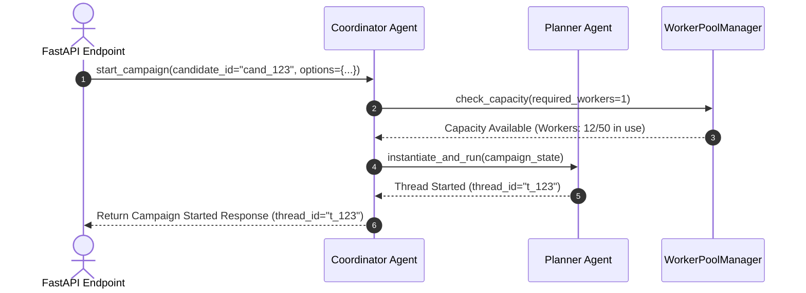
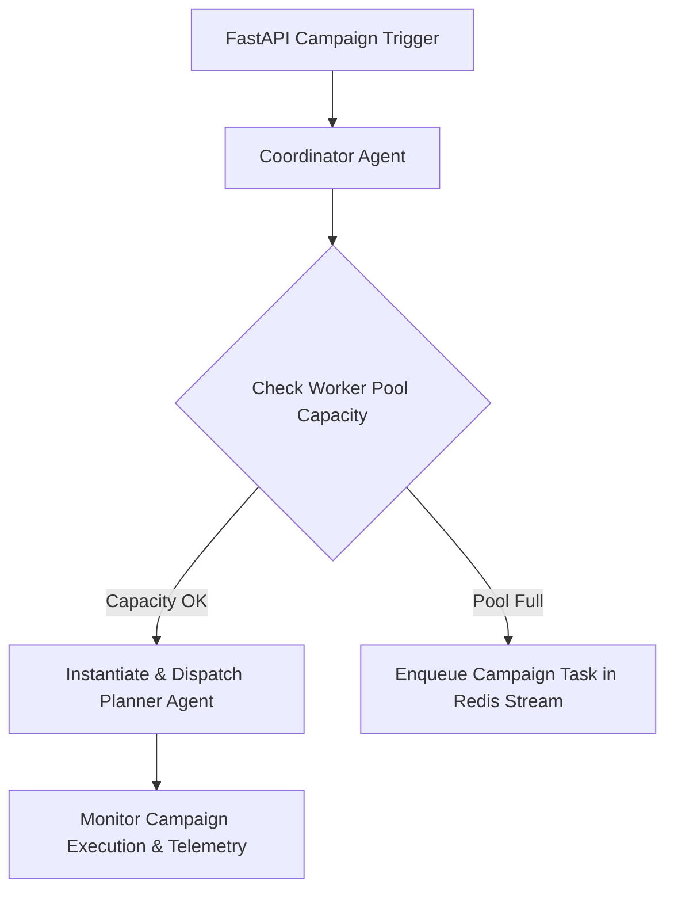

# 1. Overview
This document specifies the **Coordinator Agent**, the top-level system controller micro-agent responsible for candidate session initialization, multi-campaign dispatching, global resource allocation, and error recovery orchestration.

---

# 2. Why This Exists
While the Planner Agent manages the execution DAG for a single job application campaign, an enterprise multi-tenant platform must manage multiple candidate campaigns running simultaneously across background worker queues. The Coordinator Agent acts as the top-level supervisor for all active Planner Agents.

---

# 3. Responsibilities
- Initialize campaign sessions for candidate users.
- Dispatch execution requests to `PlannerAgent` instances.
- Monitor global worker pool resource allocation (Playwright browser concurrency, LLM rate limits).
- Manage global error recovery and system pause/resume triggers.

---

# 4. Inputs
- Campaign start requests from REST API endpoints or background schedulers.

---

# 5. Outputs
- Campaign dispatch confirmations, global worker status updates, multi-agent telemetry summaries.

---

# 6. Components
- **CoordinatorAgentCore**: Top-level system supervisor agent.
- **WorkerPoolManager**: Monitors active Playwright and LLM worker load across threads.
- **CampaignRegistry**: Tracks status of all active Planner Agent threads.

---

# 7. Folder Structure
```text
docs/Phase-06A-Multi-Agent-System/
└── Coordinator-Agent.md
```

---

# 8. Data Models
```python
from pydantic import BaseModel, Field
from typing import List, Dict, Any

class SystemCoordinatorStatus(BaseModel):
    active_campaigns_count: int
    active_planner_agents: int
    playwright_workers_in_use: int
    max_playwright_workers: int = 50
    redis_queue_depth: int
    system_health: str = Field(default="HEALTHY", description="HEALTHY, DEGRADED, PAUSED")
```

---

# 9. API Contracts
N/A (Micro-Agent Spec).

---

# 10. Sequence Diagram


---

# 11. Flow Diagram


---

# 12. Internal Working
The Coordinator Agent monitors Redis worker queue depth and Playwright container memory load. If global memory utilization exceeds 85%, the Coordinator Agent throttles new campaign dispatches until worker memory drops below safe thresholds.

---

# 13. Configuration
- Max Worker Concurrency: `MAX_WORKER_CONCURRENCY = 50`

---

# 14. Error Handling
If a Planner Agent crashes due to an unhandled exception, the Coordinator Agent catches the thread failure, logs diagnostic traces, updates campaign database status to `FAILED`, and releases allocated worker slots.

---

# 15. Retry Strategy
- Failed campaign dispatches retry up to 2 times.

---

# 16. Security
- Coordinator Agent operates with system supervisor privileges and requires Admin API authentication.

---

# 17. Logging
- Coordinator logs record `active_campaigns`, `workers_in_use`, `queue_depth`, `system_health`.

---

# 18. Metrics
- Global Worker Pool Utilization (%).
- Campaign Initialization Latency (<10ms).

---

# 19. Testing Strategy
- Integration test Coordinator Agent dispatches against mock worker pool fixtures.

---

# 20. Performance Considerations
- Non-blocking async supervisor loops keep CPU overhead under 1%.

---

# 21. Best Practices
- Always check global worker pool capacity before launching new high-memory Playwright agent tasks.

---

# 22. Production Improvements
- Implement Kubernetes KEDA autoscaling triggers managed by Coordinator Agent metrics.

---

# 23. Common Failure Scenarios
- **Scenario**: System memory reaches 90% during bulk campaign run.
  - **Resolution**: Coordinator Agent triggers emergency pause on new campaign dispatches, allowing active tasks to complete safely.

---

# 24. Future Enhancements
- Multi-datacenter coordinator synchronization for global cloud deployments.

---

# 25. References
- Coordinator Pattern Specifications for Multi-Agent Systems.
