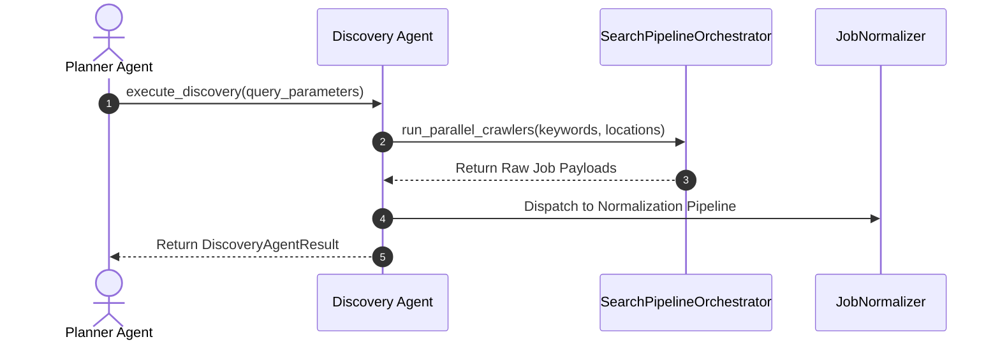
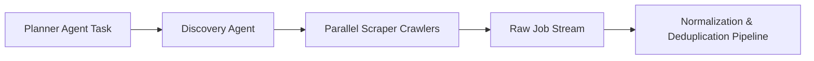

# 1. Overview
This document specifies the **Discovery Agent**, the specialized micro-agent responsible for multi-portal web crawling, job board API queries, and raw job description extraction ([scraper.py](file:///d:/Personal%20Imp/Projects/Automated-job-Agent/backend/app/services/scraper.py)).

---

# 2. Why This Exists
Decoupling job discovery into a dedicated micro-agent isolates portal crawling logic (LinkedIn, Naukri, Indeed, Wellfound) from matching, tailoring, and form automation logic, enabling independent scaling of crawler workers.

---

# 3. Responsibilities
- Execute multi-portal parallel job crawling dispatches.
- Manage crawler rate limits, pagination cursors, and portal user-agent rotations.
- Deliver raw job postings to `JobNormalizationPipeline`.

---

# 4. Inputs
- Crawl parameters (query keywords, location filters, target platforms).

---

# 5. Outputs
- Dispatched raw job posting records.

---

# 6. Components
- **DiscoveryAgentCore**: Micro-agent execution controller.
- **SearchPipelineAdapter**: Interface to `SearchPipelineOrchestrator` ([scraper.py](file:///d:/Personal%20Imp/Projects/Automated-job-Agent/backend/app/services/scraper.py)).

---

# 7. Folder Structure
```text
docs/Phase-06A-Multi-Agent-System/
└── Discovery-Agent.md
```

---

# 8. Data Models
```python
from pydantic import BaseModel, Field
from typing import List

class DiscoveryAgentResult(BaseModel):
    query_key: str
    total_raw_jobs_found: int
    platforms_scraped: List[str]
    execution_time_seconds: float
```

---

# 9. API Contracts
N/A (Micro-Agent Spec).

---

# 10. Sequence Diagram


---

# 11. Flow Diagram


---

# 12. Internal Working
The Discovery Agent executes asynchronous search requests using worker connection pools, isolating network I/O from agent planning logic.

---

# 13. Configuration
- Specified in [backend/app/config.py](file:///d:/Personal%20Imp/Projects/Automated-job-Agent/backend/app/config.py).

---

# 14. Error Handling
Portal errors are isolated; if one portal fails, the Discovery Agent continues processing jobs from healthy portals.

---

# 15. Retry Strategy
- Portal request retries up to 3 times with exponential backoff.

---

# 16. Security
- Crawlers strictly adhere to platform rate limits and proxy IP rotation rules.

---

# 17. Logging
- Logs record `discovery_task_id`, `platforms_queried`, `raw_jobs_count`, `duration_ms`.

---

# 18. Metrics
- Crawl Throughput (jobs found/sec).

---

# 19. Testing Strategy
- Unit test Discovery Agent task dispatches using mock portal scraper responses.

---

# 20. Performance Considerations
- Async non-blocking crawling fetches 100+ raw job listings in under 3.5 seconds.

---

# 21. Best Practices
- Always filter out expired job links during discovery processing.

---

# 22. Production Improvements
- Implement distributed crawler workers scaling dynamically based on target job volume.

---

# 23. Common Failure Scenarios
- **Scenario**: Target job board blocks IP address.
  - **Resolution**: Discovery Agent triggers residential proxy rotation and retries request.

---

# 24. Future Enhancements
- Predictive discovery agent auto-scheduling crawls based on historical hiring patterns.

---

# 25. References
- Micro-Agent System Architecture Guidelines.
