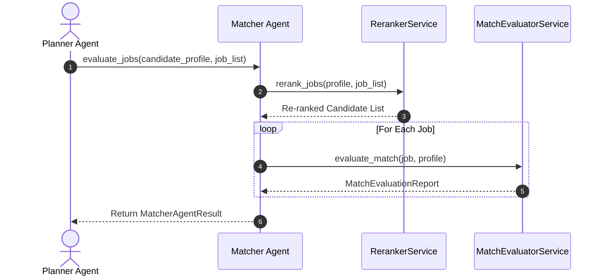
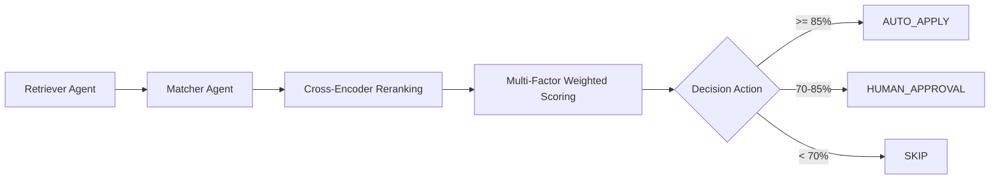

# 1. Overview
This document specifies the **Matcher Agent**, the micro-agent responsible for cross-encoder reranking and multi-factor candidate match score evaluation ([evaluator.py](file:///d:/Personal%20Imp/Projects/Automated-job-Agent/backend/app/services/matching/evaluator.py)).

---

# 2. Why This Exists
Evaluating true candidate-to-job fit requires combining cross-encoder semantic relevance scores with hard constraint evaluations (visa sponsorship, salary fit, location policy). The Matcher Agent isolates this evaluation logic from scraping and form automation.

---

# 3. Responsibilities
- Execute cross-encoder joint attention reranking (`BAAI/bge-reranker-large`).
- Calculate multi-factor match sub-scores (Semantic 40%, Skills 25%, Exp 15%, Salary 10%, Loc 10%) ([evaluator.py](file:///d:/Personal%20Imp/Projects/Automated-job-Agent/backend/app/services/matching/evaluator.py)).
- Output `MatchEvaluationReport` with action decision (`AUTO_APPLY`, `HUMAN_APPROVAL`, `SKIP`).

---

# 4. Inputs
- Candidate profile, retrieved `JobPosting` candidate list.

---

# 5. Outputs
- `MatchEvaluationReport` per candidate-job pair.

---

# 6. Components
- **MatcherAgentCore**: Micro-agent execution controller.
- **RerankerAdapter**: Calls `RerankerService` ([reranker.py](file:///d:/Personal%20Imp/Projects/Automated-job-Agent/backend/app/services/matching/reranker.py)).
- **EvaluatorAdapter**: Calls `MatchEvaluatorService` ([evaluator.py](file:///d:/Personal%20Imp/Projects/Automated-job-Agent/backend/app/services/matching/evaluator.py)).

---

# 7. Folder Structure
```text
docs/Phase-06A-Multi-Agent-System/
└── Matcher-Agent.md
```

---

# 8. Data Models
```python
from pydantic import BaseModel
from typing import List, Dict, Any

class MatcherAgentResult(BaseModel):
    total_evaluated: int
    auto_apply_count: int
    human_approval_count: int
    skipped_count: int
    evaluations: List[Dict[str, Any]]
```

---

# 9. API Contracts
N/A (Micro-Agent Spec).

---

# 10. Sequence Diagram


---

# 11. Flow Diagram


---

# 12. Internal Working
The Matcher Agent combines cross-encoder logit scores with hard constraint checks, generating a final 0-100% suitability score for every candidate job option.

---

# 13. Configuration
- Specified in [backend/app/services/matching/evaluator.py](file:///d:/Personal%20Imp/Projects/Automated-job-Agent/backend/app/services/matching/evaluator.py).

---

# 14. Error Handling
Evaluation errors default to `SKIP` action to prevent applying to unverified jobs.

---

# 15. Retry Strategy
- N/A.

---

# 16. Security
- Blacklist checking prevents applying to current employer or restricted organizations.

---

# 17. Logging
- Logs record `candidate_id`, `job_id`, `overall_score`, `decision_action`.

---

# 18. Metrics
- Match Accuracy (>93%).

---

# 19. Testing Strategy
- Unit test Matcher Agent dispatches against known fit scenarios.

---

# 20. Performance Considerations
- Reranking is capped at Top-30 jobs to maintain sub-200ms evaluation speed.

---

# 21. Best Practices
- Always log disqualification reasons for audit tracking.

---

# 22. Production Improvements
- Build visual match score breakdown component in candidate UI.

---

# 23. Common Failure Scenarios
- **Scenario**: Job posting description contains corrupt text.
  - **Resolution**: Matcher Agent catches text error, marks job as `SKIP`, and proceeds to next job.

---

# 24. Future Enhancements
- Learned candidate preference scoring based on historical user job approvals.

---

# 25. References
- Multi-Factor Evaluation Architecture Specifications.
