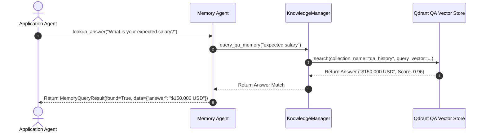
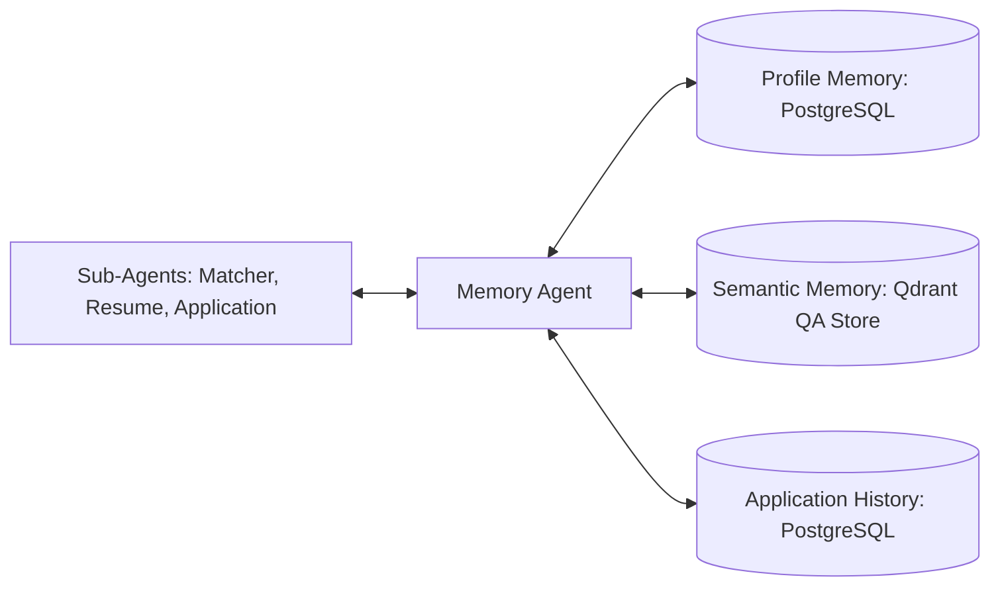

# 1. Overview
This document specifies the **Memory Agent**, the specialized micro-agent responsible for managing multi-tier memory stores (Profile, Semantic, Procedural, Application History, Reflection, Conversation, Connector, Cache) ([manager.py](file:///d:/Personal%20Imp/Projects/Automated-job-Agent/backend/app/automation/candidate/knowledge/manager.py)).

---

# 2. Why This Exists
An automated agent platform relies on multiple memory subsystems: master candidate profile, past question/answer vector RAG, portal interaction rules, and application history. Isolating memory reads and updates into a dedicated Memory Agent provides a unified data access layer for all other micro-agents.

---

# 3. Responsibilities
- Manage read/write queries across all 8 multi-tier memory stores ([manager.py](file:///d:/Personal%20Imp/Projects/Automated-job-Agent/backend/app/automation/candidate/knowledge/manager.py)).
- Update `SemanticMemory` when candidates answer new custom questionnaire fields.
- Retrieve past application history to prevent duplicate submissions.

---

# 4. Inputs
- Memory query requests (e.g. `get_question_answer`, `update_profile`, `check_history`).

---

# 5. Outputs
- Retrieved memory records, vector search hits, or confirmation of memory store updates.

---

# 6. Components
- **MemoryAgentCore**: Micro-agent controller.
- **KnowledgeManager**: Unified candidate knowledge manager ([manager.py](file:///d:/Personal%20Imp/Projects/Automated-job-Agent/backend/app/automation/candidate/knowledge/manager.py)).
- **QdrantQAMemoryStore**: Vector QA history database interface.

---

# 7. Folder Structure
```text
docs/Phase-06A-Multi-Agent-System/
└── Memory-Agent.md
```

---

# 8. Data Models
```python
from pydantic import BaseModel
from typing import Dict, Any, Optional

class MemoryQueryResult(BaseModel):
    query_type: str  # Profile, Semantic, Procedural, History
    found: bool
    data: Dict[str, Any]
    confidence: float = 1.0
```

---

# 9. API Contracts
N/A (Micro-Agent Spec).

---

# 10. Sequence Diagram


---

# 11. Flow Diagram


---

# 12. Internal Working
The Memory Agent receives query requests, determines the target memory tier (relational DB vs vector store), executes the lookup, and returns standardized payloads to calling agents.

---

# 13. Configuration
- Specified in [backend/app/automation/candidate/knowledge/manager.py](file:///d:/Personal%20Imp/Projects/Automated-job-Agent/backend/app/automation/candidate/knowledge/manager.py).

---

# 14. Error Handling
Missing memory records return `found=False` payload cleanly, prompting calling agents to synthesize or request input.

---

# 15. Retry Strategy
- Database reads retry up to 2 times on connection pool timeouts.

---

# 16. Security
- Memory queries enforce candidate user isolation to prevent cross-tenant data leaks.

---

# 17. Logging
- Memory logs record `query_type`, `key`, `found`, `latency_ms`.

---

# 18. Metrics
- Memory Retrieval Latency (Relational <2ms, Vector <15ms).

---

# 19. Testing Strategy
- Unit test Memory Agent queries against mock database and vector store fixtures.

---

# 20. Performance Considerations
- Redis caching for high-frequency candidate profile lookups cuts database read load by 80%.

---

# 21. Best Practices
- Always update `SemanticMemory` immediately whenever a candidate provides a new form answer.

---

# 22. Production Improvements
- Build automated memory clean-up routines archiving old application history records.

---

# 23. Common Failure Scenarios
- **Scenario**: Vector QA lookup returns low confidence score (<0.70).
  - **Resolution**: Memory Agent flags lookup as `found=False`, forcing candidate confirmation.

---

# 24. Future Enhancements
- Knowledge graph memory modeling relationships between candidate skills, projects, and employer domains.

---

# 25. References
- Memory Agent Architecture Specifications.
