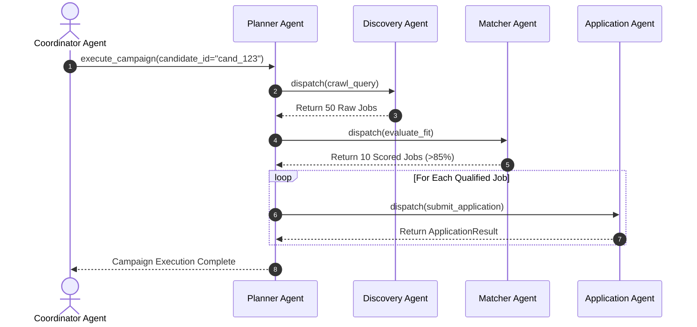
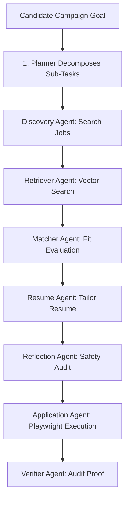

# 1. Overview
This document specifies the **Planner Agent**, the primary workflow orchestrator agent responsible for decomposing high-level candidate job search goals into executable sub-task DAGs and delegating work to specialized sub-agents.

---

# 2. Why This Exists
Single monolithic agents attempt to handle search, matching, resume tailoring, form filling, and verification all in one LLM loop. This leads to state confusion, token limit exhaustion, and high error rates. Decomposing responsibilities into specialized micro-agents coordinated by a dedicated Planner Agent guarantees modular scalability.

---

# 3. Responsibilities
- Decompose candidate job application goals into discrete task steps.
- Direct execution flow to sub-agents (Discovery, Retriever, Matcher, Resume, Application, Verifier, Reflection, Memory).
- Maintain master task execution status.

---

# 4. Inputs
- Candidate application goal parameters (target roles, locations, daily application count limit).

---

# 5. Outputs
- Orchestrated agent state updates, task dispatches, and final execution summary reports.

---

# 6. Components
- **PlannerAgentCore**: Main LangGraph orchestrator agent controller ([state_machine.py](file:///d:/Personal%20Imp/Projects/Automated-job-Agent/backend/app/automation/state_machine.py)).
- **GoalDecomposer**: Breaks candidate requests into structured sub-goal task graphs.
- **AgentStateTracker**: Monitors sub-agent execution progress and handles errors.

---

# 7. Folder Structure
```text
docs/Phase-06A-Multi-Agent-System/
├── Planner-Agent.md
├── Discovery-Agent.md
├── Retriever-Agent.md
├── Matcher-Agent.md
├── Resume-Agent.md
├── Application-Agent.md
├── Verifier-Agent.md
├── Reflection-Agent.md
├── Memory-Agent.md
└── Coordinator-Agent.md
```

---

# 8. Data Models
```python
from pydantic import BaseModel, Field
from typing import List, Dict, Any

class AgentSubTask(BaseModel):
    task_id: str
    target_agent: str  # Discovery, Matcher, Resume, Application, etc.
    parameters: Dict[str, Any]
    status: str = Field(default="PENDING", description="PENDING, IN_PROGRESS, COMPLETED, FAILED")
```

---

# 9. API Contracts
N/A (Agent Specification).

---

# 10. Sequence Diagram


---

# 11. Flow Diagram


---

# 12. Internal Working
The Planner Agent monitors `AgentState` variables inside the LangGraph engine. Upon sub-agent completion, the Planner Agent updates sub-task statuses and dispatches the next sub-agent task in the workflow DAG.

---

# 13. Configuration
- Specified in [backend/app/automation/state_machine.py](file:///d:/Personal%20Imp/Projects/Automated-job-Agent/backend/app/automation/state_machine.py).

---

# 14. Error Handling
Sub-agent failures log diagnostic errors to `AgentState['error']`. The Planner Agent evaluates retry policies or routes execution to fallback sub-agents without crashing the master pipeline.

---

# 15. Retry Strategy
- Sub-agent task dispatches retry up to 3 times before flagging a task as failed.

---

# 16. Security
- Task delegation messages omit plain-text candidate credentials.

---

# 17. Logging
- Planner logs record `campaign_id`, `sub_agent_dispatched`, `task_status`, `duration_ms`.

---

# 18. Metrics
- Planner Task Decomposition Latency (<15ms).
- Sub-Agent Orchestration Success Rate (>98%).

---

# 19. Testing Strategy
- Unit test task decomposition and sub-agent state transitions using synthetic agent task payloads.

---

# 20. Performance Considerations
- Asynchronous sub-agent dispatch enables parallel execution across independent job application tasks.

---

# 21. Best Practices
- Never allow sub-agents to bypass the Planner Agent to communicate directly with unrelated sub-agents.

---

# 22. Production Improvements
- Build real-time micro-agent interaction diagram visualizer in frontend dashboard.

---

# 23. Common Failure Scenarios
- **Scenario**: Sub-agent encounters unhandled API exception.
  - **Resolution**: Planner catches exception, marks sub-task `FAILED`, and continues executing remaining campaign tasks.

---

# 24. Future Enhancements
- Hierarchical multi-planner orchestration for concurrent multi-country job search campaigns.

---

# 25. References
- OpenAI Swarm & Multi-Agent Architecture Specifications.
