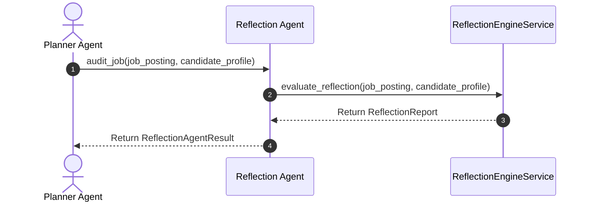
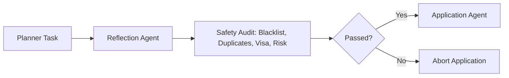

# 1. Overview
This document specifies the **Reflection Agent**, the specialized micro-agent responsible for pre-submission safety evaluation, company blacklist enforcement, duplicate application prevention, and visa sponsorship validation.

---

# 2. Why This Exists
Submitting job applications blindly exposes candidates to data privacy and employment security risks. Isolating pre-application safety evaluation into a dedicated Reflection Agent ensures every application passes rigorous multi-criteria checks before browser automation begins.

---

# 3. Responsibilities
- Evaluate 9 core reflection criteria (Company Blacklist, Duplicate Check, Visa Policy, Salary Fit, Location Policy, Experience Mismatch, Resume Score, Scam Risk, Re-application Timeout).
- Set `reflection_passed: True/False` in `AgentState`.
- Provide detailed audit logs for any failed reflection checks.

---

# 4. Inputs
- Target `JobPosting` object, candidate profile, application history records.

---

# 5. Outputs
- `ReflectionReport` specifying pass status, risk rating (0-100), and check details.

---

# 6. Components
- **ReflectionAgentCore**: Micro-agent controller.
- **ReflectionAdapter**: Wrapper calling `ReflectionEngineService`.

---

# 7. Folder Structure
```text
docs/Phase-06A-Multi-Agent-System/
└── Reflection-Agent.md
```

---

# 8. Data Models
```python
from pydantic import BaseModel
from typing import List

class ReflectionAgentResult(BaseModel):
    job_id: str
    passed: bool
    risk_score: float
    failed_reasons: List[str]
```

---

# 9. API Contracts
N/A (Micro-Agent Spec).

---

# 10. Sequence Diagram


---

# 11. Flow Diagram


---

# 12. Internal Working
The Reflection Agent executes 9 safety checks in parallel or sequence, flagging any violations (e.g., candidate current employer detected in company domain).

---

# 13. Configuration
- Max Risk Score: `MAX_ALLOWABLE_RISK_SCORE = 30.0`

---

# 14. Error Handling
Evaluation failures log audit warnings and default to `passed = False` to prioritize candidate safety.

---

# 15. Retry Strategy
- N/A.

---

# 16. Security
- Company blacklist verification protects candidate job security by guaranteeing zero automated applications are sent to current employers.

---

# 17. Logging
- Logs record `job_id`, `candidate_id`, `passed`, `risk_score`, `failed_reasons`.

---

# 18. Metrics
- Reflection Execution Speed (<20ms).
- Rejection Rate on Restricted Companies (100%).

---

# 19. Testing Strategy
- Unit test Reflection Agent dispatches against test scenarios covering blacklisted domains and duplicates.

---

# 20. Performance Considerations
- Fast in-memory checks ensure zero latency bottleneck prior to browser form fill dispatches.

---

# 21. Best Practices
- Never bypass the Reflection Agent under any circumstance.

---

# 22. Production Improvements
- Build real-time company reputation lookup integration.

---

# 23. Common Failure Scenarios
- **Scenario**: Job posting uses indirect recruiting agency domain.
  - **Resolution**: Reflection Agent inspects actual hiring company field to prevent accidental blacklisted company applications.

---

# 24. Future Enhancements
- Candidate custom reflection rule builder (e.g., "Do not apply if Glassdoor rating < 3.5").

---

# 25. References
- Reflection Agent Architecture Specifications.
