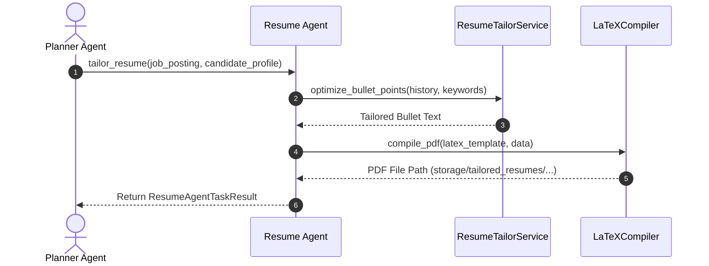

# 1. Overview
This document specifies the **Resume Agent**, the specialized micro-agent responsible for resume bullet point optimization, ATS keyword insertion, dynamic LaTeX compilation, and tailored PDF resume generation ([config.py](file:///d:/Personal%20Imp/Projects/Automated-job-Agent/backend/app/config.py#L11)).

---

# 2. Why This Exists
Tailoring resumes to match job descriptions requires specialized natural language optimization while strictly enforcing factual accuracy guardrails. Isolating resume tailoring into a dedicated Resume Agent prevents prompt dilution and separates PDF compilation from form execution.

---

# 3. Responsibilities
- Analyze missing ATS keywords from target `JobPosting` descriptions.
- Optimize candidate work experience bullets without fabricating false skills or work experience.
- Compile single-column ATS-friendly LaTeX PDF resumes saved into `storage/tailored_resumes/` ([config.py](file:///d:/Personal%20Imp/Projects/Automated-job-Agent/backend/app/config.py#L11)).

---

# 4. Inputs
- Candidate profile, `ParsedResume`, `JobPosting` object, missing keywords list.

---

# 5. Outputs
- `TailoredResumeResult` detailing PDF file path and ATS score improvement metrics.

---

# 6. Components
- **ResumeAgentCore**: Micro-agent controller.
- **TailorAdapter**: Calls `ResumeTailorService` for bullet optimization and PDF compilation.

---

# 7. Folder Structure
```text
docs/Phase-06A-Multi-Agent-System/
└── Resume-Agent.md
```

---

# 8. Data Models
```python
from pydantic import BaseModel

class ResumeAgentTaskResult(BaseModel):
    job_id: str
    candidate_id: str
    tailored_pdf_path: str
    ats_score: float
    status: str = "SUCCESS"
```

---

# 9. API Contracts
N/A (Micro-Agent Spec).

---

# 10. Sequence Diagram


---

# 11. Flow Diagram


---

# 12. Internal Working
The Resume Agent validates generated bullet text against the candidate's master skill set to ensure 100% factual accuracy before compiling the output LaTeX document into a single-column PDF.

---

# 13. Configuration
- Storage Path: `storage/tailored_resumes/` ([config.py](file:///d:/Personal%20Imp/Projects/Automated-job-Agent/backend/app/config.py#L11)).

---

# 14. Error Handling
PDF compilation errors fall back to HTML-to-PDF engine (`WeasyPrint`) to guarantee valid PDF output delivery.

---

# 15. Retry Strategy
- PDF compilation retries up to 2 times on unescaped LaTeX character errors.

---

# 16. Security
- PDF artifacts are stored in candidate-isolated directories with restricted filesystem permissions.

---

# 17. Logging
- Logs record `job_id`, `candidate_id`, `pdf_path`, `ats_score_after`, `duration_ms`.

---

# 18. Metrics
- Resume Tailoring Latency (<2.5s).

---

# 19. Testing Strategy
- Unit test Resume Agent task dispatches against mock job postings.

---

# 20. Performance Considerations
- Pre-compiling environment templates keeps LaTeX PDF generation latency under 500 milliseconds.

---

# 21. Best Practices
- Never allow the Resume Agent to invent unverified job titles or fake dates.

---

# 22. Production Improvements
- Add dynamic multi-theme LaTeX template selector.

---

# 23. Common Failure Scenarios
- **Scenario**: LLM attempts to add an unverified skill.
  - **Resolution**: `HallucinationGuardrail` rejects unverified skill and retains candidate's original bullet phrasing.

---

# 24. Future Enhancements
- Real-time ATS resume preview generation for frontend candidate dashboard.

---

# 25. References
- Resume Agent Architecture Specifications.
