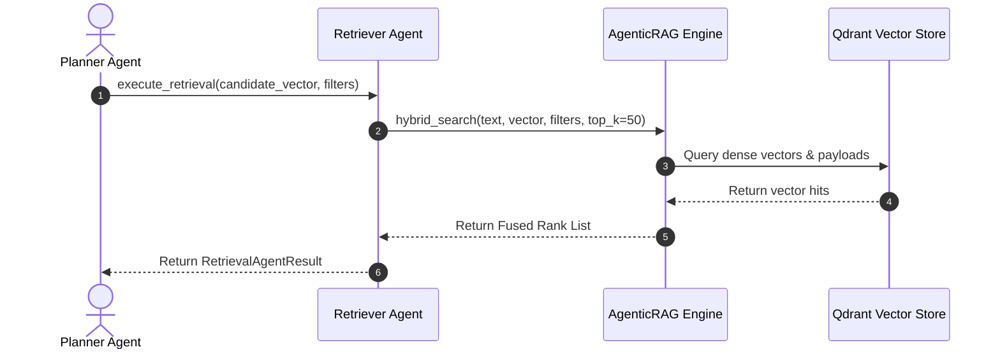
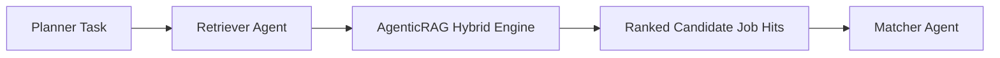

# 1. Overview
This document specifies the **Retriever Agent**, the micro-agent responsible for executing SOTA hybrid retrieval (BM25 + Qdrant Dense Vector + MMR Diversity) across vector collections ([agentic_rag.py](file:///d:/Personal%20Imp/Projects/Automated-job-Agent/backend/app/services/matching/agentic_rag.py)).

---

# 2. Why This Exists
Isolating information retrieval into a dedicated Retriever Agent allows tuning vector parameters (top_k, MMR lambda, sparse-dense weighting) independently from candidate fit evaluation or resume tailoring.

---

# 3. Responsibilities
- Execute hybrid sparse + dense vector queries against Qdrant (`jobs`, `resumes`, `qa_history`).
- Apply metadata payload filters (location, remote, salary, candidate_id).
- Return top-K candidate matches to Matcher Agent.

---

# 4. Inputs
- Candidate profile vector, keyword text, payload filters.

---

# 5. Outputs
- Fused, ranked list of `HybridSearchResult` objects.

---

# 6. Components
- **RetrieverAgentCore**: Micro-agent controller.
- **RAGAdapter**: Wrapper calling `AgenticRAG.hybrid_search(...)` ([agentic_rag.py](file:///d:/Personal%20Imp/Projects/Automated-job-Agent/backend/app/services/matching/agentic_rag.py)).

---

# 7. Folder Structure
```text
docs/Phase-06A-Multi-Agent-System/
└── Retriever-Agent.md
```

---

# 8. Data Models
```python
from pydantic import BaseModel
from typing import List, Dict, Any

class RetrievalAgentResult(BaseModel):
    query_id: str
    hits_count: int
    top_jobs: List[Dict[str, Any]]
    retrieval_latency_ms: float
```

---

# 9. API Contracts
N/A (Micro-Agent Spec).

---

# 10. Sequence Diagram


---

# 11. Flow Diagram


---

# 12. Internal Working
The Retriever Agent constructs hybrid search requests and executes them against `AgenticRAG`, returning clean candidate result arrays.

---

# 13. Configuration
- Specified in [backend/app/services/matching/agentic_rag.py](file:///d:/Personal%20Imp/Projects/Automated-job-Agent/backend/app/services/matching/agentic_rag.py).

---

# 14. Error Handling
If vector search fails, the agent falls back to SQL keyword filtering.

---

# 15. Retry Strategy
- Vector store retries up to 3 times on network timeouts.

---

# 16. Security
- Vector queries strictly enforce candidate user isolation tags.

---

# 17. Logging
- Logs record `query_id`, `hits_count`, `retrieval_latency_ms`.

---

# 18. Metrics
- Retrieval Speed (<120ms).

---

# 19. Testing Strategy
- Unit test retrieval dispatches against mock vector store outputs.

---

# 20. Performance Considerations
- Parallel async search execution keeps retrieval ultra-fast.

---

# 21. Best Practices
- Always verify payload filter syntax before dispatching vector queries.

---

# 22. Production Improvements
- Enable gRPC vector streaming for 2x faster point retrieval.

---

# 23. Common Failure Scenarios
- **Scenario**: Unconfigured vector index.
  - **Resolution**: Retriever Agent logs error and routes request to SQL text search fallback.

---

# 24. Future Enhancements
- Fine-tune dense-sparse weighting based on search query domain type.

---

# 25. References
- Agentic RAG Architecture Specifications.
