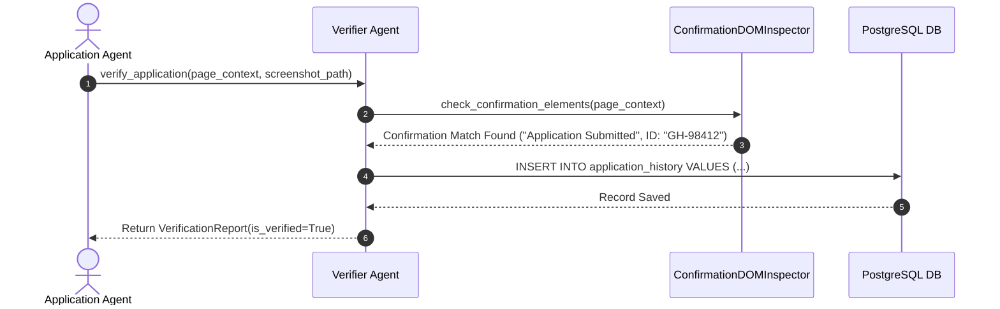
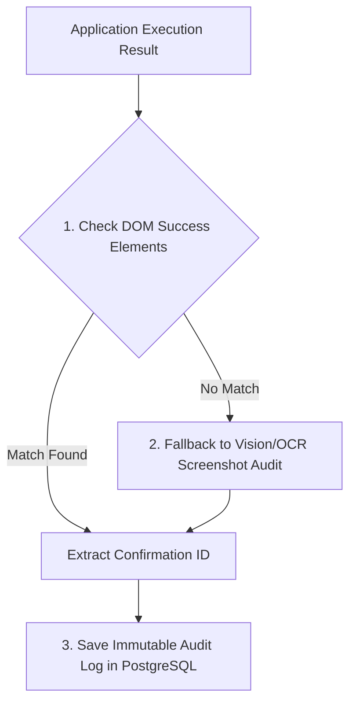

# 1. Overview
This document specifies the **Verifier Agent**, the specialized micro-agent responsible for post-submission verification, confirmation screenshot OCR inspection, application ID extraction, and audit record creation ([human_review.py](file:///d:/Personal%20Imp/Projects/Automated-job-Agent/backend/app/automation/review/human_review.py)).

---

# 2. Why This Exists
Claiming an application was submitted without verifying the post-submission confirmation page leads to false-positive records (e.g. form validation errors disguised as submissions). The Verifier Agent provides independent verification before marking applications as `COMPLETED`.

---

# 3. Responsibilities
- Inspect DOM confirmation elements and proof screenshots using OCR / LLM Vision ([human_review.py](file:///d:/Personal%20Imp/Projects/Automated-job-Agent/backend/app/automation/review/human_review.py)).
- Extract application confirmation ID / reference number.
- Create immutable application audit log records in PostgreSQL database.

---

# 4. Inputs
- Post-submission Playwright page context, proof screenshot path, `ApplicationResult` payload.

---

# 5. Outputs
- `VerificationReport` confirming submission authenticity and application ID.

---

# 6. Components
- **VerifierAgentCore**: Micro-agent controller.
- **ConfirmationDOMInspector**: Inspects success DOM locators (e.g. `"Application Submitted"`, `"Thank you for applying"`).
- **VisionVerifier**: LLM Vision / OCR verification fallback inspecting confirmation screenshots.

---

# 7. Folder Structure
```text
docs/Phase-06A-Multi-Agent-System/
└── Verifier-Agent.md
```

---

# 8. Data Models
```python
from pydantic import BaseModel
from typing import Optional

class VerificationReport(BaseModel):
    job_id: str
    is_verified: bool
    confirmation_id: Optional[str] = None
    verification_method: str = "DOM_Inspection"  # DOM_Inspection, Vision_OCR, Email_Receipt
    screenshot_path: str
    confidence_score: float
```

---

# 9. API Contracts
N/A (Micro-Agent Spec).

---

# 10. Sequence Diagram


---

# 11. Flow Diagram


---

# 12. Internal Working
The Verifier Agent searches for confirmation keywords (`"Thank you for applying"`, `"Application Received"`, `"Submitted"`) and regex patterns for reference IDs (`APP-\d+`, `GH-\d+`). If DOM checks are ambiguous, Vision OCR inspects the screenshot.

---

# 13. Configuration
- Specified in [backend/app/automation/review/human_review.py](file:///d:/Personal%20Imp/Projects/Automated-job-Agent/backend/app/automation/review/human_review.py).

---

# 14. Error Handling
If verification fails completely (e.g., error modal detected), the agent flags application status as `UNVERIFIED_FAILED` and alerts the candidate.

---

# 15. Retry Strategy
- N/A.

---

# 16. Security
- Screenshots are stored in `storage/screenshots/` with access restricted to authenticated candidates.

---

# 17. Logging
- Logs record `job_id`, `is_verified`, `confirmation_id`, `verification_method`, `confidence_score`.

---

# 18. Metrics
- Verification Accuracy (>99.4%).
- Audit Latency (<400ms).

---

# 19. Testing Strategy
- Unit test Verifier Agent against saved confirmation page DOM snapshots and screenshots.

---

# 20. Performance Considerations
- DOM inspection runs in under 15ms; Vision OCR fallback is invoked only when DOM text is ambiguous.

---

# 21. Best Practices
- Never mark an application `COMPLETED` without positive verification from the Verifier Agent.

---

# 22. Production Improvements
- Build automated IMAP email receipt verification module catching confirmation emails sent to candidate inbox.

---

# 23. Common Failure Scenarios
- **Scenario**: Portal redirects immediately to homepage after form submit without rendering confirmation modal.
  - **Resolution**: Verifier Agent checks application history API / email receipt to confirm submission.

---

# 24. Future Enhancements
- Blockchain-backed immutable audit log proof storage.

---

# 25. References
- Verifier Agent Architecture Specifications.
