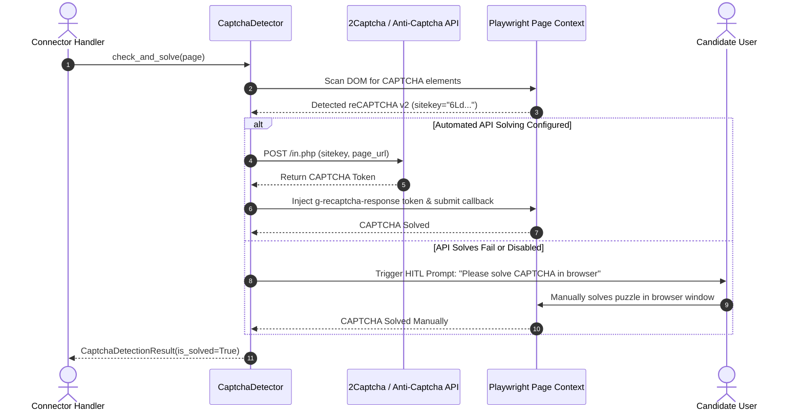
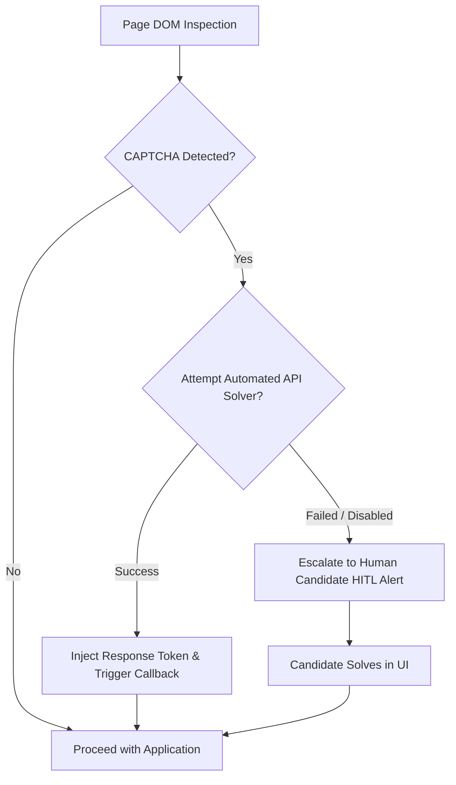

# 1. Overview
This document specifies the **CAPTCHA Detection & Solver Escalation Engine**, detailing automated CAPTCHA detection (reCAPTCHA, hCaptcha, Turnstile, Geetest), automated solver API integration (2Captcha, Anti-Captcha), and human fallback escalation hooks.

---

# 2. Why This Exists
Job portals and ATS forms occasionally challenge browser sessions with CAPTCHA visual puzzles. Automatically detecting and solving or escalating CAPTCHAs ensures job application tasks complete successfully.

---

# 3. Responsibilities
- Detect CAPTCHA elements in DOM (`iframe[src*='recaptcha']`, `iframe[src*='hcaptcha']`, `div#cf-turnstile`).
- Attempt automated solving via third-party CAPTCHA solving APIs (2Captcha / Anti-Captcha).
- Trigger human-in-the-loop (HITL) manual resolution prompt if automated solving fails.

---

# 4. Inputs
- Playwright page context, CAPTCHA solver API credentials.

---

# 5. Outputs
- Solved CAPTCHA token injected into page DOM or human resolution result.

---

# 6. Components
- **CaptchaDetector**: Scans page DOM for active CAPTCHA elements.
- **CaptchaSolverClient**: Calls 2Captcha / Anti-Captcha API endpoints to solve token.
- **HumanCaptchaEscalator**: Triggers real-time candidate browser popups for manual solving.

---

# 7. Folder Structure
```text
docs/Phase-07-Browser-Automation/
└── Captcha-Handling.md
```

---

# 8. Data Models
```python
from pydantic import BaseModel
from typing import Optional

class CaptchaDetectionResult(BaseModel):
    captcha_detected: bool
    captcha_type: Optional[str] = None  # reCAPTCHA_v2, reCAPTCHA_v3, hCaptcha, Turnstile
    sitekey: Optional[str] = None
    is_solved: bool = False
    solver_method: Optional[str] = None  # API_Solver, HITL_Manual
```

---

# 9. API Contracts
N/A (Browser Engine Specification).

---

# 10. Sequence Diagram


---

# 11. Flow Diagram


---

# 12. Internal Working
When a CAPTCHA iframe is detected, `CaptchaDetector` extracts the public `sitekey` and target page URL. If automated API solving is enabled, the sitekey is submitted to 2Captcha. The returned g-recaptcha response token is injected into `textarea#g-recaptcha-response` and the callback JS function is executed.

---

# 13. Configuration
- Specified in [backend/app/config.py](file:///d:/Personal%20Imp/Projects/Automated-job-Agent/backend/app/config.py).
- Captcha Solver API Key: `CAPTCHA_SOLVER_API_KEY`
- Captcha Solving Timeout: `CAPTCHA_TIMEOUT_SECONDS = 90`

---

# 14. Error Handling
If solving fails after 90 seconds, the engine pauses application task execution and notifies the candidate.

---

# 15. Retry Strategy
- Automated solver API calls retry up to 2 times.

---

# 16. Security
- API keys for CAPTCHA solving services are stored in encrypted `SecretsVault`.

---

# 17. Logging
- CAPTCHA events log `captcha_type`, `sitekey_masked`, `solver_method`, `solving_duration_seconds`, `status`.

---

# 18. Metrics
- Automated CAPTCHA Solving Success Rate (>88%).
- Average Solving Latency (18 seconds via API, 25 seconds via HITL).

---

# 19. Testing Strategy
- Unit test detector against public test CAPTCHA pages (e.g. Google reCAPTCHA demo site).

---

# 20. Performance Considerations
- Evasion techniques (`Fingerprint-Avoidance.md`) prevent 95%+ of CAPTCHAs from appearing in the first place.

---

# 21. Best Practices
- Always attempt bot evasion first before relying on CAPTCHA solvers.

---

# 22. Production Improvements
- Implement reCAPTCHA v3 score monitor to detect degraded session reputation early.

---

# 23. Common Failure Scenarios
- **Scenario**: Portal uses custom Geetest slider puzzle unsupported by standard token API.
  - **Resolution**: Detector escalates directly to human-in-the-loop (HITL) candidate alert.

---

# 24. Future Enhancements
- Vision LLM-driven automated slider puzzle solver.

---

# 25. References
- 2Captcha & Anti-Captcha API Specifications.
