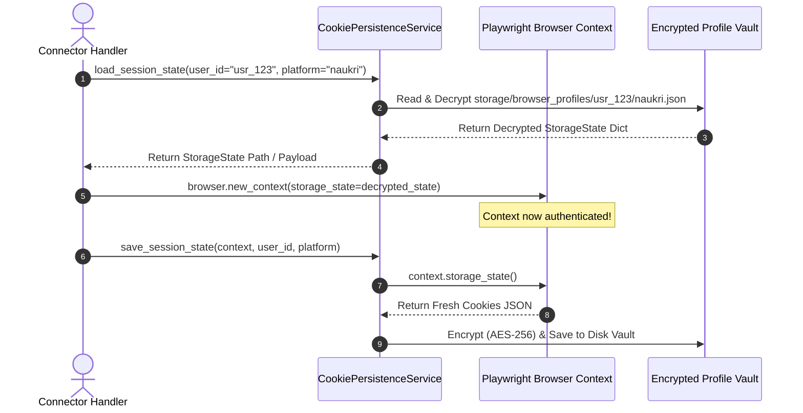
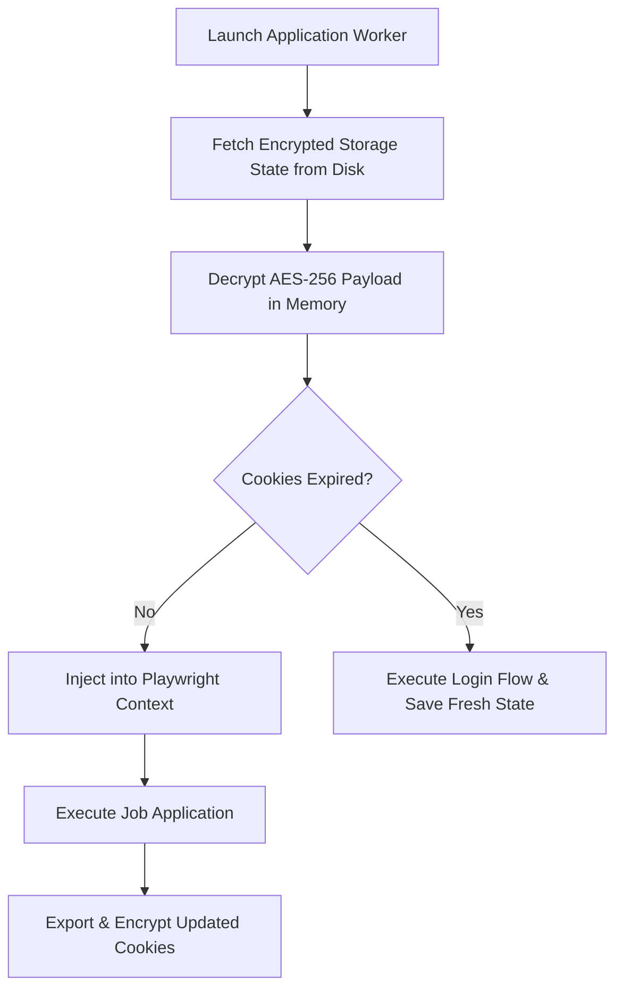

# 1. Overview
This document specifies the **Cookie Serialization & Storage Profile Persistence Engine**, detailing storage state exporting, JSON cookie serialization, AES-256 vault encryption, and automated session renewal ([session_manager.py](file:///d:/Personal%20Imp/Projects/Automated-job-Agent/backend/app/automation/session/session_manager.py)).

---

# 2. Why This Exists
Repeated manual sign-ins across job portals (LinkedIn, Naukri, Indeed) trigger anti-bot security blocks and multi-factor authentication (MFA) challenges. Exporting, encrypting, and re-injecting authenticated browser cookie states allows automated job applications to run seamlessly without repeated login prompts.

---

# 3. Responsibilities
- Export storage state JSON from Playwright contexts (`context.storage_state()`).
- Encrypt storage state files using AES-256-GCM before saving to `storage/browser_profiles/` ([config.py](file:///d:/Personal%20Imp/Projects/Automated-job-Agent/backend/app/config.py#L13)).
- Inject valid storage states into newly launched Playwright browser contexts.

---

# 4. Inputs
- Active Playwright browser context, candidate user ID, target platform ID.

---

# 5. Outputs
- Encrypted storage state file saved to `storage/browser_profiles/<user_id>/<platform>.json`.

---

# 6. Components
- **CookiePersistenceService**: Manages export, import, and encryption routines ([session_manager.py](file:///d:/Personal%20Imp/Projects/Automated-job-Agent/backend/app/automation/session/session_manager.py)).
- **VaultCryptoAdapter**: Handles AES-256-GCM encryption/decryption.
- **SessionValidator**: Checks cookie expiration timestamps before injecting into browser context.

---

# 7. Folder Structure
```text
docs/Phase-07-Browser-Automation/
└── Cookie-Persistence.md
```

---

# 8. Data Models
```python
from pydantic import BaseModel
from typing import List, Dict, Any, Optional
from datetime import datetime

class CookieStorageRecord(BaseModel):
    user_id: str
    platform: str
    encrypted_file_path: str
    cookie_names: List[str]
    expires_at: Optional[datetime] = None
    last_updated_at: datetime = Field(default_factory=datetime.utcnow)
```

---

# 9. API Contracts
N/A (Browser Engine Specification).

---

# 10. Sequence Diagram


---

# 11. Flow Diagram


---

# 12. Internal Working
The engine uses Playwright's native `context.storage_state()`, which serializes all cookies, `localStorage` pairs, and `sessionStorage` pairs into a JSON structure. The JSON string is encrypted via `AESGCM` before writing to `storage/browser_profiles/`.

---

# 13. Configuration
- Storage Directory: `storage/browser_profiles/` ([config.py](file:///d:/Personal%20Imp/Projects/Automated-job-Agent/backend/app/config.py#L13)).

---

# 14. Error Handling
Decryption failures or corrupted JSON files trigger automatic file archival and flag the portal session for credential re-login.

---

# 15. Retry Strategy
- Storage state writes retry up to 2 times on file system lock collisions.

---

# 16. Security
- Files inside `storage/browser_profiles/` are encrypted at rest using AES-256-GCM and strictly listed in `.gitignore`.

---

# 17. Logging
- Cookie persistence events log `user_id`, `platform`, `cookie_count`, `file_size_bytes`, `duration_ms`.

---

# 18. Metrics
- Storage State Hydration Speed (<25ms).
- Session Persistence Success Rate (>95%).

---

# 19. Testing Strategy
- Unit test round-trip export, encryption, decryption, and browser injection routines.

---

# 20. Performance Considerations
- Injecting saved cookies skips 10-15 seconds of login page navigation per job.

---

# 21. Best Practices
- Update storage state after every successful application submission to capture updated session tokens.

---

# 22. Production Improvements
- Store browser profile vaults in encrypted cloud object storage (S3 / GCP Secrets) for multi-worker node access.

---

# 23. Common Failure Scenarios
- **Scenario**: Portal revokes session cookie due to IP rotation.
  - **Resolution**: `SessionValidator` detects redirect to login page, flags cookie as invalid, and triggers re-login.

---

# 24. Future Enhancements
- Cross-worker browser profile synchronization via Redis pub/sub.

---

# 25. References
- Playwright Python Storage State Specifications.
