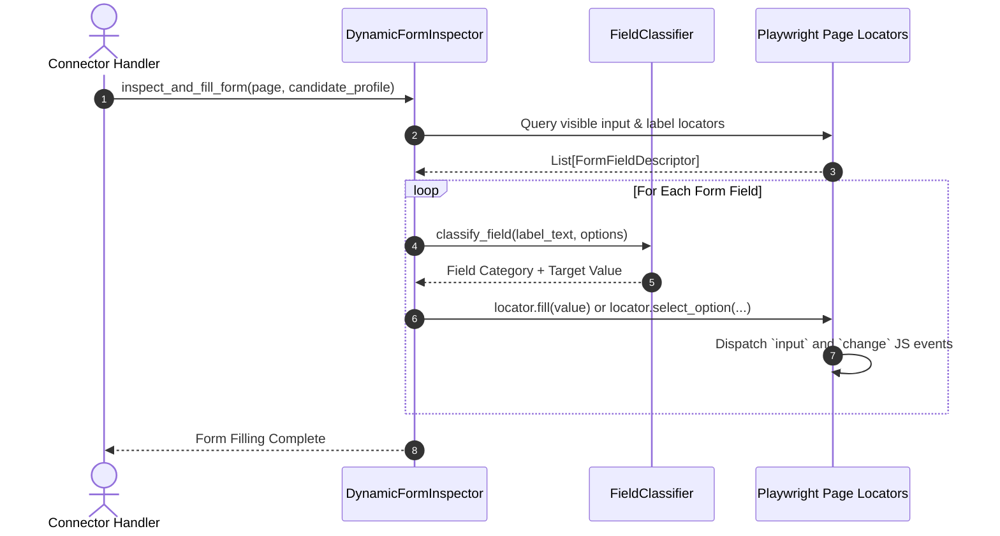
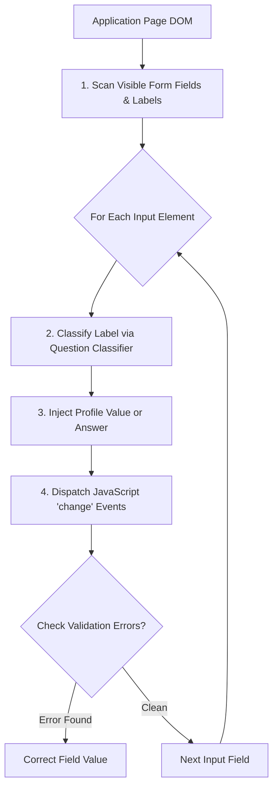

# 1. Overview
This document specifies the **Dynamic Form Inspector & Field Filling Engine**, detailing DOM + Vision dual-mode form inspection, semantic question classification, dynamic input injection, radio/checkbox handling, and validation error detection ([app_classifier.py](file:///d:/Personal%20Imp/Projects/Automated-job-Agent/backend/app/automation/classifier/app_classifier.py)).

---

# 2. Why This Exists
Application forms across ATS platforms use dynamic single-page app (SPA) DOM elements: conditional inputs that appear only after previous questions are answered, custom dropdown overlays, custom radio button groups, and complex validation rules.

---

# 3. Responsibilities
- Inspect DOM input elements (`input`, `textarea`, `select`, `[role='combobox']`, `[type='radio']`).
- Map field labels to candidate profile data using semantic classification ([qa_agent.py](file:///d:/Personal%20Imp/Projects/Automated-job-Agent/backend/app/automation/question_engine/qa_agent.py)).
- Execute locator fill actions and handle dynamic field re-hydration events.

---

# 4. Inputs
- Playwright page context, candidate profile, `FormMap` parameter dictionary.

---

# 5. Outputs
- Populated form fields, zero remaining validation errors, ready-to-submit form state.

---

# 6. Components
- **DynamicFormInspector**: Scans page for visible input fields and associated label text ([app_classifier.py](file:///d:/Personal%20Imp/Projects/Automated-job-Agent/backend/app/automation/classifier/app_classifier.py)).
- **FieldClassifier**: Classifies question type (Contact Info, Work History, Legal/EEOC, Salary, Custom Short Answer) ([question_classifier.py](file:///d:/Personal%20Imp/Projects/Automated-job-Agent/backend/app/services/matching/question_classifier.py)).
- **InputInjector**: Executes Playwright fill, select, check, and dispatch event actions.

---

# 7. Folder Structure
```text
docs/Phase-07-Browser-Automation/
└── Dynamic-Forms.md
```

---

# 8. Data Models
```python
from pydantic import BaseModel, Field
from typing import List, Optional

class FormFieldDescriptor(BaseModel):
    element_id: Optional[str] = None
    name_attribute: Optional[str] = None
    field_type: str = Field(..., description="text, textarea, select, radio, checkbox, file")
    label_text: str
    is_required: bool = False
    options: List[str] = Field(default_factory=list)
```

---

# 9. API Contracts
N/A (Browser Engine Specification).

---

# 10. Sequence Diagram


---

# 11. Flow Diagram


---

# 12. Internal Working
The engine targets elements by label association (`<label for="...">` or `aria-label`). For custom radio buttons (`div[role='radio']`), the engine executes `locator.click()`. JavaScript events (`change`, `blur`) are dispatched to trigger frontend React/Vue reactive state updates.

---

# 13. Configuration
- Specified in [backend/app/automation/classifier/app_classifier.py](file:///d:/Personal%20Imp/Projects/Automated-job-Agent/backend/app/automation/classifier/app_classifier.py).

---

# 14. Error Handling
If an input field displays a red validation error border after filling, `DynamicFormInspector` re-inspects formatting rules (e.g. converting `"(555) 019-2831"` to `"5550192831"`).

---

# 15. Retry Strategy
- Field input injections retry up to 3 times on DOM re-render delays.

---

# 16. Security
- Input values are sanitized to prevent DOM injection.

---

# 17. Logging
- Form fill logs record `field_label`, `field_type`, `value_injected_masked`, `duration_ms`.

---

# 18. Metrics
- Form Field Filling Accuracy (>97%).
- Average Field Fill Latency (<200ms per field).

---

# 19. Testing Strategy
- Unit test form inspector against a suite of 20 complex HTML form templates.

---

# 20. Performance Considerations
- Batching locator calls keeps full form filling duration under 6 seconds.

---

# 21. Best Practices
- Always trigger JavaScript `change` and `blur` events after setting element input values to ensure SPA reactive framework hydration.

---

# 22. Production Improvements
- LLM Vision fallback for canvas-rendered or obfuscated form controls.

---

# 23. Common Failure Scenarios
- **Scenario**: Dropdown options load asynchronously after input click.
  - **Resolution**: Locator auto-waits for option list visibility (`expect(page.locator('div[role="option"]')).to_be_visible()`).

---

# 24. Future Enhancements
- Automated multi-language form field label translation and mapping.

---

# 25. References
- Playwright Locator & Event Dispatch Specifications.
