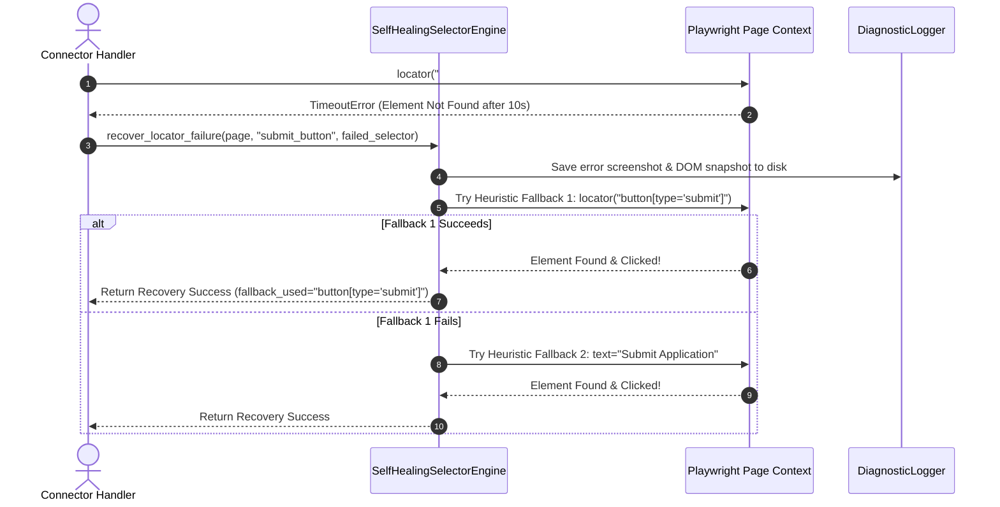
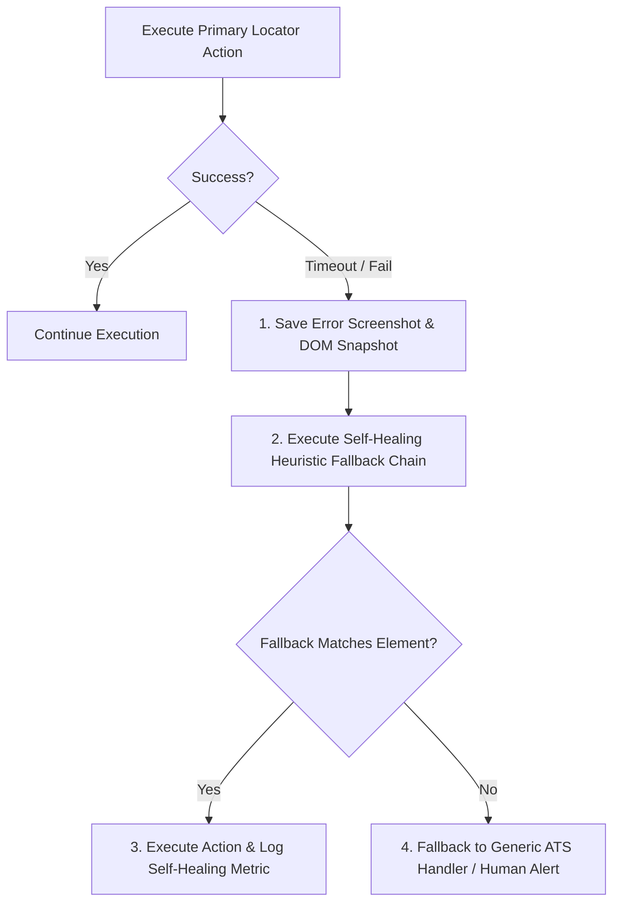

# 1. Overview
this document specifies the **Browser Automation Failure Diagnostic & Self-Healing Engine**, detailing DOM locator fallback, automatic screenshot capture on exception, CDP network error inspection, and self-healing selector updates.

---

# 2. Why This Exists
Employer job portals frequently update their HTML DOM layouts, rename CSS classes, or alter form field structure without warning. Hardcoded locators break when layouts shift. A self-healing diagnostic engine detects selector failures, logs DOM snapshots, and executes heuristic fallback strategies to complete form submissions.

---

# 3. Responsibilities
- Intercept DOM locator failures and execution timeouts.
- Capture diagnostic error screenshots saved to `storage/screenshots/error_<timestamp>.png`.
- Execute heuristic selector fallbacks (e.g. falling back from `#first_name` to `input[name*='first']` to fuzzy ARIA label matching).

---

# 4. Inputs
- Playwright page context, failed primary selector, target field semantic label.

---

# 5. Outputs
- Heuristic fallback locator match or self-healing error report.

---

# 6. Components
- **SelfHealingSelectorEngine**: Tries fallback selector chains when primary locators fail.
- **DiagnosticLogger**: Saves error screenshots and full page HTML DOM snapshots (`storage/dom_snapshots/`).
- **CDPNetworkInspector**: Logs failed network requests (HTTP 4xx, 5xx) leading up to the failure.

---

# 7. Folder Structure
```text
docs/Phase-07-Browser-Automation/
└── Error-Recovery.md
```

---

# 8. Data Models
```python
from pydantic import BaseModel
from typing import List, Optional

class BrowserErrorDiagnosticReport(BaseModel):
    job_id: str
    failed_selector: str
    error_type: str  # TimeoutError, ElementNotFound, NavigationFailed
    error_screenshot_path: str
    dom_snapshot_path: str
    fallback_selector_used: Optional[str] = None
    is_recovered: bool = False
```

---

# 9. API Contracts
N/A (Browser Engine Specification).

---

# 10. Sequence Diagram


---

# 11. Flow Diagram


---

# 12. Internal Working
When a primary selector fails, `SelfHealingSelectorEngine` evaluates a predefined heuristic tree:
1. **Primary CSS Selector**: `#first_name`
2. **Name Attribute Match**: `input[name*='first']`
3. **ARIA Label Match**: `input[aria-label*='First Name' i]`
4. **Label Associated Input**: `label:has-text('First Name') ~ input`
5. **Fuzzy Text Match**: `page.get_by_label('First Name', exact=False)`

---

# 13. Configuration
- Specified in [backend/app/automation/browser/playwright_client.py](file:///d:/Personal%20Imp/Projects/Automated-job-Agent/backend/app/automation/browser/playwright_client.py).
- Snapshot Path: `storage/dom_snapshots/`

---

# 14. Error Handling
If all fallbacks fail, the engine captures diagnostic artifacts, sets task status to `AUTOMATION_FAILED`, and notifies developers via telemetry logs.

---

# 15. Retry Strategy
- Self-healing fallback attempts up to 4 heuristic rules sequentially.

---

# 16. Security
- DOM snapshots are sanitized to strip any pre-filled sensitive password strings before saving to disk.

---

# 17. Logging
- Error recovery events log `failed_selector`, `error_type`, `fallback_used`, `is_recovered`.

---

# 18. Metrics
- Self-Healing Auto-Recovery Rate (>78% of broken selector events recovered automatically).

---

# 19. Testing Strategy
- Unit test self-healing engine against modified HTML DOM test pages where primary element IDs have been altered.

---

# 20. Performance Considerations
- Fallback chain evaluation completes in under 300 milliseconds.

---

# 21. Best Practices
- Always write resilient semantic ARIA locators (`get_by_role`, `get_by_label`) rather than fragile auto-generated XPath strings.

---

# 22. Production Improvements
- LLM Vision locator fallback identifying target buttons visually when DOM selectors fail.

---

# 23. Common Failure Scenarios
- **Scenario**: Portal renames element ID from `#applicant-first-name` to `#fn-input`.
  - **Resolution**: ARIA label and fuzzy label text heuristics locate `#fn-input` successfully.

---

# 24. Future Enhancements
- Automated PR generation submitting updated connector selectors to Git repository when self-healing triggers.

---

# 25. References
- Playwright Robust Locator & Self-Healing Automation Literature.
