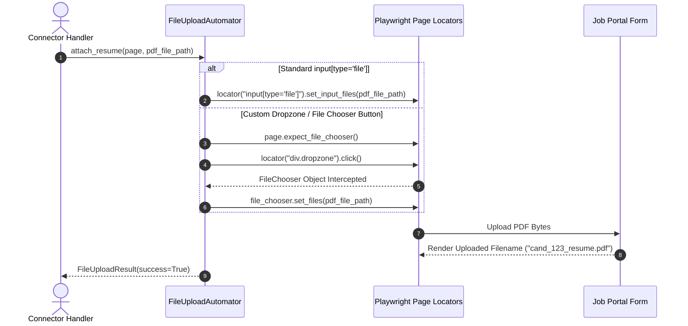

# 1. Overview
This document specifies the **Automated File Upload & Resume Attachment Engine**, detailing file input locators, hidden input handling, Playwright file choosers, drag-and-drop uploads, and upload verification.

---

# 2. Why This Exists
Attaching tailored resume PDF files is mandatory across all job application forms. Modern ATS portals use hidden file inputs (`display: none`), custom drag-and-drop dropzones (`div.dropzone`), or native OS file chooser prompts. A dedicated file upload engine handles all attachment variations reliably.

---

# 3. Responsibilities
- Locate file attachment inputs (`input[type='file']`) across standard, hidden, and custom dropzone elements.
- Inject tailored PDF resume paths using Playwright `locator.set_input_files(...)` or `expect_file_chooser()` API.
- Verify successful file upload parsing and DOM attachment confirmation.

---

# 4. Inputs
- Playwright page context, absolute file path to tailored PDF resume (`storage/tailored_resumes/...`).

---

# 5. Outputs
- Attached file verification confirmation and DOM file state validation.

---

# 6. Components
- **FileUploadAutomator**: Handles file attachment injection routines.
- **FileChooserListener**: Intercepts native OS file chooser dialog events (`page.expect_file_chooser()`).
- **UploadValidator**: Inspects DOM to confirm uploaded filename appears in attachment list.

---

# 7. Folder Structure
```text
docs/Phase-07-Browser-Automation/
└── File-Upload.md
```

---

# 8. Data Models
```python
from pydantic import BaseModel
from typing import Optional

class FileUploadResult(BaseModel):
    success: bool
    file_path: str
    uploaded_filename: str
    target_selector: str
    execution_time_ms: float
    error_message: Optional[str] = None
```

---

# 9. API Contracts
N/A (Browser Engine Specification).

---

# 10. Sequence Diagram


---

# 11. Flow Diagram
```mermaid
flowchart TD
    Req[Attach PDF File Request] --> Locate{Locate File Input}
    Locate -->|Standard input[type='file']| Standard[locator.set_input_files]
    Locate -->|Custom Dropzone| Chooser[expect_file_chooser + click]
    Chooser --> Intercept[file_chooser.set_files]
    Standard --> Verify[Verify Filename Displayed in DOM]
    Intercept --> Verify
    Verify --> Complete[Log File Upload Success]
```

---

# 12. Internal Working
Playwright handles file inputs natively without requiring OS window interaction. For hidden inputs (`style="display:none"`), Playwright's `set_input_files()` bypasses visibility checks directly.

---

# 13. Configuration
- Specified in [backend/app/config.py](file:///d:/Personal%20Imp/Projects/Automated-job-Agent/backend/app/config.py).
- Allowed File Types: `.pdf`, `.docx`
- Max Attachment Timeout: `FILE_UPLOAD_TIMEOUT_MS = 15000`

---

# 14. Error Handling
If file upload fails due to file size restrictions, `FileUploadAutomator` raises `FileUploadFailedError` and captures a diagnostic screenshot.

---

# 15. Retry Strategy
- Upload actions retry up to 2 times on network upload delays.

---

# 16. Security
- Uploaded file paths are verified to ensure they reside exclusively within approved `storage/` directories.

---

# 17. Logging
- File upload events log `file_path`, `uploaded_filename`, `selector_used`, `duration_ms`.

---

# 18. Metrics
- File Upload Success Rate (>99%).
- Upload Execution Latency (<1.2 seconds for 500KB PDF).

---

# 19. Testing Strategy
- Unit test file upload against mock HTML file input templates.

---

# 20. Performance Considerations
- Direct CDP file stream injection avoids expensive disk copy operations.

---

# 21. Best Practices
- Always verify that the uploaded filename is rendered in the form DOM before proceeding to submit.

---

# 22. Production Improvements
- Implement dynamic PDF file compression if target portal enforces strict <2MB upload limits.

---

# 23. Common Failure Scenarios
- **Scenario**: Portal uses React drag-and-drop dropzone without standard file input element.
  - **Resolution**: `FileUploadAutomator` triggers `expect_file_chooser()`, clicks dropzone container, and sets file bytes.

---

# 24. Future Enhancements
- Cover letter PDF and portfolio attachment multi-file upload support.

---

# 25. References
- Playwright Python File Chooser & Input File Specifications.
