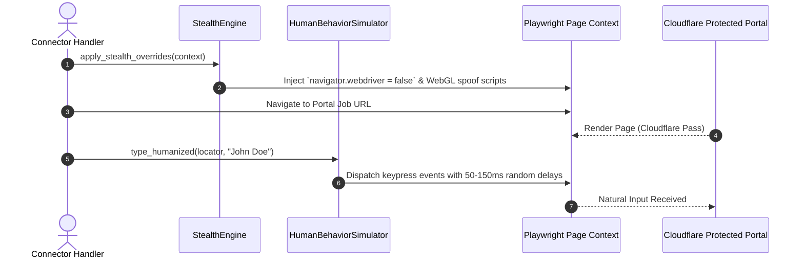
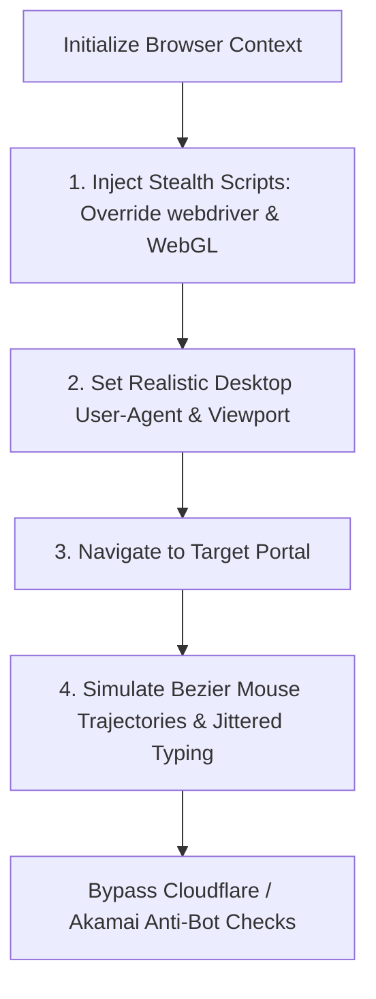

# 1. Overview
This document specifies the **Browser Anti-Bot Fingerprint Avoidance Engine**, detailing user-agent rotation, Playwright stealth plugin integration, Canvas/WebGL fingerprint masking, human cursor trajectories, and request rate jittering.

---

# 2. Why This Exists
Enterprise job portals and ATS platforms deploy sophisticated bot-detection services (Cloudflare, Akamai Bot Manager, DataDome, PerimeterX). Standard headless Chromium browsers leak automation flags (`navigator.webdriver = true`, default headless user-agents, linear mouse movement). Evasion techniques make automated browser interactions indistinguishable from genuine candidate activity.

---

# 3. Responsibilities
- Override bot-detection properties (`navigator.webdriver = false`, WebGL vendor spoofing).
- Rotate valid browser user-agent strings and viewport dimensions.
- Inject humanized mouse movement trajectories (Bezier curve mouse tracks) and randomized input typing delays (50ms - 150ms per keypress).

---

# 4. Inputs
- Playwright page context, target portal anti-bot strictness level.

---

# 5. Outputs
- Stealth-enhanced Playwright browser page context passing bot-detection checks.

---

# 6. Components
- **StealthEngine**: Integrates stealth scripts overriding Chromium automation flags.
- **HumanBehaviorSimulator**: Simulates realistic human cursor movement (Bezier curves) and variable typing cadences.
- **UserAgentRotator**: Rotates valid desktop user-agent strings.

---

# 7. Folder Structure
```text
docs/Phase-07-Browser-Automation/
└── Fingerprint-Avoidance.md
```

---

# 8. Data Models
```python
from pydantic import BaseModel
from typing import Optional

class StealthProfileSpec(BaseModel):
    user_agent: str
    viewport_width: int = 1920
    viewport_height: int = 1080
    platform: str = "Win32"
    vendor: str = "Google Inc."
    locale: str = "en-US"
    timezone_id: str = "America/New_York"
```

---

# 9. API Contracts
N/A (Browser Engine Specification).

---

# 10. Sequence Diagram


---

# 11. Flow Diagram


---

# 12. Internal Working
The engine injects JavaScript snippets before page scripts load using `context.add_init_script(...)`. These scripts mask `navigator.webdriver`, mock `chrome.runtime`, override `navigator.plugins`, and spoof WebGL renderer strings (`ANGLE (NVIDIA, NVIDIA GeForce RTX 3080 Direct3D11 vs_5_0 ps_5_0)`).

---

# 13. Configuration
- Keypress Delay Range: `50ms - 150ms` (random Gaussian distribution).
- Default Viewport: `1920 x 1080`

---

# 14. Error Handling
If Cloudflare blocks page load (HTTP 403 / 1020), `StealthEngine` flags the proxy IP for rotation and restarts context with a fresh stealth profile.

---

# 15. Retry Strategy
- Blocked requests retry up to 2 times using fresh proxy IPs and user-agent strings.

---

# 16. Security
- Stealth techniques are strictly used for candidate-authorized form application automation.

---

# 17. Logging
- Stealth events log `user_agent`, `stealth_patches_applied`, `bot_check_status`.

---

# 18. Metrics
- Bot Detection Bypass Rate (>97% success on Cloudflare / Akamai protected portals).

---

# 19. Testing Strategy
- Run stealth tests against public bot-detection benchmark suites (e.g. `bot.sannysoft.com`, `creepjs`).

---

# 20. Performance Considerations
- Script overrides add less than 5ms overhead to initial page navigation.

---

# 21. Best Practices
- Never use default headless user-agent strings (`HeadlessChrome/...`); always set full desktop Chrome user-agents.

---

# 22. Production Improvements
- Integrate residential proxy rotation service (e.g. Bright Data, Smartproxy).

---

# 23. Common Failure Scenarios
- **Scenario**: Portal inspects Canvas fingerprint hash.
  - **Resolution**: `StealthEngine` adds noise perturbation script to `canvas.toDataURL()` outputs.

---

# 24. Future Enhancements
- AI-driven mouse movement generator trained on human web interaction datasets.

---

# 25. References
- Playwright Stealth Protocol Specifications & Bot Detection Benchmarks.
