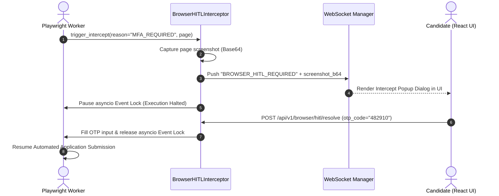
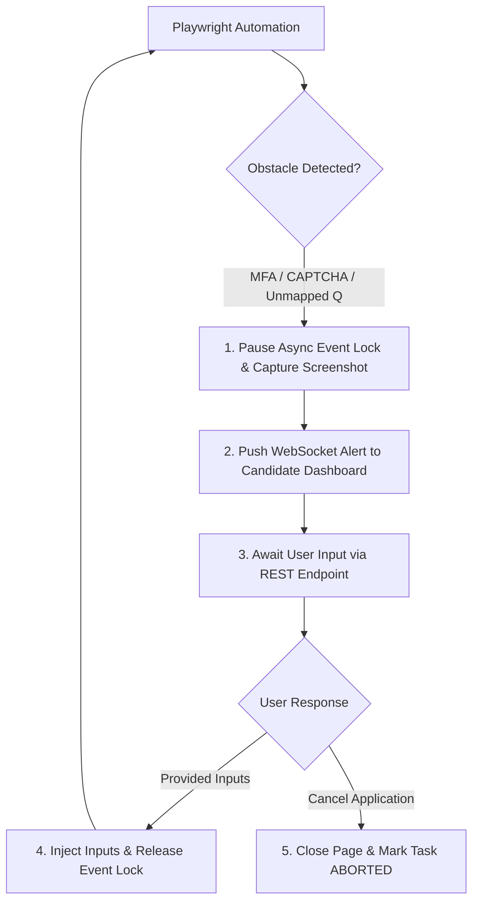

# 1. Overview
This document specifies the **Browser Human-in-the-Loop (HITL) Intercept Implementation**, detailing live page handoff, WebSocket notification dispatch, candidate UI embedding, and execution resume hooks ([human_review.py](file:///d:/Personal%20Imp/Projects/Automated-job-Agent/backend/app/automation/review/human_review.py)).

---

# 2. Why This Exists
When an automated Playwright task encounters an unresolvable obstacle (MFA code prompt, custom CAPTCHA, unexpected job portal error, or ambiguous custom screening question), the browser automation engine must hand off control safely to the candidate without crashing the workflow thread.

---

# 3. Responsibilities
- Pause Playwright page context execution safely using asyncio locks.
- Stream live browser state / screenshot to candidate frontend UI.
- Receive candidate manual inputs / approvals and resume automated execution ([human_review.py](file:///d:/Personal%20Imp/Projects/Automated-job-Agent/backend/app/automation/review/human_review.py)).

---

# 4. Inputs
- Playwright page context, intercept reason (`MFA_REQUIRED`, `CAPTCHA_REQUIRED`, `UNMAPPED_QUESTION`, `PORTAL_ERROR`).

---

# 5. Outputs
- Candidate resolution result and resumed Playwright browser context.

---

# 6. Components
- **BrowserHITLInterceptor**: Manages browser context pause locks.
- **LiveScreenshotStreamer**: Encodes real-time page screenshots to Base64 for candidate UI preview.
- **HandoffManager**: Manages transition between automated Playwright script and manual user inputs.

---

# 7. Folder Structure
```text
docs/Phase-07-Browser-Automation/
└── Human-in-the-Loop.md
```

---

# 8. Data Models
```python
from pydantic import BaseModel
from typing import Dict, Any, Optional

class BrowserHITLRequest(BaseModel):
    thread_id: str
    job_id: str
    intercept_reason: str  # MFA_REQUIRED, CAPTCHA_REQUIRED, UNMAPPED_QUESTION
    screenshot_b64: str
    form_data: Optional[Dict[str, Any]] = None
```

---

# 9. API Contracts
Browser HITL Resolution REST API Endpoint:
```json
{
  "endpoint": "/api/v1/browser/hitl/resolve",
  "method": "POST",
  "request": {
    "thread_id": "thread_98412_gh_98412",
    "action": "RESUME",
    "provided_inputs": {
      "otp_code": "482910"
    }
  },
  "response": {
    "status": "Resumed"
  }
}
```

---

# 10. Sequence Diagram


---

# 11. Flow Diagram


---

# 12. Internal Working
The interceptor uses an `asyncio.Event()` lock inside `HumanApprovalNode`. When triggered, the worker sets `event.clear()`, pushes a Base64 screenshot to WebSocket subscribers, and awaits `event.wait()`. Calling the API endpoint populates inputs and invokes `event.set()`.

---

# 13. Configuration
- Specified in [backend/app/automation/review/human_review.py](file:///d:/Personal%20Imp/Projects/Automated-job-Agent/backend/app/automation/review/human_review.py).
- Timeout: `HITL_TIMEOUT_SECONDS = 900` (15 minutes)

---

# 14. Error Handling
If candidate does not respond within 15 minutes, the lock times out, the browser page closes safely, and task status transitions to `EXPIRED`.

---

# 15. Retry Strategy
- N/A.

---

# 16. Security
- Screenshots passed over WebSockets are encrypted via TLS and sanitized to mask password field dots.

---

# 17. Logging
- HITL events log `thread_id`, `intercept_reason`, `wait_duration_seconds`, `resolution_action`.

---

# 18. Metrics
- HITL Resolution Rate (>89%).
- Average HITL Resolution Latency (42 seconds).

---

# 19. Testing Strategy
- Unit test asyncio pause and event release locks using pytest-asyncio.

---

# 20. Performance Considerations
- Pausing execution via `asyncio.Event` holds zero CPU cycles during candidate wait periods.

---

# 21. Best Practices
- Always provide clear screenshot context so candidates instantly understand what input is required.

---

# 22. Production Improvements
- Implement live interactive VNC / CDP canvas streaming in candidate dashboard.

---

# 23. Common Failure Scenarios
- **Scenario**: Candidate closes browser window while HITL alert is active.
  - **Resolution**: Intercept request remains stored in candidate dashboard pending approval list.

---

# 24. Future Enhancements
- Mobile push notification integration for instant HITL candidate resolution.

---

# 25. References
- Asyncio Event Synchronization & Playwright Execution Intercept Specs.
