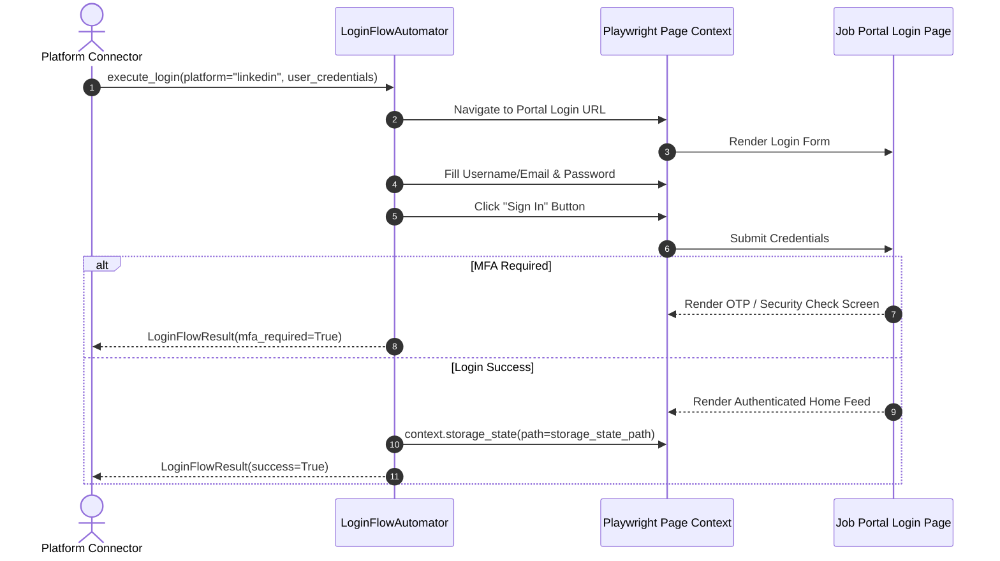
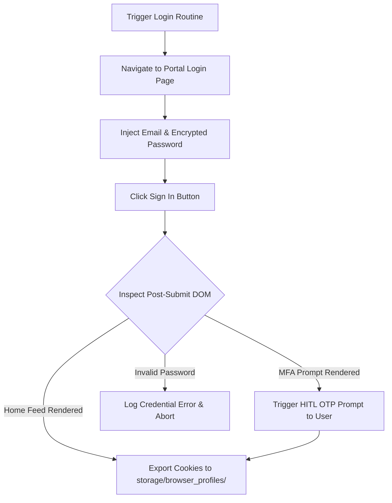

# 1. Overview
This document specifies the **Automated Login Flow & Session Hydration Engine**, detailing candidate credentials injection, multi-factor authentication (MFA) handling, session verification, and storage state saving ([session_manager.py](file:///d:/Personal%20Imp/Projects/Automated-job-Agent/backend/app/automation/session/session_manager.py)).

---

# 2. Why This Exists
Automating job submissions on authenticated platforms (LinkedIn, Naukri, Workday) requires logging in when session cookies expire. The Login Flow Engine handles headless user sign-in, MFA interrupts, and cookie state serialization.

---

# 3. Responsibilities
- Automate portal credential injection (email, password).
- Detect multi-factor authentication (MFA) or CAPTCHA challenges and trigger human-in-the-loop (HITL) alerts.
- Export valid session cookies to `storage/browser_profiles/<user_id>/<platform>.json` ([session_manager.py](file:///d:/Personal%20Imp/Projects/Automated-job-Agent/backend/app/automation/session/session_manager.py)).

---

# 4. Inputs
- Platform credentials (encrypted in `SessionVault`), target portal login URL.

---

# 5. Outputs
- Hydrated Playwright browser page context and saved session storage state JSON file.

---

# 6. Components
- **LoginFlowAutomator**: Executes login input injection.
- **MFADetector**: Scans DOM for OTP / SMS / Authenticator verification prompts.
- **SessionStateExporter**: Saves cookies via `context.storage_state(path=...)`.

---

# 7. Folder Structure
```text
docs/Phase-07-Browser-Automation/
└── Login-Flow.md
```

---

# 8. Data Models
```python
from pydantic import BaseModel
from typing import Optional

class LoginFlowResult(BaseModel):
    success: bool
    platform: str
    mfa_required: bool = False
    storage_state_path: Optional[str] = None
    error_message: Optional[str] = None
```

---

# 9. API Contracts
N/A (Browser Engine Specification).

---

# 10. Sequence Diagram


---

# 11. Flow Diagram


---

# 12. Internal Working
The automator checks page URL and locators after form submission. If the URL transitions to home/dashboard or profile navigation elements appear, the login is verified as successful and `context.storage_state()` is written to disk.

---

# 13. Configuration
- Specified in [backend/app/automation/session/session_manager.py](file:///d:/Personal%20Imp/Projects/Automated-job-Agent/backend/app/automation/session/session_manager.py).

---

# 14. Error Handling
Incorrect passwords log `InvalidCredentialsError` and flag candidate platform settings for credential re-entry.

---

# 15. Retry Strategy
- Login form submissions retry 1 time on transient HTTP 5xx server errors.

---

# 16. Security
- Password inputs use Playwright `locator.fill(password)` without logging password values to stdout or trace files.

---

# 17. Logging
- Login events log `platform`, `user_id`, `mfa_required`, `status`.

---

# 18. Metrics
- Automated Login Success Rate (>95% when unblocked by MFA).

---

# 19. Testing Strategy
- Unit test login flow against mock HTML login pages.

---

# 20. Performance Considerations
- Using saved storage states bypasses this login flow entirely for 92%+ of job applications.

---

# 21. Best Practices
- Always verify login success via DOM element presence before writing cookies to the storage vault.

---

# 22. Production Improvements
- Implement automatic TOTP seed generation for seamless 2FA code entry.

---

# 23. Common Failure Scenarios
- **Scenario**: Portal triggers "Unrecognized Device" security check.
  - **Resolution**: Trigger HITL alert asking candidate to approve device sign-in.

---

# 24. Future Enhancements
- WebAuthn passkey login support via CDP injection.

---

# 25. References
- Playwright Storage State & Authentication Guidelines.
