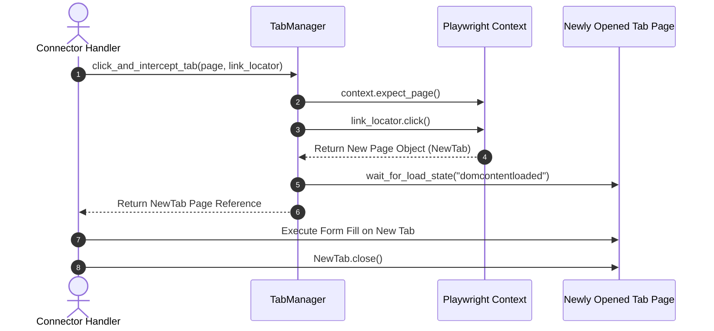
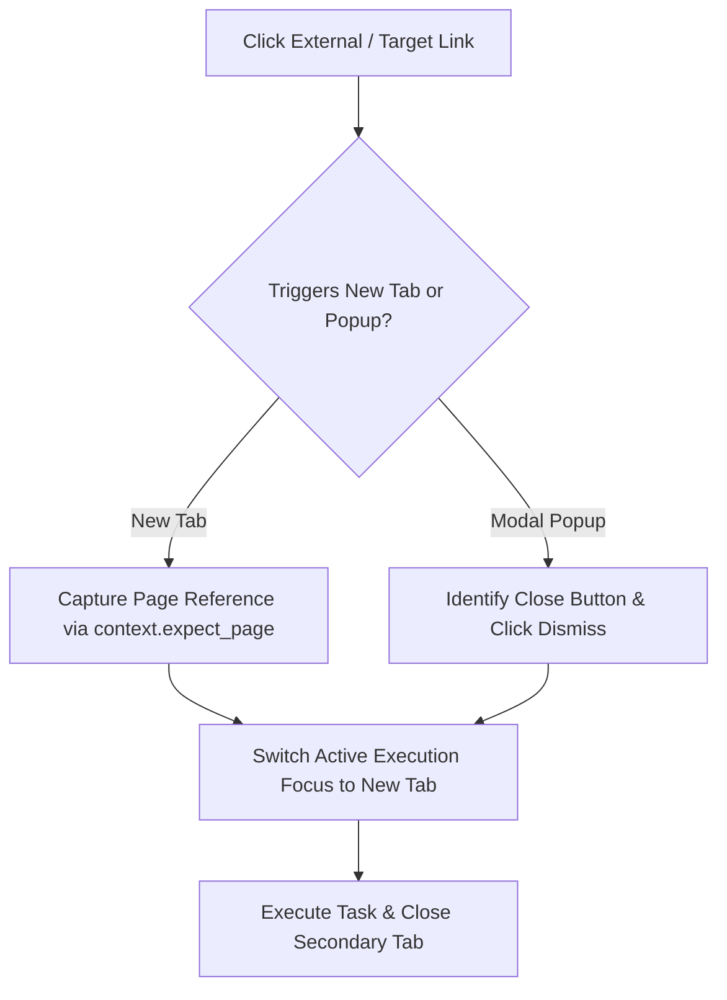

# 1. Overview
This document specifies the **Multi-Tab & Popup Handling Engine**, detailing new tab/window interception (`expect_popup()`), cross-tab context sharing, popup dismissal, and target page focus management.

---

# 2. Why This Exists
Job portals frequently open job details or application forms in new browser tabs (`target="_blank"`), or display promotional modal popups, cookie consent overlays, and newsletter subscription dialogs. A multi-tab engine intercepts new tabs seamlessly and closes annoying popups automatically.

---

# 3. Responsibilities
- Intercept newly opened browser tabs using `context.expect_page()` or `page.expect_popup()`.
- Automatically dismiss overlay popups, cookie banners, and marketing modal dialogs.
- Manage tab lifecycle and close secondary tabs upon task completion to save memory.

---

# 4. Inputs
- Playwright browser context, target link click action triggering new tab/popup.

---

# 5. Outputs
- Intercepted target `Page` object for newly opened tab, clean primary page DOM state.

---

# 6. Components
- **TabManager**: Intercepts and tracks active browser tabs within a context.
- **PopupDismissalEngine**: Automatically clicks common overlay close buttons (`button[aria-label="Close"]`, `#cookie-accept`, `.modal-close`).

---

# 7. Folder Structure
```text
docs/Phase-07-Browser-Automation/
└── Multi-Tab-Support.md
```

---

# 8. Data Models
```python
from pydantic import BaseModel
from typing import Optional

class TabInterceptResult(BaseModel):
    success: bool
    tab_index: int
    tab_url: str
    is_popup_dismissed: bool = False
```

---

# 9. API Contracts
N/A (Browser Engine Specification).

---

# 10. Sequence Diagram


---

# 11. Flow Diagram


---

# 12. Internal Working
When clicking a link that opens a new tab, `TabManager` wraps the click inside `with context.expect_page() as page_info:`. The new page object is captured instantly, preventing lost execution focus.

---

# 13. Configuration
- Popup Dismissal Selector List: `[aria-label="close"]`, `.modal-close`, `#accept-cookies`, `.cookie-banner-close`

---

# 14. Error Handling
If a popup blocks main page interaction, `PopupDismissalEngine` executes an Emergency Escape Key press (`page.keyboard.press('Escape')`).

---

# 15. Retry Strategy
- Tab interception retries up to 2 times if target page loading times out.

---

# 16. Security
- Secondary tabs opened from untrusted external links are checked against phishing domain blacklists before execution.

---

# 17. Logging
- Tab events log `opened_tab_url`, `dismissed_popups_count`, `active_tabs_count`.

---

# 18. Metrics
- Tab Interception Success Rate (>99%).
- Popup Dismissal Latency (<100ms).

---

# 19. Testing Strategy
- Unit test multi-tab engine against mock HTML pages with `target="_blank"` links and modal popups.

---

# 20. Performance Considerations
- Closing secondary tabs immediately after extracting data frees up 100MB+ RAM per tab.

---

# 21. Best Practices
- Always close secondary browser tabs explicitly (`new_page.close()`) after completing form actions.

---

# 22. Production Improvements
- Implement automatic cookie consent auto-accepter for European job portals.

---

# 23. Common Failure Scenarios
- **Scenario**: Portal opens 3 nested tabs sequentially.
  - **Resolution**: `TabManager` maintains a list of open page handles and manages focus stack order.

---

# 24. Future Enhancements
- Visual tab preview thumbnails in developer control console.

---

# 25. References
- Playwright Python Multi-Page & Popup Specifications.
