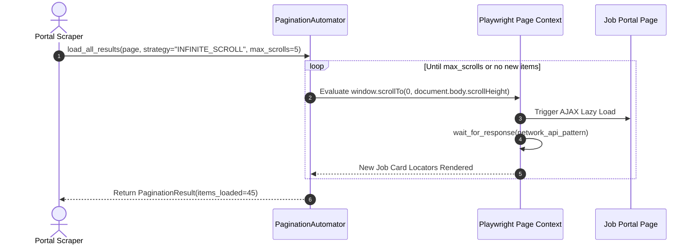
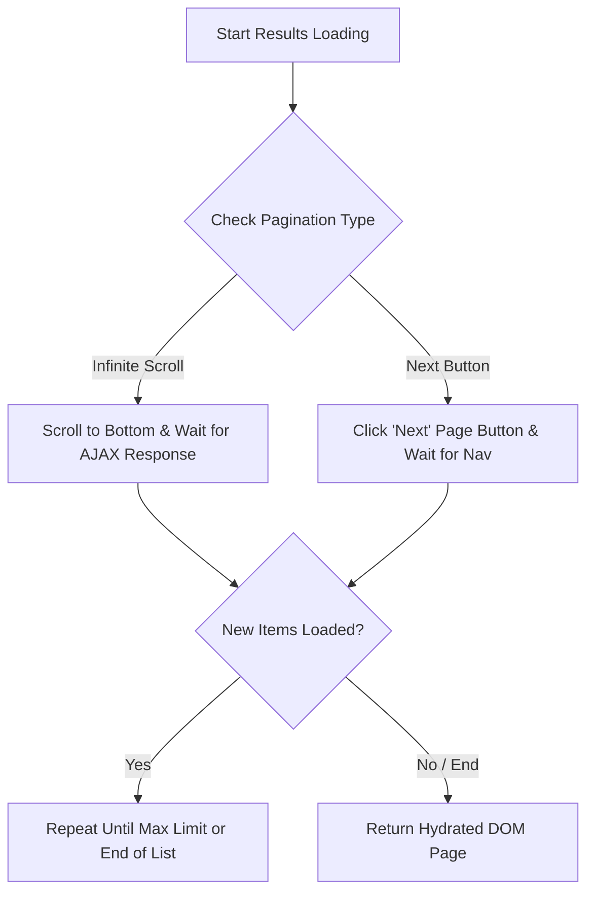

# 1. Overview
This document specifies the **Infinite Scroll & Page Pagination Engine**, detailing infinite scroll triggering, lazy-load element waiting, page number navigation, and virtualized list item extraction.

---

# 2. Why This Exists
Job portals (LinkedIn, Indeed, Naukri, Wellfound) display search results using infinite scroll containers or paginated list controls (`Next >` buttons). Scrapers must smoothly scroll down pages and trigger dynamic AJAX hydration to load all matching job postings.

---

# 3. Responsibilities
- Automate page scrolling (`window.scrollTo(0, document.body.scrollHeight)`) to trigger infinite scroll loading.
- Wait for AJAX network responses and DOM list updates before extracting job cards.
- Execute page number click navigation (`page.locator('button[aria-label="Next"]').click()`).

---

# 4. Inputs
- Playwright page context, target pagination strategy (`INFINITE_SCROLL` vs `PAGE_BUTTONS`), maximum pages to crawl.

---

# 5. Outputs
- Fully hydrated job list DOM state ready for raw job card extraction.

---

# 6. Components
- **PaginationAutomator**: Manages scroll events and pagination clicks.
- **AJAXResponseWatcher**: Waits for background network responses (`page.wait_for_response(...)`).

---

# 7. Folder Structure
```text
docs/Phase-07-Browser-Automation/
└── Pagination-and-Scroll.md
```

---

# 8. Data Models
```python
from pydantic import BaseModel
from typing import Optional

class PaginationResult(BaseModel):
    current_page: int
    total_items_loaded: int
    has_next_page: bool
    scroll_duration_ms: float
```

---

# 9. API Contracts
N/A (Browser Engine Specification).

---

# 10. Sequence Diagram


---

# 11. Flow Diagram


---

# 12. Internal Working
For infinite scroll, `PaginationAutomator` evaluates `window.scrollTo` with jittered delays (300-800ms) mimicking human scrolling speed to prevent triggering anti-bot detections.

---

# 13. Configuration
- Max Scroll Count: `MAX_INFINITE_SCROLLS = 10`
- Scroll Delay Range: `300ms - 800ms`

---

# 14. Error Handling
If scrolling fails to trigger new items after 3 attempts, the automator concludes the end of the job list has been reached and returns loaded items.

---

# 15. Retry Strategy
- Scroll evaluations retry up to 2 times with increased delay.

---

# 16. Security
- Scrolling scripts contain safe viewport commands that cannot execute malicious script injections.

---

# 17. Logging
- Scroll events log `page_number`, `items_loaded_count`, `has_next_page`, `duration_ms`.

---

# 18. Metrics
- Item Load Accuracy (>98%).
- Average Scroll Cycle Latency (<600ms per scroll).

---

# 19. Testing Strategy
- Unit test pagination automator against mock HTML pages with infinite scroll and paginated list controls.

---

# 20. Performance Considerations
- Scrolling in small increments prevents browser memory spikes on virtualized list items.

---

# 21. Best Practices
- Always combine `window.scrollTo` with explicit network response waiting (`page.wait_for_response(...)`) rather than fixed time delays.

---

# 22. Production Improvements
- Intercept GraphQL search responses directly during scroll events to extract raw JSON data before DOM rendering.

---

# 23. Common Failure Scenarios
- **Scenario**: Portal uses sticky footer overlapping "Next" page button.
  - **Resolution**: `PaginationAutomator` uses `locator.scroll_into_view_if_needed()` before executing click.

---

# 24. Future Enhancements
- Automated detection of virtualized list dom recycling.

---

# 25. References
- Playwright Page Scroll & Network Response Specifications.
