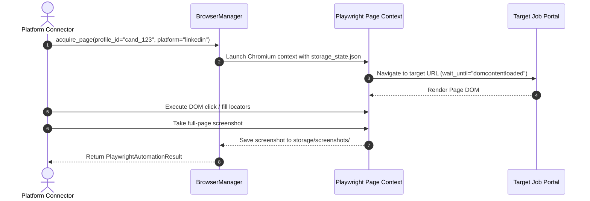
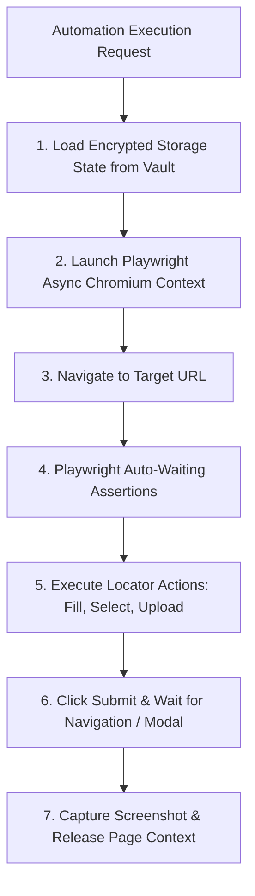

# 1. Overview
This document specifies the **Playwright Async Browser Automation Architecture**, detailing browser context management, persistent storage profile injection, page lifecycle hooks, network event listening, and screenshot archival ([playwright_client.py](file:///d:/Personal%20Imp/Projects/Automated-job-Agent/backend/app/automation/browser/playwright_client.py)).

---

# 2. Why This Exists
Web applications across job boards and Applicant Tracking Systems (ATS) rely on dynamic client-side single-page app (SPA) hydration, dynamic modal overlays, shadow DOM elements, and anti-bot protection algorithms. A robust, non-blocking browser automation engine is required to control headless Chromium browser contexts safely and reliably.

---

# 3. Responsibilities
- Manage asynchronous Playwright Chromium browser instances and page contexts ([playwright_client.py](file:///d:/Personal%20Imp/Projects/Automated-job-Agent/backend/app/automation/browser/playwright_client.py)).
- Inject persistent session cookies and local storage tokens from `storage/browser_profiles/` ([config.py](file:///d:/Personal%20Imp/Projects/Automated-job-Agent/backend/app/config.py#L13)).
- Capture full-page confirmation evidence screenshots saved to `storage/screenshots/` ([config.py](file:///d:/Personal%20Imp/Projects/Automated-job-Agent/backend/app/config.py#L14)).

---

# 4. Inputs
- Target page URLs, form fill actions, file upload paths, browser profile IDs.

---

# 5. Outputs
- DOM action execution results, filled form fields, page screenshots, and post-submission DOM verification.

---

# 6. Components
- **PlaywrightClient**: Asynchronous manager for Playwright browser contexts and pages ([playwright_client.py](file:///d:/Personal%20Imp/Projects/Automated-job-Agent/backend/app/automation/browser/playwright_client.py)).
- **BrowserManager**: High-level manager wrapping context pool allocation ([browser_manager.py](file:///d:/Personal%20Imp/Projects/Automated-job-Agent/backend/app/services/browser_manager.py)).
- **ScreenshotVault**: Manages proof screenshot captures saved to `storage/screenshots/`.

---

# 7. Folder Structure
```text
docs/Phase-07-Browser-Automation/
├── Playwright-Architecture.md
├── Login-Flow.md
├── Dynamic-Forms.md
├── File-Upload.md
├── Shadow-DOM-and-iFrames.md
├── Pagination-and-Scroll.md
├── Multi-Tab-Support.md
├── Cookie-Persistence.md
├── Fingerprint-Avoidance.md
├── Captcha-Handling.md
├── Human-in-the-Loop.md
└── Error-Recovery.md
```

---

# 8. Data Models
```python
from pydantic import BaseModel
from typing import Optional, List

class PlaywrightAutomationResult(BaseModel):
    success: bool
    url: str
    screenshot_path: Optional[str] = None
    execution_time_ms: float
    logs: List[str]
```

---

# 9. API Contracts
N/A (Browser Engine Specification).

---

# 10. Sequence Diagram


---

# 11. Flow Diagram


---

# 12. Internal Working
Playwright connects directly via Chrome DevTools Protocol (CDP). Auto-waiting locators (`page.locator('button#submit').click()`) verify that target elements are visible, enabled, and stable before dispatching click events.

---

# 13. Configuration
- Specified in [backend/app/config.py](file:///d:/Personal%20Imp/Projects/Automated-job-Agent/backend/app/config.py).
- `BROWSER_HEADLESS`: `True`
- `PLAYWRIGHT_TIMEOUT_MS`: `30000`

---

# 14. Error Handling
Element interaction timeouts raise `PlaywrightTimeoutError`. The client captures a diagnostic screenshot (`storage/screenshots/error_<timestamp>.png`) and logs page console errors.

---

# 15. Retry Strategy
- Page locator actions retry up to 3 times with 1-second delays.

---

# 16. Security
- Browser context processes run in sandboxed environments with isolated cookies and zero remote debugging port access in production.

---

# 17. Logging
- Browser events log `url`, `action_type`, `selector`, `latency_ms`, `http_status`.

---

# 18. Metrics
- Browser Action Success Rate (>96%).
- Average Page Navigation Time (<1.8s).

---

# 19. Testing Strategy
- Unit test browser automation against mock local HTML form fixtures.

---

# 20. Performance Considerations
- Context reuse across consecutive jobs on the same platform saves 2-3 seconds of browser launch cold-start per application.

---

# 21. Best Practices
- Never use static `time.sleep()`; rely exclusively on Playwright locators with auto-waiting (`expect(locator).to_be_visible()`).

---

# 22. Production Improvements
- Mount Playwright browser context pools in distributed headless browser cluster nodes.

---

# 23. Common Failure Scenarios
- **Scenario**: Portal hydration delays element rendering past 30 seconds.
  - **Resolution**: Client catches timeout, checks page console logs, and attempts locator fallback.

---

# 24. Future Enhancements
- Live CDP network tracing visualizer for operational debugging.

---

# 25. References
- Playwright Python Architecture & API Documentation.
