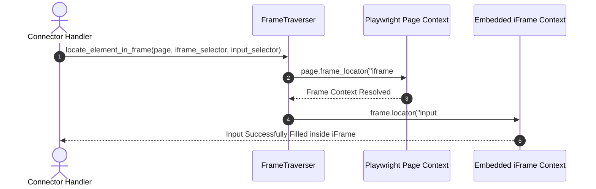

# 1. Overview
This document specifies the **Shadow DOM & iFrame Automation Engine**, detailing cross-frame locator resolution, shadow root piercing, and embedded ATS form execution.

---

# 2. Why This Exists
Enterprise career portals often embed ATS application forms (Greenhouse, Workday, Taleo) inside cross-origin `<iframe>` containers or open web component shadow DOM trees (`#shadow-root`). Legacy tools fail because standard DOM selectors cannot cross frame boundaries.

---

# 3. Responsibilities
- Pierce web component shadow DOM boundaries automatically using Playwright locators.
- Locate and traverse cross-origin `<iframe>` elements using `page.frame_locator(...)`.
- Execute form filling and file uploads inside nested frame contexts.

---

# 4. Inputs
- Playwright page context, target form input selectors, iframe frame name/URL patterns.

---

# 5. Outputs
- Interacted DOM locators within shadow roots and frame contexts.

---

# 6. Components
- **FrameTraverser**: Resolves target iframe contexts using `page.frame_locator(...)`.
- **ShadowDOMPiercer**: Uses Playwright's native shadow-piercing CSS selector engine.

---

# 7. Folder Structure
```text
docs/Phase-07-Browser-Automation/
└── Shadow-DOM-and-iFrames.md
```

---

# 8. Data Models
```python
from pydantic import BaseModel
from typing import Optional

class FrameLocatorDescriptor(BaseModel):
    iframe_selector: str
    frame_url_pattern: Optional[str] = None
    target_input_selector: str
```

---

# 9. API Contracts
N/A (Browser Engine Specification).

---

# 10. Sequence Diagram


---

# 11. Flow Diagram
```mermaid
flowchart TD
    Page[Main Employer Page] --> Detect{Is Form Inside iFrame or Shadow DOM?}
    Detect -->|Shadow DOM| Shadow[Playwright Shadow-Piercing Selector Engine]
    Detect -->|iFrame| Frame[page.frame_locator('iframe#target_id')]
    Detect -->|Standard DOM| Standard[page.locator('input#target_id')]
    Shadow --> Fill[Execute Form Fill Actions]
    Frame --> Fill
    Standard --> Fill
```

---

# 12. Internal Working
Playwright selectors pierce shadow DOM roots by default without extra configuration (e.g. `page.locator('custom-element input')` automatically pierces `#shadow-root`). For iFrames, `page.frame_locator('iframe[src*="greenhouse"]')` creates a transparent frame context.

---

# 13. Configuration
- Specified in [backend/app/automation/browser/playwright_client.py](file:///d:/Personal%20Imp/Projects/Automated-job-Agent/backend/app/automation/browser/playwright_client.py).

---

# 14. Error Handling
If an iframe fails to load due to cross-origin CORS security blocks, `FrameTraverser` catches `FrameNotFoundError` and navigates directly to the iframe source URL.

---

# 15. Retry Strategy
- Frame resolution retries up to 3 times while waiting for iframe DOM hydration (`wait_for_selector`).

---

# 16. Security
- Playwright frame locators adhere to browser security sandboxes while allowing explicit user-authorized automation.

---

# 17. Logging
- Frame events log `iframe_selector`, `frame_url`, `inner_locator`, `status`.

---

# 18. Metrics
- Frame Resolution Speed (<30ms).

---

# 19. Testing Strategy
- Unit test frame traverser against mock HTML pages containing nested iFrames and web components with shadow roots.

---

# 20. Performance Considerations
- `frame_locator` avoids switching global browser context, maintaining high execution speed.

---

# 21. Best Practices
- Always use `page.frame_locator(...)` instead of legacy `page.frames[0]` index references.

---

# 22. Production Improvements
- Build automatic iframe detector that extracts iframe source URLs and logs embedded ATS types.

---

# 23. Common Failure Scenarios
- **Scenario**: Company career site embeds form inside double-nested iFrames.
  - **Resolution**: Chained frame locators (`page.frame_locator('iframe#outer').frame_locator('iframe#inner')`) traverse multi-level nesting seamlessly.

---

# 24. Future Enhancements
- Automated visual frame boundary detection via Vision AI.

---

# 25. References
- Playwright Shadow DOM & Frame Locator Specifications.
