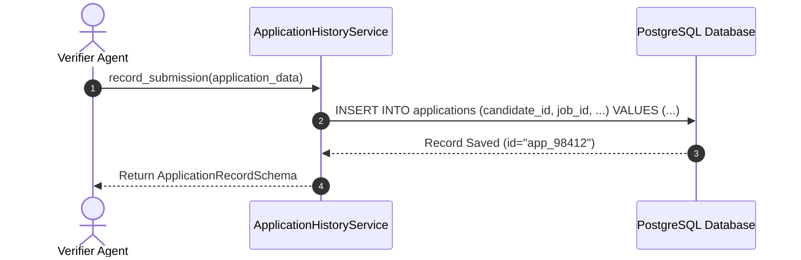
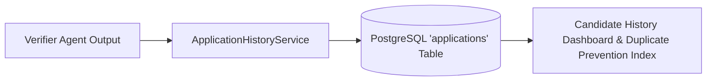

# 1. Overview
This document specifies the **Application History & Immutable Submission Memory Subsystem**, detailing PostgreSQL relational schema, proof screenshot links, submission tracking statuses, and duplicate check indexes ([models.py](file:///d:/Personal%20Imp/Projects/Automated-job-Agent/backend/app/models/models.py)).

---

# 2. Why This Exists
Candidates require a complete, immutable record of every job application submitted by the automated agent: job details, submission timestamp, tailored resume PDF path, proof screenshot URL, application confirmation ID, and application lifecycle status (`APPLIED`, `INTERVIEWING`, `REJECTED`, `OFFER`) ([models.py](file:///d:/Personal%20Imp/Projects/Automated-job-Agent/backend/app/models/models.py)).

---

# 3. Responsibilities
- Record application submission records in PostgreSQL `applications` table ([models.py](file:///d:/Personal%20Imp/Projects/Automated-job-Agent/backend/app/models/models.py)).
- Link tailored resume PDF files (`storage/tailored_resumes/`) and proof screenshots (`storage/screenshots/`) ([config.py](file:///d:/Personal%20Imp/Projects/Automated-job-Agent/backend/app/config.py#L14)).
- Provide indexed duplicate application prevention checks for Reflection Engine.

---

# 4. Inputs
- Completed `ApplicationResult` payload from Verifier Agent.

---

# 5. Outputs
- Saved `ApplicationRecord` database entity and application history query API payloads.

---

# 6. Components
- **ApplicationModel**: SQLAlchemy ORM entity ([models.py](file:///d:/Personal%20Imp/Projects/Automated-job-Agent/backend/app/models/models.py)).
- **ApplicationHistoryService**: Service managing submission history persistence and querying.

---

# 7. Folder Structure
```text
docs/Phase-08-Memory/
└── Application-History-Memory.md
```

---

# 8. Data Models
```python
from pydantic import BaseModel
from typing import Optional
from datetime import datetime

class ApplicationRecordSchema(BaseModel):
    id: str
    candidate_id: str
    job_id: str
    job_title: str
    company_name: str
    platform: str
    status: str = "APPLIED"  # APPLIED, INTERVIEWING, REJECTED, OFFER, WITHDRAWN
    confirmation_id: Optional[str] = None
    tailored_resume_path: str
    screenshot_path: str
    applied_at: datetime = Field(default_factory=datetime.utcnow)
```

---

# 9. API Contracts
Application History API Endpoint Response:
```json
{
  "endpoint": "/api/v1/applications/history",
  "method": "GET",
  "response": {
    "total_applications": 42,
    "applications": [
      {
        "id": "app_98412",
        "job_title": "Senior Backend Engineer",
        "company_name": "Acme Corp",
        "status": "APPLIED",
        "applied_at": "2026-07-28T14:32:00Z"
      }
    ]
  }
}
```

---

# 10. Sequence Diagram


---

# 11. Flow Diagram


---

# 12. Internal Working
The database table includes a composite unique index on `(candidate_id, job_id)` to enforce absolute database-level duplicate submission prevention.

---

# 13. Configuration
- Specified in [backend/app/models/models.py](file:///d:/Personal%20Imp/Projects/Automated-job-Agent/backend/app/models/models.py).

---

# 14. Error Handling
Duplicate insertion attempts raise `IntegrityError`, caught by the service to prevent corrupt duplicate state creation.

---

# 15. Retry Strategy
- Database writes retry up to 2 times on connection pool lock delays.

---

# 16. Security
- Database access enforces candidate user ID row isolation.

---

# 17. Logging
- History events log `candidate_id`, `job_id`, `company_name`, `status`, `duration_ms`.

---

# 18. Metrics
- History Record Insertion Speed (<5ms).

---

# 19. Testing Strategy
- Unit test application history persistence and query filters using pytest-asyncio and SQLite/PostgreSQL fixtures.

---

# 20. Performance Considerations
- Indexing `(candidate_id, applied_at)` ensures sub-10ms query execution across 100,000+ historical records.

---

# 21. Best Practices
- Never overwrite historical submission records; mark state changes via `status` field updates.

---

# 22. Production Improvements
- Implement automated CSV/PDF application export feature for candidate job search reporting.

---

# 23. Common Failure Scenarios
- **Scenario**: DB transaction fails after PDF file written to disk.
  - **Resolution**: Transaction rollback cleans up uncommitted database states and logs file path for cleanup.

---

# 24. Future Enhancements
- Integration with external candidate tracking tools (e.g. Notion, Airtable, Huntr).

---

# 25. References
- Application History Schema & Tracking Specifications.
