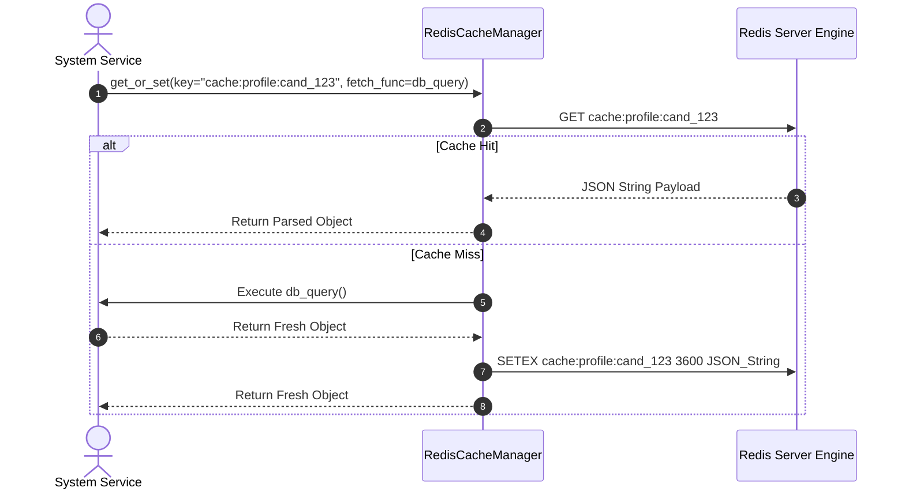

# 1. Overview
This document specifies the **Redis L2 Cache Memory & Volatile State Subsystem**, detailing Redis caching strategies, key namespace conventions, TTL eviction policies, rate limit counters, and pub/sub event broadcasting.

---

# 2. Why This Exists
High-frequency agent operations (querying candidate profiles, checking rate limits, checking duplicate job IDs, streaming progress events) generate excessive PostgreSQL and Qdrant database queries if un-cached. A dedicated Redis L2 Cache Subsystem provides ultra-fast in-memory caching.

---

# 3. Responsibilities
- Cache active candidate profiles (`cache:profile:<id>`, TTL 1 hour).
- Cache raw job search results (`cache:job_query:<hash>`, TTL 24 hours).
- Manage sliding window rate limit counters (`ratelimit:<platform>:<id>`).
- Broadcast real-time execution progress messages over Redis Pub/Sub channels.

---

# 4. Inputs
- Cache key, raw data payload, TTL duration.

---

# 5. Outputs
- Cached string / JSON string or pub/sub broadcast delivery confirmation.

---

# 6. Components
- **RedisCacheManager**: High-level manager wrapping `redis-py` async client.
- **CacheKeyBuilder**: Constructs standardized Redis key strings.

---

# 7. Folder Structure
```text
docs/Phase-08-Memory/
└── Cache-Memory.md
```

---

# 8. Data Models
```python
from pydantic import BaseModel
from typing import Optional

class CacheItemSpec(BaseModel):
    key: str
    value_json: str
    ttl_seconds: int = 3600
```

---

# 9. API Contracts
N/A (Subsystem Spec).

---

# 10. Sequence Diagram


---

# 11. Flow Diagram
```mermaid
flowchart TD
    Req[Read Data Request] --> CheckRedis{1. Query Redis In-Memory Key}
    CheckRedis -->|Hit| ReturnFast[2. Return Cached Data (<1ms)]
    CheckRedis -->|Miss| QuerySource[3. Query PostgreSQL / Qdrant Source DB]
    QuerySource --> WriteRedis[4. Write Payload to Redis with TTL]
    WriteRedis --> ReturnFast
```

---

# 12. Internal Working
Key namespace conventions:
- `cache:profile:<id>` (Candidate profile)
- `cache:job:<id>` (Job posting)
- `ratelimit:<platform>:<id>` (Rate limits)
- `session:<id>` (User Auth Session)
- `stream:progress:<task_id>` (Pub/Sub Channel)

---

# 13. Configuration
- Redis Port: `6379`
- Eviction Policy: `allkeys-lru` (Least Recently Used)

---

# 14. Error Handling
If Redis is offline, the manager catches connection errors, logs degraded warning telemetry, and bypasses cache to read directly from PostgreSQL/Qdrant databases.

---

# 15. Retry Strategy
- Redis commands retry up to 2 times on network socket reconnects.

---

# 16. Security
- Sensitive tokens stored in Redis are encrypted or stored with strict password authentication enabled (`requirepass`).

---

# 17. Logging
- Cache events log `action` (GET/SET/DEL), `key`, `hit_or_miss`, `latency_ms`.

---

# 18. Metrics
- Cache Hit Ratio (>85%).
- Read/Write Latency (<0.8ms).

---

# 19. Testing Strategy
- Unit test cache manager against mock Redis client (`fakeredis`).

---

# 20. Performance Considerations
- JSON serialization uses `orjson` for 3x faster string serialization than standard `json`.

---

# 21. Best Practices
- Always set an explicit TTL on cached keys to prevent unbounded memory growth.

---

# 22. Production Improvements
- Deploy Redis Sentinel / Cluster for high availability and automatic failover.

---

# 23. Common Failure Scenarios
- **Scenario**: Redis memory reaches 100% capacity.
  - **Resolution**: `allkeys-lru` eviction policy automatically drops oldest un-accessed cache keys to free memory.

---

# 24. Future Enhancements
- Client-side in-memory LRU cache layering in Python worker processes for microsecond lookups.

---

# 25. References
- Redis Architecture & Caching Strategy Guidelines.
