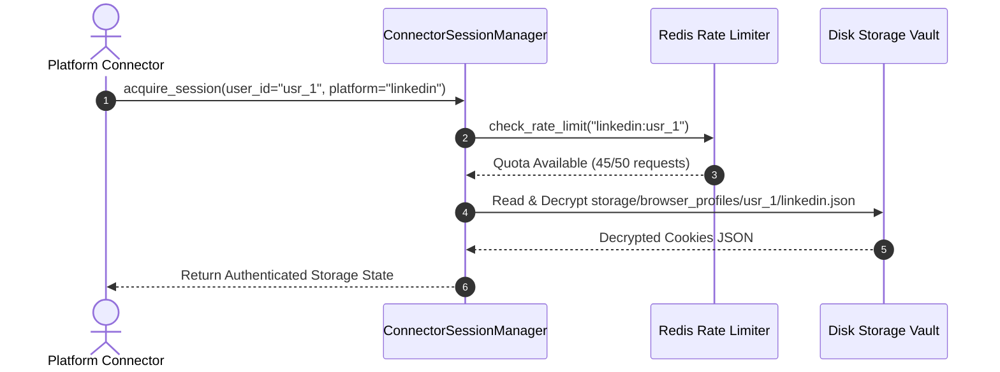
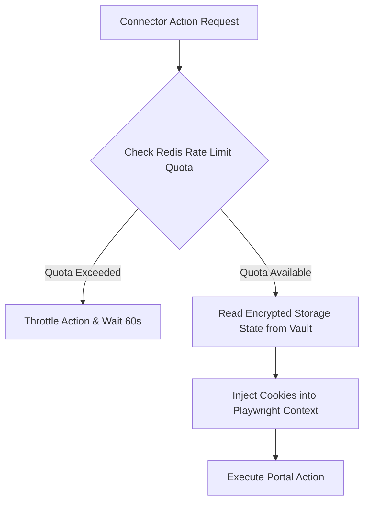

# 1. Overview
This document specifies the **Connector Session & Portal State Memory Subsystem**, detailing encrypted browser cookie storage state vaults, portal login tokens, rate limit counters, and portal health metrics ([session_manager.py](file:///d:/Personal%20Imp/Projects/Automated-job-Agent/backend/app/automation/session/session_manager.py)).

---

# 2. Why This Exists
Each job portal (LinkedIn, Naukri, Workday, Greenhouse) maintains distinct session authentication states, API rate limit quotas, and portal health metrics. Storing connector state separately from candidate profile memory isolates platform-specific runtime metadata.

---

# 3. Responsibilities
- Store encrypted Playwright session storage state files (`storage/browser_profiles/`) ([config.py](file:///d:/Personal%20Imp/Projects/Automated-job-Agent/backend/app/config.py#L13)).
- Track connector rate limit counters in Redis.
- Record portal health status (Normal, Degraded, Blocked).

---

# 4. Inputs
- Platform connector ID, candidate user ID, active session context.

---

# 5. Outputs
- Decrypted storage state JSON payloads and rate limit quota status.

---

# 6. Components
- **ConnectorSessionManager**: Manages cookie storage vaults ([session_manager.py](file:///d:/Personal%20Imp/Projects/Automated-job-Agent/backend/app/automation/session/session_manager.py)).
- **RateLimitTracker**: Redis-backed sliding window rate limiter.
- **PortalHealthMonitor**: Records portal HTTP 429/403 block events.

---

# 7. Folder Structure
```text
docs/Phase-08-Memory/
└── Connector-Memory.md
```

---

# 8. Data Models
```python
from pydantic import BaseModel, Field
from typing import Optional
from datetime import datetime

class ConnectorSessionState(BaseModel):
    user_id: str
    platform_id: str  # linkedin, naukri, workday, greenhouse
    is_authenticated: bool = True
    encrypted_vault_path: str
    rate_limit_requests_remaining: int
    health_status: str = Field(default="HEALTHY", description="HEALTHY, DEGRADED, BLOCKED")
    last_verified_at: datetime = Field(default_factory=datetime.utcnow)
```

---

# 9. API Contracts
N/A (Subsystem Spec).

---

# 10. Sequence Diagram


---

# 11. Flow Diagram


---

# 12. Internal Working
The subsystem uses Redis key-value pairs with TTL expiration (`EXPIRE`) to track portal request rates (e.g. max 50 LinkedIn applications per candidate per day) and enforce sliding window rate limits.

---

# 13. Configuration
- Specified in [backend/app/automation/session/session_manager.py](file:///d:/Personal%20Imp/Projects/Automated-job-Agent/backend/app/automation/session/session_manager.py).

---

# 14. Error Handling
Rate limit breaches trigger automatic task throttling without throwing application errors.

---

# 15. Retry Strategy
- Vault file reads retry up to 2 times on file lock collisions.

---

# 16. Security
- Session cookies are encrypted at rest via AES-256-GCM.

---

# 17. Logging
- Connector memory events log `user_id`, `platform_id`, `requests_remaining`, `health_status`.

---

# 18. Metrics
- Session Load Speed (<15ms).
- Rate Limit Compliance Rate (100%).

---

# 19. Testing Strategy
- Unit test connector session manager and rate limiter against mock Redis instance.

---

# 20. Performance Considerations
- Redis in-memory storage keeps rate limit checks under 1 millisecond latency.

---

# 21. Best Practices
- Always decrement rate limit counters before dispatching portal network actions.

---

# 22. Production Improvements
- Dynamic rate limit adjustment based on detected portal anti-bot strictness.

---

# 23. Common Failure Scenarios
- **Scenario**: Portal returns HTTP 429 Too Many Requests.
  - **Resolution**: `PortalHealthMonitor` marks status `DEGRADED` and pauses portal tasks for 15 minutes.

---

# 24. Future Enhancements
- Automated multi-proxy session binding for enterprise scale.

---

# 25. References
- Connector Memory Architecture Specifications.
