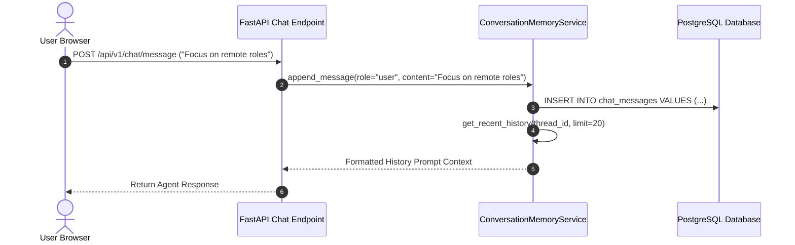
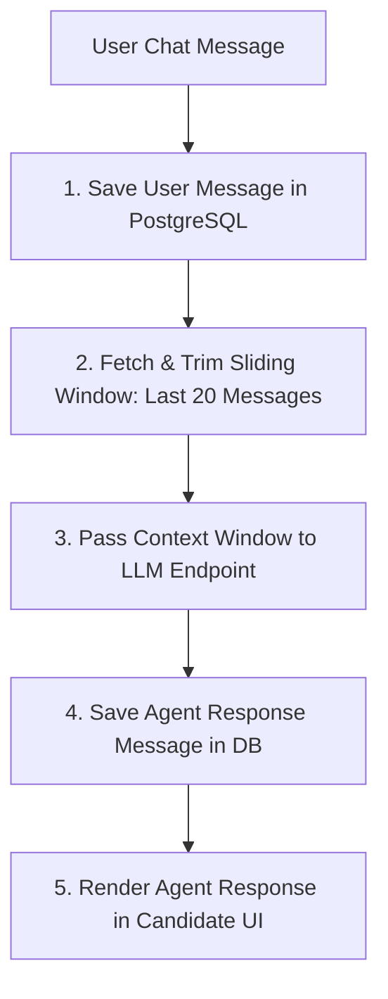

# 1. Overview
This document specifies the **Candidate Conversation & Chat Interaction Memory Subsystem**, detailing chat session persistence, user directive history, context window trimming, and multi-turn interaction state management.

---

# 2. Why This Exists
Candidates interact with the automated job agent via a conversational dashboard interface (asking for campaign status, updating job preferences, or overriding resume tailoring settings). Storing multi-turn chat memory ensures the agent maintains context across user sessions.

---

# 3. Responsibilities
- Persist multi-turn candidate chat messages in PostgreSQL `chat_messages` table.
- Supply conversation context to LLM planning and chat endpoints.
- Manage context window token trimming (sliding window of last 20 messages).

---

# 4. Inputs
- Candidate chat inputs, agent responses, session thread ID.

---

# 5. Outputs
- Saved message records and formatted conversation history context strings.

---

# 6. Components
- **ChatMessageModel**: SQLAlchemy ORM entity.
- **ConversationMemoryService**: Manages message persistence and token trimming.

---

# 7. Folder Structure
```text
docs/Phase-08-Memory/
└── Conversation-Memory.md
```

---

# 8. Data Models
```python
from pydantic import BaseModel
from typing import Optional
from datetime import datetime

class ChatMessageSchema(BaseModel):
    id: str
    thread_id: str
    candidate_id: str
    role: str  # user, assistant, system
    content: str
    created_at: datetime = Field(default_factory=datetime.utcnow)
```

---

# 9. API Contracts
Conversation History API Endpoint:
```json
{
  "endpoint": "/api/v1/chat/history",
  "method": "GET",
  "response": {
    "thread_id": "thread_cand_98412",
    "messages": [
      {
        "role": "user",
        "content": "Focus today's campaign on remote Python roles."
      },
      {
        "role": "assistant",
        "content": "Understood. Updating search filters to Remote Python positions."
      }
    ]
  }
}
```

---

# 10. Sequence Diagram


---

# 11. Flow Diagram


---

# 12. Internal Working
The subsystem implements a sliding context window that retains system prompts, user preferences, and the 20 most recent dialogue turns, truncating older messages to stay within LLM token boundaries.

---

# 13. Configuration
- Max Context Window Messages: `MAX_CHAT_CONTEXT_MESSAGES = 20`

---

# 14. Error Handling
Database errors fall back gracefully to in-memory session arrays.

---

# 15. Retry Strategy
- N/A.

---

# 16. Security
- Conversation logs strictly enforce candidate user thread isolation.

---

# 17. Logging
- Conversation events log `thread_id`, `role`, `message_length`, `duration_ms`.

---

# 18. Metrics
- History Retrieval Speed (<4ms).

---

# 19. Testing Strategy
- Unit test sliding context window trimming logic.

---

# 20. Performance Considerations
- Database index on `(thread_id, created_at DESC)` ensures sub-5ms message retrieval.

---

# 21. Best Practices
- Never store raw API keys or plain-text candidate credentials in chat history tables.

---

# 22. Production Improvements
- Summarize long conversation histories using LLM background consolidation tasks.

---

# 23. Common Failure Scenarios
- **Scenario**: Chat session exceeds 500 messages over a month.
  - **Resolution**: Sliding window reads only the last 20 messages; background task archives old entries.

---

# 24. Future Enhancements
- Multi-channel conversation memory syncing across Web UI, WhatsApp, and Telegram interfaces.

---

# 25. References
- LLM Conversation Context Management Specifications.
