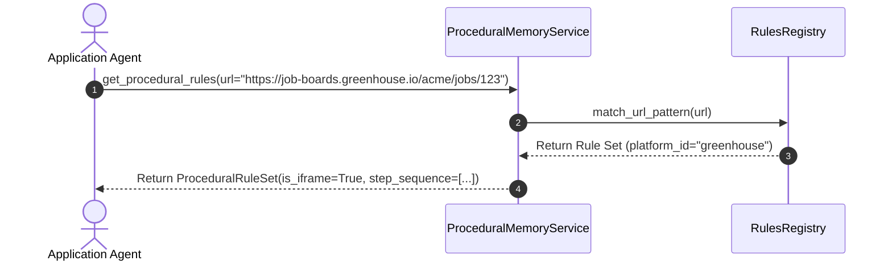
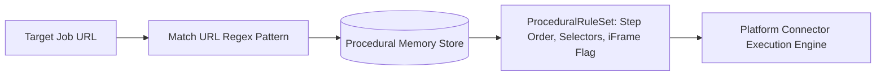

# 1. Overview
This document specifies the **Procedural Memory & Portal Interaction Rules Subsystem**, detailing learned portal interaction sequences, custom form fill strategies, self-healing DOM selector rules, and portal-specific execution patterns ([registry.py](file:///d:/Personal%20Imp/Projects/Automated-job-Agent/backend/app/automation/portal_plugins/registry.py)).

---

# 2. Why This Exists
Different Applicant Tracking Systems (Workday, Greenhouse, Lever, Taleo) exhibit unique procedural behavior: Workday requires creating a candidate account first, Greenhouse embeds forms in cross-origin iFrames, and Taleo uses multi-page wizard navigation. Storing these learned interaction steps in Procedural Memory prevents repeating execution mistakes.

---

# 3. Responsibilities
- Store portal execution rule sets (e.g. `WORKDAY_SIGNUP_FIRST`, `GREENHOUSE_IFRAME_EMBED`, `LEVER_SINGLE_PAGE`).
- Store dynamic self-healing selector rules learned from past successful applications.
- Provide step-by-step procedural directives to Application Agent and Platform Connectors ([registry.py](file:///d:/Personal%20Imp/Projects/Automated-job-Agent/backend/app/automation/portal_plugins/registry.py)).

---

# 4. Inputs
- Target portal domain / URL pattern.

---

# 5. Outputs
- `ProceduralRuleSet` detailing step sequences, locator fallbacks, and anti-bot mitigation directives.

---

# 6. Components
- **ProceduralMemoryService**: Service managing portal rules.
- **RulesRegistry**: In-memory and PostgreSQL database rules repository.

---

# 7. Folder Structure
```text
docs/Phase-08-Memory/
└── Procedural-Memory.md
```

---

# 8. Data Models
```python
from pydantic import BaseModel, Field
from typing import List, Dict, Any

class ProceduralRuleSet(BaseModel):
    platform_id: str  # greenhouse, lever, workday, naukri, linkedin
    url_pattern: str
    requires_login: bool = False
    is_iframe_embedded: bool = False
    custom_step_sequence: List[str] = Field(default_factory=list)
    known_selector_overrides: Dict[str, str] = Field(default_factory=dict)
```

---

# 9. API Contracts
N/A (Memory Subsystem Spec).

---

# 10. Sequence Diagram


---

# 11. Flow Diagram


---

# 12. Internal Working
The subsystem matches URLs against compiled regex patterns. When a self-healing selector succeeds (`Error-Recovery.md`), Procedural Memory updates `known_selector_overrides` so future runs use the working locator directly.

---

# 13. Configuration
- Specified in [backend/app/automation/portal_plugins/registry.py](file:///d:/Personal%20Imp/Projects/Automated-job-Agent/backend/app/automation/portal_plugins/registry.py).

---

# 14. Error Handling
Unrecognized URLs fall back to `GenericATSPlanner` rules.

---

# 15. Retry Strategy
- N/A.

---

# 16. Security
- Procedural rules contain zero candidate PII or credentials.

---

# 17. Logging
- Procedural logs record `platform_id`, `url_matched`, `rules_applied_count`.

---

# 18. Metrics
- Rule Resolution Speed (<1ms).

---

# 19. Testing Strategy
- Unit test procedural rule matching against a test suite of 50 sample ATS URLs.

---

# 20. Performance Considerations
- In-memory regex matching ensures zero database overhead during connector routing.

---

# 21. Best Practices
- Keep procedural rules modular and decoupled from candidate profile data.

---

# 22. Production Improvements
- Dynamic crowd-sourced selector updates learned across all worker nodes.

---

# 23. Common Failure Scenarios
- **Scenario**: ATS portal completely redesigns URL structure.
  - **Resolution**: System falls back to `GenericATSPlanner` and logs unmapped domain alert.

---

# 24. Future Enhancements
- Automated procedural graph generation from Playwright execution traces.

---

# 25. References
- Procedural Memory Architecture Specifications.
