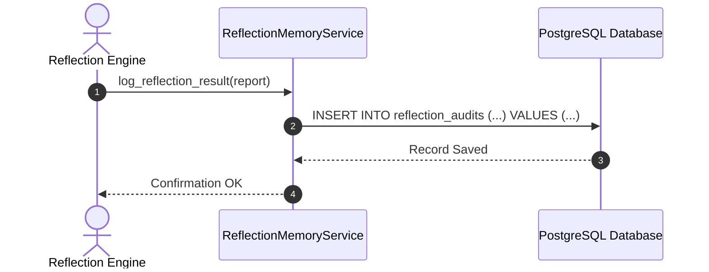
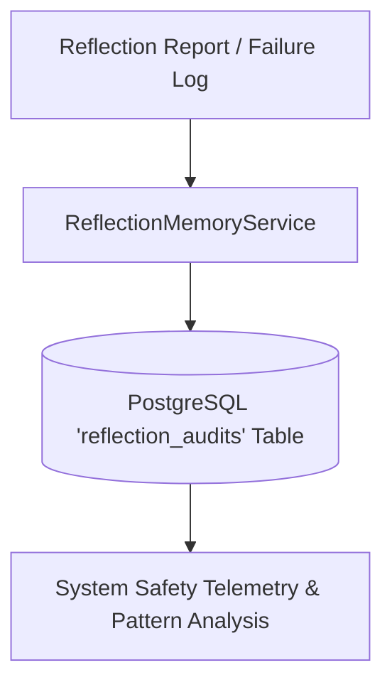

# 1. Overview
This document specifies the **Reflection & Failure Audit Memory Subsystem**, detailing evaluation audit logs, failure pattern tracking, risk score history, and self-learning safety rule updates.

---

# 2. Why This Exists
When an application fails pre-submission reflection or encounters a runtime browser error, capturing the diagnostic details in Reflection Memory enables root-cause analysis and helps refine matching thresholds to prevent repeating failure patterns.

---

# 3. Responsibilities
- Record reflection audit decisions in PostgreSQL `reflection_audits` table.
- Aggregate failure patterns across job portals and company domains.
- Provide failure diagnostic history to candidate dashboard.

---

# 4. Inputs
- `ReflectionReport` from Reflection Engine, error diagnostic logs from Playwright.

---

# 5. Outputs
- Saved `ReflectionAuditRecord` database entity and system risk telemetry.

---

# 6. Components
- **ReflectionAuditModel**: SQLAlchemy ORM entity.
- **ReflectionMemoryService**: Manages audit logging and pattern analysis.

---

# 7. Folder Structure
```text
docs/Phase-08-Memory/
└── Reflection-Memory.md
```

---

# 8. Data Models
```python
from pydantic import BaseModel
from typing import List
from datetime import datetime

class ReflectionAuditRecord(BaseModel):
    id: str
    job_id: str
    candidate_id: str
    passed: bool
    risk_score: float
    failed_checks: List[str]
    created_at: datetime = Field(default_factory=datetime.utcnow)
```

---

# 9. API Contracts
N/A (Subsystem Spec).

---

# 10. Sequence Diagram


---

# 11. Flow Diagram


---

# 12. Internal Working
Audit records store full JSON breakdowns of passed and failed checks, allowing administrators to audit why specific job applications were blocked or approved.

---

# 13. Configuration
- Specified in [backend/app/models/models.py](file:///d:/Personal%20Imp/Projects/Automated-job-Agent/backend/app/models/models.py).

---

# 14. Error Handling
Database insertion errors log warnings to system telemetry without failing the main agent execution loop.

---

# 15. Retry Strategy
- N/A.

---

# 16. Security
- Audit logs sanitize any sensitive candidate information before persistence.

---

# 17. Logging
- Audit events log `job_id`, `candidate_id`, `passed`, `risk_score`, `failed_checks_count`.

---

# 18. Metrics
- Audit Insertion Speed (<3ms).

---

# 19. Testing Strategy
- Unit test reflection audit logging against mock reports.

---

# 20. Performance Considerations
- Asynchronous database insertion prevents reflection logging from slowing down workflow transitions.

---

# 21. Best Practices
- Never delete reflection audit records; they provide vital compliance proof for candidate safety.

---

# 22. Production Improvements
- Automated alert triggers when reflection failure rates exceed 15% across a campaign batch.

---

# 23. Common Failure Scenarios
- **Scenario**: DB connection drops during audit log.
  - **Resolution**: Service queues audit log to Redis fallback queue for async replay.

---

# 24. Future Enhancements
- Machine learning model trained on reflection audit memory to predict application rejection probability.

---

# 25. References
- Reflection Memory Architecture Specifications.
