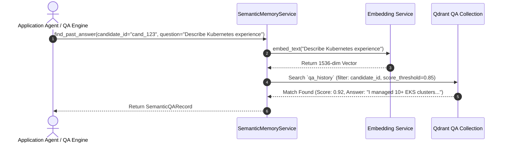
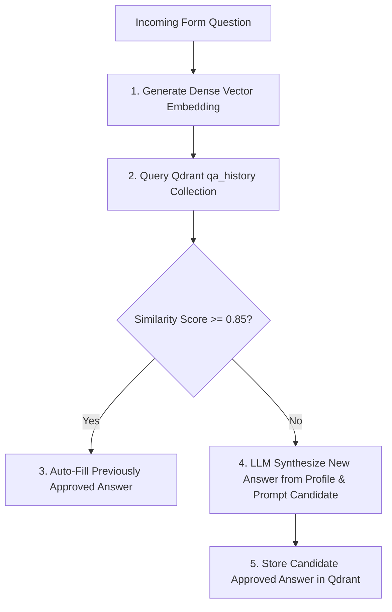

# 1. Overview
this document specifies the **Vector Question-Answer & Semantic Memory Subsystem**, detailing question-answer vector embedding, Qdrant `qa_history` collection indexing, similarity retrieval, and auto-learning candidate form answers ([qa_agent.py](file:///d:/Personal%20Imp/Projects/Automated-job-Agent/backend/app/automation/question_engine/qa_agent.py)).

---

# 2. Why This Exists
Application forms across different employers ask similar custom questions ("Describe a difficult technical challenge you solved", "What is your experience with Kubernetes?", "Why do you want to work at our company?"). Semantic Memory stores past candidate answers as dense vector embeddings in Qdrant, enabling the agent to auto-answer similar future questions accurately.

---

# 3. Responsibilities
- Embed custom application questions using `text-embedding-3-small` or `all-MiniLM-L6-v2`.
- Store question-answer pairs in Qdrant `qa_history` collection ([qa_agent.py](file:///d:/Personal%20Imp/Projects/Automated-job-Agent/backend/app/automation/question_engine/qa_agent.py)).
- Perform vector similarity search ($\ge 0.85$ cosine similarity threshold) to auto-fill answers.

---

# 4. Inputs
- Form question string, candidate ID.

---

# 5. Outputs
- Vector search hit containing candidate's previously approved answer text and similarity score.

---

# 6. Components
- **SemanticMemoryService**: Manages QA embedding and vector store lookups ([qa_agent.py](file:///d:/Personal%20Imp/Projects/Automated-job-Agent/backend/app/automation/question_engine/qa_agent.py)).
- **QdrantQAStore**: Interface to Qdrant `qa_history` collection.

---

# 7. Folder Structure
```text
docs/Phase-08-Memory/
└── Semantic-Memory.md
```

---

# 8. Data Models
```python
from pydantic import BaseModel
from typing import Optional

class SemanticQARecord(BaseModel):
    id: str
    candidate_id: str
    question_text: str
    answer_text: str
    category: str = "Technical"
    similarity_score: Optional[float] = None
```

---

# 9. API Contracts
Semantic Memory QA Retrieval API Response Payload:
```json
{
  "found": true,
  "similarity_score": 0.94,
  "question_text": "What experience do you have with distributed systems?",
  "answer_text": "I have 5 years of experience building distributed FastAPI microservices..."
}
```

---

# 10. Sequence Diagram


---

# 11. Flow Diagram


---

# 12. Internal Working
When a candidate approves an answer during human review, `SemanticMemoryService` generates a dense vector embedding of the question text and persists the record into Qdrant (`qa_history` collection) with `candidate_id` metadata payload filter.

---

# 13. Configuration
- Vector Collection: `qa_history`
- Vector Dimension: `1536`
- Minimum Similarity Threshold: `0.85`

---

# 14. Error Handling
If Qdrant is unavailable, Semantic Memory falls back to exact text match lookup in PostgreSQL `qa_pairs` table.

---

# 15. Retry Strategy
- Vector queries retry up to 3 times on connection timeouts.

---

# 16. Security
- Vector searches strictly enforce `candidate_id` payload filtering to eliminate cross-tenant data leaks.

---

# 17. Logging
- Semantic memory logs record `candidate_id`, `question_truncated`, `similarity_score`, `hit_found`.

---

# 18. Metrics
- QA Retrieval Speed (<15ms).
- Question Auto-Answer Success Rate (>84%).

---

# 19. Testing Strategy
- Unit test QA vector search against sample question variations.

---

# 20. Performance Considerations
- In-memory vector caching for Top-20 candidate QA pairs speeds up form filling.

---

# 21. Best Practices
- Never auto-fill an answer if the vector similarity score is below 0.85.

---

# 22. Production Improvements
- Implement automated semantic deduplication merging duplicate question records.

---

# 23. Common Failure Scenarios
- **Scenario**: Candidate changes career focus (e.g. Frontend to Backend).
  - **Resolution**: Candidate can flush or update their QA memory store in profile settings.

---

# 24. Future Enhancements
- Multi-lingual semantic QA matching.

---

# 25. References
- Qdrant Semantic Vector Search Specifications.
